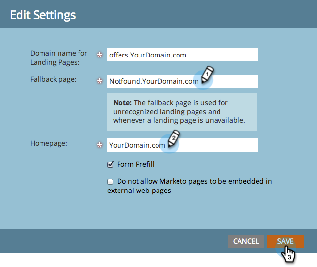

# Pasos de configuración {#setup-steps}

**¡Bienvenido a Adobe Marketo Engage!**

Antes de profundizar en el uso de Marketo, debe completar algunos pasos.

Estos pasos incluyen:

* Alguna configuración básica de la cuenta
* Personalizar la marca de las direcciones URL de la página de aterrizaje y los vínculos de correo electrónico para mejorar la confianza y la capacidad de envío
* Sincronización de CRM
* Añadir un código de seguimiento al sitio web corporativo

>[!NOTE]
>
>Solo debe seguir estos pasos si su empresa está **nuevo en Marketo**. Si no es así, es posible que ya se haya realizado la configuración.

Algunos pasos requieren la ayuda de su equipo de TI.

>[!TIP]
>
>Si usted [imprimir esta lista de comprobación](/help/marketo/getting-started/initial-setup/setup-checklist.md){target="_blank"}, puede desactivar elementos a medida que los complete.

## Inicie sesión y cree usuarios de Marketo adicionales {#log-in-and-create-additional-marketo-users}

>[!IMPORTANT]
>
>Si su suscripción a Marketo se creó el 31 de julio de 2023 o después, o ya se ha migrado a [Adobe Identity Management](/help/marketo/product-docs/administration/marketo-with-adobe-identity/adobe-identity-management-overview.md){target="_blank"}, the steps for adding a user outlined below will not apply to you. Please see [this article](/help/marketo/product-docs/administration/marketo-with-adobe-identity/add-or-remove-a-user.md){target="_blank"} en su lugar.

Iniciar sesión en Marketo [aquí](https://app.marketo.com/){target="_blank"} usando las credenciales que recibió por correo electrónico.

¡Felicidades! Ahora está en Marketo y puede empezar a explorar. Es posible que desee invitar a sus compañeros del equipo de marketing para que se unan a usted. Para ello, agregue nuevos usuarios.

Vaya a la **[!UICONTROL Administrador]** área.

>[!TIP]
>
>Mientras esté aquí, puede hacer clic en **[!UICONTROL Mi cuenta]** para cambiar la configuración de la cuenta y la ubicación, así como para establecer un nuevo nombre de suscripción.

>[!NOTE]
>
>**Permisos de administración necesarios**

Clic **[!UICONTROL Usuarios y funciones]**.

Clic **[!UICONTROL Invitar nuevo usuario]**.

Rellene la dirección de correo electrónico, el nombre y los apellidos de sus compañeros. _Establecer una fecha de caducidad para el acceso es opcional_. Clic **[!UICONTROL Siguiente]**.

>[!TIP]
>
>Una fecha de caducidad es ideal para partes interesadas externas o consultores a corto plazo que solo necesitan acceso a Marketo durante un breve periodo.

>[!NOTE]
>
>Cuando llega la fecha de caducidad, el usuario recibe una notificación de caducidad y la cuenta se bloquea.

Seleccione una función y haga clic en **[!UICONTROL Siguiente]**. Los usuarios estándar tienen acceso a todas las áreas excepto a la de Administración.

>[!NOTE]
>
>Además de las cinco funciones integradas, también puede crear funciones personalizadas. Más información sobre [Administración de roles y permisos de usuario](/help/marketo/product-docs/administration/users-and-roles/managing-user-roles-and-permissions.md){target="_blank"}.

No dude en modificar el texto de la invitación. Clic **Enviar**.

El nuevo usuario ahora aparece en la lista **[!UICONTROL Usuarios]** y deben recibir un correo electrónico con un vínculo para crear una contraseña y un inicio de sesión. ¡Siguiente paso!

## Configure Los Contactos De Soporte Autorizados {#set-up-your-authorized-support-contacts}

Es posible que el Soporte de Marketo le haya enviado un correo electrónico en el que se indica que es el administrador de Soporte al cliente de Marketo de su empresa. Si es así, puede configurar **contactos de soporte autorizados** para su equipo. Solo los contactos de asistencia autorizados pueden ponerse en contacto con Asistencia al cliente de Marketo directamente a través de la [Portal de asistencia de Marketo](https://support.marketo.com){target="_blank"}.

>[!NOTE]
>
>El número de contactos de asistencia que puede crear está determinado por el paquete que ha adquirido. Este límite se especifica en el correo electrónico del Soporte técnico de Marketo.

Los documentos de contacto de asistencia autorizados se han trasladado a la Comunidad de Marketo. Consulte lo siguiente [este artículo](https://nation.marketo.com/t5/Knowledgebase/Managing-Authorized-Support-Contacts/ta-p/254341){target="_blank"}.

>[!NOTE]
>
>En la lista solo aparecen las personas que han iniciado sesión en la Comunidad de Marketo. Si no encuentra a la persona, asegúrese de que inicia sesión en la comunidad primero.

## Personalización de las direcciones URL de su página de aterrizaje con un CNAME {#customize-your-landing-page-urls-with-a-cname}

>[!NOTE]
>
>¿Es cliente de Launch Pack? Puede omitir este paso. Su asesor le proporcionará un documento de instrucciones de configuración de TI durante la llamada de inicio.

>[!NOTE]
>
>**Permisos de administración necesarios**

Elija un CNAME para las páginas de aterrizaje. Algunos ejemplos:

    * **ir**.[CompanyDomain].com
    * **www2**.[CompanyDomain].com
    * **lp**.[CompanyDomain].com

>[!TIP]
>
>¡Manténgalo corto! Las direcciones URL más cortas son más fáciles de recordar. Sugerimos &quot;ir&quot; como dominio.

La primera parte (en negrita) es la siguiente `[LandingPageCNAME]`. Lo necesitará en el paso 5.

Para recuperar el ID de Munchkin que va a reemplazar con el CNAME de su página de aterrizaje, vaya al área de Administración.

Clic **Mi cuenta**.

Copie el [!UICONTROL Cadena de cuenta] desde la configuración de la página de aterrizaje.

Este es el `[Munchkin ID]`. Guárdelo... Tendrá que darlo a TI en el paso 5.

Configure los ajustes de dominio para que las páginas de aterrizaje utilicen el dominio de su empresa en lugar del de Marketo (donde están alojadas).

## Garantizar entrega de correo electrónico {#ensure-email-deliverability}

>[!NOTE]
>
>¿Es cliente de Launch Pack? Puede omitir este paso. Su asesor le proporcionará un documento de instrucciones de configuración de TI durante la llamada de inicio.

Hay varias medidas que puede tomar para garantizar que los correos electrónicos lleguen a la mayor cantidad de personas posible.

* **Marque sus vínculos de seguimiento**. Puede elegir un CNAME para utilizar su propio dominio (en lugar del de Marketo) en los vínculos que incluye en los correos electrónicos de Marketo. Esto refuerza la marca de su dominio y aumenta la confianza y la capacidad de envío con sus destinatarios.
* **Añada Marketo a la lista de permitidos de correo electrónico corporativa.** Es una práctica recomendada común enviar correos electrónicos de prueba a las cuentas de prueba antes de enviar correos electrónicos a personas reales. Mediante la inclusión en la lista de permitidos de Marketo, puede evitar que los correos electrónicos de prueba se bloqueen o marquen como correo no deseado.
* **Configure SPF y DKIM.** Estas tecnologías garantizan a los destinatarios que los correos electrónicos de Marketo no son spam. Para evitar que los filtros de correo no deseado de los destinatarios rechacen sus correos electrónicos de Marketo, siga estos pasos para lo siguiente [Configuración de un SPF y un DKIM para la entrega de correo electrónico](/help/marketo/product-docs/email-marketing/deliverability/set-up-spf-and-dkim-for-your-email-deliverability.md).
* **Configure un registro MX para su dominio.** Un registro MX le permite recibir correo en el dominio desde el que envía el correo electrónico para procesar las respuestas y los respondedores automáticos. Si envía desde su dominio corporativo, es probable que ya lo tenga configurado. Si no es así, normalmente puede configurarlo para que se asigne al registro MX de su dominio corporativo.
* **Configuración recomendada para la dirección de origen.** Debe utilizar un dominio de correo electrónico válido, existente y en funcionamiento en la dirección De en todas las campañas de correo electrónico. Puede resultar beneficioso configurar un subdominio del dominio corporativo en lugar de enviar desde el dominio corporativo. Esto garantizará que los problemas del flujo de correo corporativo no afecten al flujo de correo de Marketo y viceversa. Además, el envío de correo desde `something@nonexistentdomain.com` provocará que el correo electrónico se filtre o bloquee. Cualquier dominio utilizado en la dirección remitente del remitente debe tener una cuenta válida y activa postmaster@ y abuse@.

Si usas aplicaciones de Google para alojar tu correo electrónico corporativo, no podrás crear correos electrónicos de abuse@ o postmaster@ bajo tu dominio. Para evitar esto, debe crear grupos llamados &quot;abuso&quot; y &quot;administrador de correo&quot;. Los usuarios que sean miembros de estos grupos recibirán correos electrónicos enviados a esas direcciones (por ejemplo, postmaster@domain.com). Encontrará instrucciones detalladas para crear grupos [aquí](https://support.google.com/a/answer/33343#adminconsole){target="_blank"}.

Elija un CNAME para los vínculos de seguimiento de correo electrónico (elija uno que sea _distinto_ de la página de aterrizaje (CNAME que eligió en el paso 3). Algunos ejemplos:

* go2.[CompanyDomain].com
* em.[CompanyDomain].com
* vaya.[CompanyDomain].com

La primera parte es el CNAME de seguimiento de correo electrónico, `[EmailTrackingCNAME]`. Deberá proporcionárselo a TI en el paso 5.

>[!CAUTION]
>
>Los CNAME de los correos electrónicos y las páginas de aterrizaje deben ser diferentes. Además, evite CNAME como &quot;seguimiento&quot; o &quot;vínculo&quot;. A menudo se marca como spam

Para encontrar el vínculo de seguimiento de Marketo, vaya a **[!UICONTROL Administrador]** área.

Clic **[!UICONTROL Correo electrónico]**.

Copie el [!UICONTROL Vínculo de seguimiento] desde la configuración de correo electrónico.

El [!UICONTROL Vínculo de seguimiento] tiene el siguiente formato: `mkto-[a-z][4 digits].com`.

Este es su `[MktoTrackingLink]`. Guárdelo... Tendrá que darlo a TI en el paso 5.

Recopilar dominios &quot;De&quot;. Cree una lista de todos los dominios &quot;De&quot; (como en, `[Sender]@[FromDomain].com`) que planea utilizar para enviar correos electrónicos desde Marketo. Para la mayoría, solo hay una.

Por ejemplo, &quot;marketo.com&quot;, &quot;info.marketo.com&quot;, &quot;&quot;. Estos son `[FromDomain1]`,`[FromDomain2]`, etc. Sálvalos... Tendrá que entregarlos a TI en el paso 5.

Ahora dispone de toda la información necesaria para enviar su solicitud a TI.

## Pedir a TI que configure protocolos {#ask-it-to-configure-protocols}

>[!NOTE]
>
>¿Es cliente de Launch Pack? Puede omitir este paso. Su asesor le proporcionará un documento de instrucciones de configuración de TI durante la llamada de inicio.

Una vez que haya recopilado toda la información necesaria, estará listo para enviar una solicitud a TI. Puede utilizar el texto siguiente como plantilla y reemplazar el texto en negrita por su propia información.

[Incluir un vínculo a este artículo](/help/marketo/getting-started/initial-setup/configure-protocols-for-marketo.md).

Pegue este texto en el correo electrónico y reemplace los marcadores de posición en negrita:

>[!NOTE]
>
>Consulte los pasos 3 y 4 anteriores para determinar el texto que reemplazará los marcadores de posición. Recuerde que `[LandingPageCNAME]` y `[EmailTrackingCNAME]` debe ser diferente.

`----------------------------------------------`

Estimado administrador de TI increíble,

Nuestro equipo de marketing ahora utiliza la plataforma Marketo para comunicarse con nuestros empleados. Para garantizar una buena entrega de correos electrónicos, debemos realizar los siguientes cambios:

`1)` Para nuestras páginas de aterrizaje, agregue una Entrada DNS (CNAME) para **[LandingPageCNAME]**.**[CompanyDomain]**.com, apuntando a **[ID de Munchkin]**.mktoweb.com.

`2)` Para nuestros vínculos de seguimiento en el correo electrónico, agregue una Entrada DNS (CNAME) para **[EmailTrackingCNAME]**.**[CompanyDomain]**.com, apuntando a **[MktoTrackingLink]**.

`3)` Lista de permitidos Marketo.

    * Si utilizamos direcciones IP en nuestra Lista de permitidos de correo electrónico, añada las direcciones IP que se indican a continuación:
    199.15.212.0/22
    
    192.28.144.0/20
    
    192.28.160.0/19
    
    185.28.196.0/22
    
    130.248.172.0/24
    
    130.248.173.0/24
    
    103.237.104.0/22
    
    94,236.119.0/26

>[!NOTE]
>
>Póngase en contacto con el Soporte de Marketo si desea una lista abreviada de direcciones IP para la lista de permitidos específica de su entorno.

    * Si nuestro sistema antispam utiliza los dominios De, agregue lo siguiente:

**`[FromDomain1]`**
**`[FromDomain2]`**

`4)` Necesitamos configurar SPF y DKIM para que Marketo esté autorizado a enviar correos electrónicos firmados en nuestro nombre.

`a.` Para configurar SPF, agregue la siguiente línea a nuestras entradas DNS:

EN TXT **[Desde el dominio]**: v=spf1 mx ip4:**[IP(s) corporativa(es)]**
 include: mktomail.com ~all

Si ya tenemos un registro SPF en nuestra entrada DNS, simplemente agréguele lo siguiente:

include:mktomail.com

`[`Reemplazar **Desde el dominio** con su dominio de origen de correo electrónico (por ejemplo: company.com) y **CorpIP** con la dirección IP del servidor de correo electrónico corporativo (por ejemplo: 255.255.255.255).  Si va a enviar correos electrónicos desde varios dominios a través de Marketo, debe pedir al personal informático que añada esta línea a cada dominio (en una línea).`]`

`b.` Para DKIM, cree Registros de recursos DNS para cada dominio que deseemos configurar. A continuación se muestran los registros de host y los valores TXT de cada dominio que firmaremos:

**`[DKIMDomain1]`**: el registro de host es **`[HostRecord1]`** y el valor TXT es **[ValorTV1]**.

**`[DKIMDomain2]`**: el registro de host es **`[HostRecord2]`** y el valor TXT es **`[TXTValue2]`**.

`[`Copie el **HostRecord** y **TXTValue** para cada **DKIMDomain** ha configurado después de seguir el [instrucciones aquí](/help/marketo/product-docs/email-marketing/deliverability/set-up-a-custom-dkim-signature.md). No olvide verificar cada dominio en **Administración > Correo electrónico > DKIM** después de que el personal de TI haya completado este paso.`]`

`5)` Necesitamos asegurarnos de que haya un registro MX válido para nuestros dominios FROM **[FromDomain1]**, **[FromDomain2]**, etc. ¿Puede confirmarlo? Si no es así, configúrelo para asignar a nuestro registro MX de dominio corporativo. Esto garantizará que podamos procesar las respuestas/respuestas automáticas a nuestros correos de Marketo.

Avíseme cuando haya completado estos pasos para que pueda completar el proceso de configuración con Marketo.

¡Gracias! ¡Eres el mejor!

Amor,

**`[Your Name]`**

`----------------------------------------------`

Envíe el correo electrónico a TI. Entendemos que el departamento de TI puede tardar algún tiempo en completar estas tareas. Puede continuar con el paso 7, pero recuerde que debe devolver el paso 6 para completar la configuración de Marketo.

## Complete la configuración de Marketo una vez finalizada la tecnología informática {#complete-your-marketo-setup-after-it-finishes}

Una vez que el departamento de TI haya completado sus tareas, siga estos pasos para añadir los CNAME de la página de aterrizaje y del correo electrónico, y para activar la firma DKIM.

Vaya a la **[!UICONTROL Administrador]** para añadir el CNAME de su página de aterrizaje

Seleccione Landing Pages y haga clic en **[!UICONTROL Editar]** en el [!UICONTROL Configuración] área.

Introduzca su nuevo nombre de dominio en el campo **[!UICONTROL Nombre de dominio para páginas de aterrizaje]**. Debe tener el siguiente formato:

`[LandingPageCNAME].[CompanyDomain].com`

En el **[!UICONTROL Reserva]** , introduzca la dirección URL a la que desea que vayan los visitantes si una página de aterrizaje no está disponible. Puede utilizar la página principal de la empresa si no dispone de una página de reserva. En el **[!UICONTROL Homepage]** , introduzca el sitio web de la empresa.

En el [!UICONTROL Administrador] , seleccione **[!UICONTROL Correo electrónico]** para añadir su CNAME de correo electrónico

Desplácese hacia abajo hasta [!UICONTROL Dominios de marca]. Seleccione el dominio y haga clic en **[!UICONTROL Editar]**.

En el campo Dominio, introduzca el dominio de seguimiento de correo electrónico. Debe tener el siguiente formato:

`[EmailTrackingCNAME].[CompanyDomain].com`. Haga clic en **[!UICONTROL Guardar]**.

## Integración de su CRM {#integrate-your-crm}

Este es probablemente el paso más emocionante de su configuración: es hora de rellenar Marketo con todos esos posibles clientes y contactos que ha almacenado en su CRM.

Elija entre las siguientes opciones, según el CRM que utilice su compañía.

    * [Integrar Marketo con [!DNL Salesforce.com]](/help/marketo/product-docs/crm-sync/salesforce-sync/understanding-the-salesforce-sync.md)
    * [Integrar Marketo con [!DNL Microsoft Dynamics]](/help/marketo/product-docs/crm-sync/microsoft-dynamics-sync/understanding-the-microsoft-dynamics-sync.md)

>[!NOTE]
>
>Necesita la asistencia del administrador de CRM de su empresa para completar estos pasos.

## Añadir código de seguimiento a su sitio web {#add-tracking-code-to-your-website}

>[!NOTE]
>
>¿Es usted? [!DNL Launch Pack] ¿cliente? Puede omitir este paso. Su consultor le proporcionará lo siguiente [!DNL Munchkin] instrucciones de código en su documento de instrucciones de configuración de TI.

Marketo tiene JavaScript de seguimiento personalizado (llamado [!DNL Munchkin]) que puede utilizar para realizar el seguimiento de las actividades de la persona en cualquier página web. [!DNL Munchkin] es necesario para integrar el sitio web en Marketo. Siga estos pasos para [Añadir [!DNL Munchkin] Código de seguimiento para su sitio web](/help/marketo/product-docs/administration/additional-integrations/add-munchkin-tracking-code-to-your-website.md){target="_blank"}.

>[!NOTE]
>
>Experiencia con el HTML necesaria para añadir el código de seguimiento.

## Expectativas de rendimiento {#performance-expectations}

¿Qué puede esperar en términos de rendimiento de Marketo? Puede variar según el tamaño y la complejidad de las campañas de marketing. Sin embargo, puede esperar niveles de rendimiento a la par con lo que se describe en la columna &quot;Estándar&quot; en varias de las tablas de la [Descripción del producto del Marketo Engage](https://helpx.adobe.com/legal/product-descriptions/adobe-marketo-engage---product-description.html){target="_blank"}. The "Performance" and "Performance Plus" columns refer to performance tier packages that provide [higher performance levels](https://nation.marketo.com/t5/product-documents/marketo-engage-performance-tiers/ta-p/328835){target="_blank"}.

Todos los pasos de configuración han finalizado. ¡Lo único que queda es sumergirse y usar Marketo!
