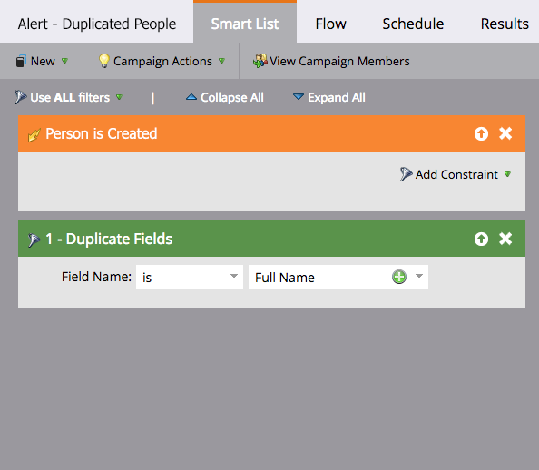

# Automatizar una alerta para posibles personas duplicadas {#automate-an-alert-for-possible-duplicate-people}

¿Desea crear una alerta cada vez que se cree una persona duplicada? A continuación se muestra cómo configurar una campaña inteligente para hacerlo.

1. [Cree una nueva campaña inteligente](/help/marketo/product-docs/core-marketo-concepts/smart-campaigns/creating-a-smart-campaign/create-a-new-smart-campaign.md). Defina la siguiente lista inteligente:

* Déclencheur: **La persona es creada**
* Filtro: **Campos duplicados.** Nombre de campo  **es Nombre completo**

   

   >[!TIP]
   >
   >Sé creativo. Experimente con diferentes campos para obtener mejores resultados de filtrado.

1. En el paso de flujo, seleccione la acción de flujo [Send Alert](/help/marketo/product-docs/core-marketo-concepts/smart-campaigns/flow-actions/send-alert.md).

   

   >[!TIP]
   >
   >Usar el [Send Alert Info token](/help/marketo/product-docs/email-marketing/general/using-tokens/use-the-send-alert-info-token.md) para incluir un vínculo a la persona en el CRM.

   >[!CAUTION]
   >
   >Si importa una lista grande, puede obtener un montón de estas alertas a la vez.
   >
   >Además, dos personas con el mismo nombre no significa automáticamente que sean la misma persona.

1. Active la campaña en la pestaña **Schedule**.

   

¡Eso es todo! Esta campaña inteligente se déclencheur cada vez que se cree una nueva persona con un nombre completo existente en Marketo.

>[!MORELIKETHIS]
>
>[Buscar y combinar personas duplicadas](/help/marketo/product-docs/core-marketo-concepts/smart-lists-and-static-lists/managing-people-in-smart-lists/find-and-merge-duplicate-people.md)
