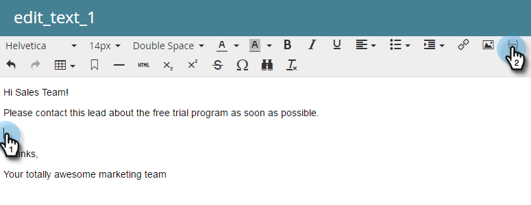
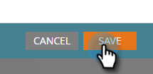
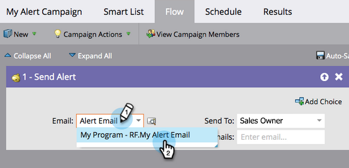

# Alerta al representante de ventas {#alert-the-sales-rep}

## Misión: Avisar al representante de ventas cuando una persona rellene un formulario en el sitio web {#mission-alert-the-sales-rep-when-a-person-fills-out-a-form-on-your-web-site}

Para enviar correos electrónicos de alerta automáticamente a los representantes de ventas, solo necesita un correo electrónico de alerta y una campaña de correo electrónico. Así es como se hace.

>[!PREREQUISITES]
>
>[Página de destino con un formulario](/help/marketo/getting-started/quick-wins/landing-page-with-a-form.md){target="_blank"}

## Paso 1: Crear un mensaje de correo electrónico de alerta {#step-create-an-alert-email}

1. Vaya al área **[!UICONTROL Actividades de marketing]**.

   

1. Seleccione **Mi programa** que creó en la [página de aterrizaje con una ganancia rápida de Form](/help/marketo/getting-started/quick-wins/landing-page-with-a-form.md){target="_blank"} y, a continuación, en **[!UICONTROL Nuevo]** haga clic en **[!UICONTROL Nuevo recurso local]**.

   

1. Haga clic en **[!UICONTROL Correo electrónico]**.

   

1. **Nombre** el correo electrónico &quot;Mi alerta por correo electrónico&quot;, selecciona una plantilla y haz clic en **[!UICONTROL Crear]**.

   

1. Escriba el **Nombre desde**, **Correo electrónico desde**, **[!UICONTROL Responder a]** y **[!UICONTROL Asunto]** que desea que vea su equipo de ventas.

   

1. Haga doble clic para editar el texto del correo electrónico.

   

1. Escriba el contenido del correo electrónico.

   

1. Coloque el cursor donde desee insertar la información de contacto de la persona y haga clic en el icono **Insertar token**.

   

1. Busque y seleccione el `{{SP_Send_Alert_Info}}` **[!UICONTROL Token]** y haga clic en **[!UICONTROL Insertar]**.

   

   >[!NOTE]
   >
   >{{SP_Send_Alert_Info}} es un token especial para los correos electrónicos de alerta. Consulte [Usar el token Enviar información de alerta](/help/marketo/product-docs/email-marketing/general/using-tokens/use-the-send-alert-info-token.md){target="_blank"}{target="_blank"} para obtener más información.

1. Haga clic en **[!UICONTROL Guardar]**.

   

1. Haga clic en el menú desplegable **[!UICONTROL Acciones de correo electrónico]** y seleccione **[!UICONTROL Aprobar y cerrar]**.

   

## Paso 2: Crear una campaña de Déclencheur de alertas {#step-create-an-alert-trigger-campaign}

1. Seleccione **Mi programa** creado anteriormente y, a continuación, en **[!UICONTROL Nuevo]** haga clic en **[!UICONTROL Nueva campaña inteligente]**.

   

1. **Asigne un nombre** a la campaña &quot;Mi campaña de alerta&quot; y haga clic en **[!UICONTROL Crear]**.

   

1. En la ficha **[!UICONTROL Lista inteligente]**, busque y arrastre el déclencheur **[!UICONTROL Rellena el formulario]** al lienzo.

   

1. Seleccione el formulario que hemos creado anteriormente.

   

1. En la ficha **[!UICONTROL Flujo]**, busque y arrastre la acción de flujo **[!UICONTROL Enviar alerta]** al lienzo.

   

1. Seleccione **[!UICONTROL Mi correo electrónico de alerta]** creado anteriormente y deje **[!UICONTROL Enviar a]** como **[!UICONTROL Propietario de ventas]**.

   

1. Escriba su dirección de correo electrónico en el campo **[!UICONTROL Para otros correos electrónicos]**.

   

1. Vaya a la ficha **[!UICONTROL Programar]** y haga clic en el botón **[!UICONTROL Activar]**.

   

   >[!TIP]
   >
   >Establezca las **[!UICONTROL Reglas de calificación]** en **[!UICONTROL cada vez]** (editando la campaña inteligente) para permitir que la misma persona almacene alertas en déclencheur varias veces.

1. Haz clic en **[!UICONTROL Activar]** en la pantalla de confirmación.

   

## Paso 3: ¡Pruébelo! {#step-test-it-out}

1. Seleccione su página de aterrizaje y haga clic en **[!UICONTROL Ver página aprobada]**.

   

   >[!NOTE]
   >
   >No olvide aprobar las páginas de aterrizaje; no se activan hasta que se aprueban.

1. Complete el formulario y haga clic en **[!UICONTROL Enviar]**.

   

1. Recibirá su correo electrónico en breve. Una vez que haya verificado que todo funciona como debe, elimine su dirección de correo electrónico del flujo de envío de alertas (consulte el paso 2.7 anterior).

   >[!NOTE]
   >
   >Haga clic en la ficha **[!UICONTROL Información de persona]** de Marketo para ver la información de contacto.

## Misión completada. {#mission-complete}

  

[◄ Misión 7: Personalizar un correo electrónico](/help/marketo/getting-started/quick-wins/personalize-an-email.md)

[Misión 9: Actualizar datos de persona ►](/help/marketo/getting-started/quick-wins/update-person-data.md)
