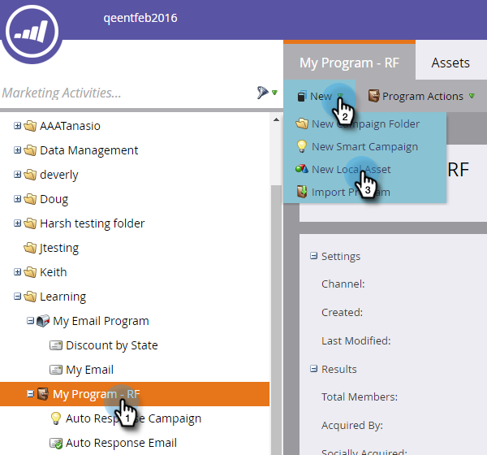
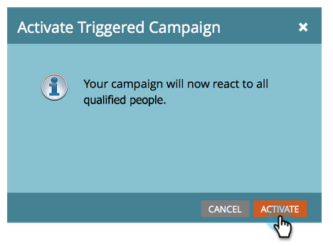

# Alerta al representante de ventas {#alert-the-sales-rep}

## Misión: Alerta al representante de ventas cuando una persona rellene un formulario en el sitio web {#mission-alert-the-sales-rep-when-a-person-fills-out-a-form-on-your-web-site}

Para enviar automáticamente correos electrónicos de alerta a los representantes de ventas, todo lo que necesita es un correo electrónico de alerta y una campaña de correo electrónico. Así es como hacerlo.

>[!PREREQUISITES]
>
>[Página de aterrizaje con un formulario](/help/marketo/getting-started/quick-wins/landing-page-with-a-form.md){target=&quot;_blank&quot;}

## Paso 1: Crear un correo electrónico de alerta {#step-create-an-alert-email}

1. Vaya a la **Actividades de marketing** .

   

1. Select **Mi programa** que ha creado en el [Página de aterrizaje con un formulario](/help/marketo/getting-started/quick-wins/landing-page-with-a-form.md){target=&quot;_blank&quot;} victoria rápida, luego en **Nuevo** click **Nuevo recurso local**.

   

1. Haga clic en **Correo electrónico**.

   

1. **Nombre** el correo electrónico &quot;Mi alerta de correo electrónico&quot;, seleccione una plantilla y haga clic en **Crear**.

   

1. Introduzca la variable **Desde nombre**, **De correo electrónico**, **Responder** y **Asunto** que desea que vea su equipo de ventas.

   

1. Haga doble clic para editar el texto del correo electrónico.

   

1. Escriba el contenido del correo electrónico.

   

1. Coloque el cursor donde desee insertar la información de contacto de la persona y haga clic en el botón **Insertar token** icono.

   

1. Busque y seleccione el `{{SP_Send_Alert_Info}}` **Token** y haga clic en **Insertar**.

   

   >[!NOTE]
   >
   >{{SP_Send_Alert_Info}} es un token especial para correos electrónicos de alerta. Consulte [Usar el token de información de alerta de envío](/help/marketo/product-docs/email-marketing/general/using-tokens/use-the-send-alert-info-token.md){target=&quot;_blank&quot;}{target=&quot;_blank&quot;} para obtener más información.

1. Haga clic en **Guardar**.

   

1. Cierre la pestaña o ventana del editor de correo electrónico.

   

1. En **Acciones de correo electrónico** click **Aprobar**.

   

## Paso 2: Creación de una campaña de Déclencheur de alertas {#step-create-an-alert-trigger-campaign}

1. Select **Mi programa** creado anteriormente, luego en **Nuevo** click **Nueva campaña inteligente**.

   

1. **Nombre** la campaña &quot;My Alert Campaign&quot; y haga clic en **Crear**.

   

1. En el **Lista inteligente** , busque y arrastre la pestaña **Rellena el formulario** déclencheur al lienzo.

   

1. Seleccione el formulario que hemos creado anteriormente.

   

1. En el **Flujo** , busque y arrastre la pestaña **Enviar alerta** acción de flujo al lienzo.

   

1. Select **Mi correo electrónico de alerta** creado anteriormente y salir **Enviar a** como **Propietario de ventas**.

   

1. Escriba su dirección de correo electrónico en la **A otros correos electrónicos** campo .

   

1. Vaya a la **Programación** y haga clic en **Activar** botón.

   

   >[!TIP]
   >
   >Configure las variables **Reglas de calificación** a **cada vez** (editando la campaña inteligente) para permitir que la misma persona déclencheur alertas varias veces.

1. Haga clic en **Activar** en la pantalla de confirmación.

   

## Paso 3: ¡Pruébelo! {#step-test-it-out}

1. Seleccione la página de aterrizaje y haga clic en **Ver página aprobada**.

   

   >[!NOTE]
   >
   >No olvide aprobar páginas de aterrizaje; no se activan hasta que se aprueban.

1. Complete el formulario y haga clic en **Submit**.

   

1. Debería recibir su correo electrónico en breve. Una vez que haya verificado que todo funciona como debería, elimine su dirección de correo electrónico del flujo Enviar alerta (consulte el paso 2.7 anterior).

   >[!NOTE]
   >
   >Haga clic en el **Información de persona** en Marketo para ver la información de contacto.

## ¡Misión finalizada! {#mission-complete}

  

[◄ Misión 7: Personalización de un correo electrónico](/help/marketo/getting-started/quick-wins/personalize-an-email.md)

[Misión 9: Actualización de datos de personas ►](/help/marketo/getting-started/quick-wins/update-person-data.md)
