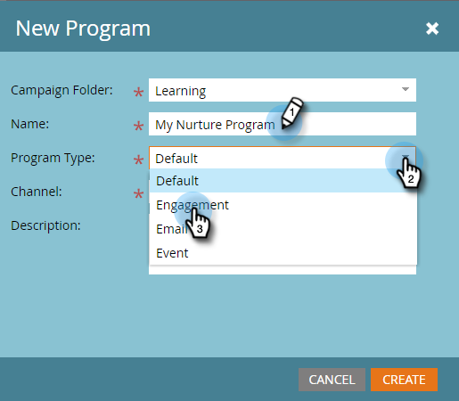
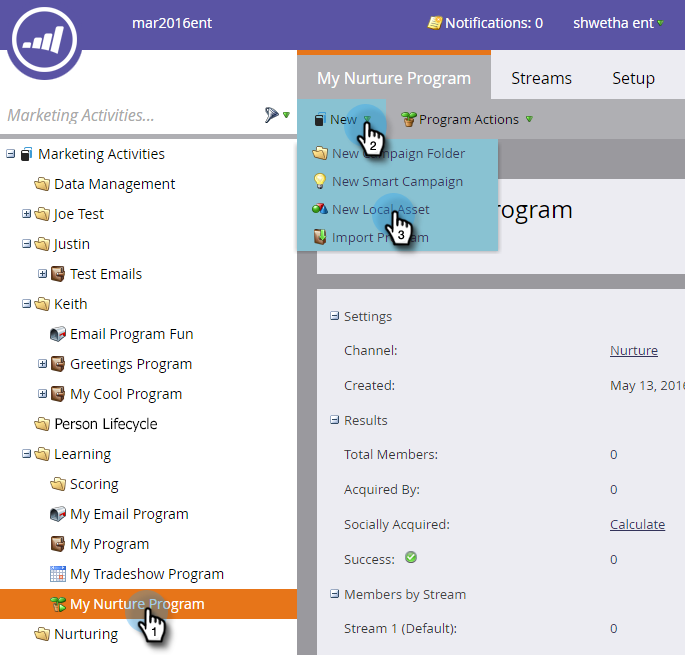
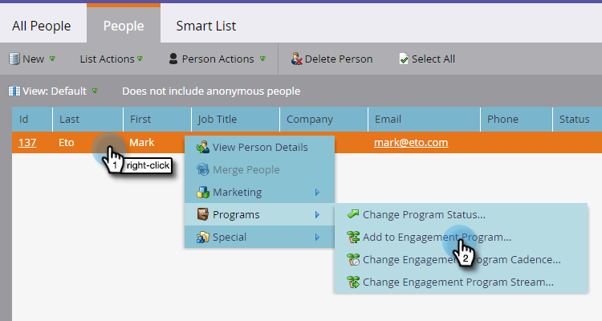

# Perforación, Perforación {#drip-drip-nurture}

## Misión: Aprenda a las personas que asistieron a su reciente feria comercial {#mission-nurture-the-people-who-attended-your-recent-tradeshow}

Puede crear fácilmente un sistema de alimentación avanzado y sofisticado en Marketo. ¡Así es!

>[!PREREQUISITES]
>
>* [Configurar y agregar una persona](/help/marketo/getting-started/quick-wins/get-set-up-and-add-a-person.md)
>* [Importar una lista de personas](/help/marketo/getting-started/quick-wins/import-a-list-of-people.md)

## Paso 1: Crear un programa de participación {#step-create-an-engagement-program}

1. Vaya al área **Marketing Activities** .

   

1. Seleccione la carpeta **Learning**, haga clic en la lista desplegable **New** y seleccione **New Program**.

   

1. Introduzca un **Name** y seleccione **Engagement** para el **Program Type**.

   

1. Asegúrese de que el campo **Channel** es **Nurture** y haga clic en **Create**.

   

   Ahora ha creado un programa de participación.

## Paso 2: Crear un correo electrónico {#step-create-an-email}

1. Seleccione su programa de participación, haga clic en **Nuevo** y seleccione **Nuevo recurso local**.

   

1. Haga clic en **Email**.

   

1. Introduzca un **Name**, seleccione la **Template** que desee utilizar y haga clic en **Crear**.

   

   >[!NOTE]
   >
   >¿No ve el editor de correo electrónico? Es probable que el navegador haya bloqueado la ventana. Habilite las ventanas emergentes de [app.marketo.com](https://app.marketo.com) en el explorador y haga clic en **Editar borrador** en la barra de menú superior.

1. Introduzca un asunto.

   

1. Seleccione el área del correo electrónico que desea editar, haga clic en el icono del engranaje y seleccione **Editar**.

   

1. Edite el correo electrónico y haga clic en **Save**.

   

1. Cierre la pestaña o ventana del editor de correo electrónico.

   

1. En **Acciones de correo electrónico**, haga clic en **Aprobar**.

   

   >[!NOTE]
   >
   >No olvide aprobar sus correos electrónicos o no podrá activarlos más adelante.

1. Ahora cree otro correo electrónico repitiendo las acciones del paso 2.

   

## Paso 3: Añadir contenido a la emisión {#step-add-content-to-your-stream}

1. Ahora es el momento de crear un flujo de contenido para su programa de participación mediante los correos electrónicos que ha creado.

1. Seleccione su programa de participación y haga clic en la pestaña **Streams**.

   

1. Arrastre los dos correos electrónicos que ha creado al lienzo derecho.

   

   >[!TIP]
   >
   >También puede utilizar el botón **Añadir contenido** o el icono de flujo **+**.

## Paso 4: Activar el contenido del flujo {#step-activate-stream-content}

1. Para activar todo el contenido a la vez, haga clic en el icono de la rueda de engranaje y, a continuación, haga clic en **Activar todo el contenido**.

   

   >[!NOTE]
   >
   >No puede activar el contenido sin aprobarlo primero.

   ¡bueno trabajo! Un paso más y el programa de participación está listo.

## Paso 5: Establecer la secuencia de flujo {#step-set-the-stream-cadence}

1. Haga clic en **Establecer secuencia de flujo**.

   

1. Edite la configuración para que coincida con la programación que desee y haga clic en **Guardar**.

   

   Su programa de participación está configurado. Ahora vamos a agregar una persona de prueba a su programa.

   >[!NOTE]
   >
   >La persona de prueba es la persona que comprueba el programa de participación para probar que es correcto antes de enviarlo a los clientes.

## Paso 6: Agregar una persona de prueba al programa de participación {#step-add-a-test-person-to-your-engagement-program}

1. Vaya al área **Database**.

   

1. Busque la persona de prueba.

   

   >[!NOTE]
   >
   >Asegúrese de que la persona de prueba tiene una dirección de correo electrónico válida para que pueda confirmar la recepción de correos electrónicos al realizar la prueba.

1. Haga clic con el botón derecho en la persona y, a continuación, haga clic en Programas y en Agregar al programa de participación.

   

1. Seleccione su **Program** y **Stream** y haga clic en **Run Now**.

   

1. ¡Misión finalizada!

1. Debe recibir un correo electrónico a la hora y la cadencia que haya especificado.

   >[!NOTE]
   >
   >Obtenga más información sobre [Programas de participación](/help/marketo/product-docs/email-marketing/drip-nurturing/creating-an-engagement-program/understanding-engagement-programs.md).

  

[◄ Misión 5: Importar una lista de posibles clientes](/help/marketo/getting-started/quick-wins/import-a-list-of-people.md)

[Misión 7: Personalización de un correo electrónico ►](/help/marketo/getting-started/quick-wins/personalize-an-email.md)
