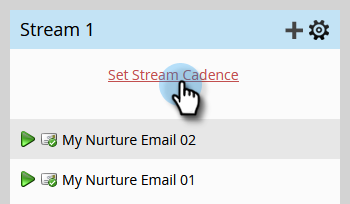

# Goteo, Goteo, Nutrición {#drip-drip-nurture}

## Misión: Nutrir a las personas que asistieron a su reciente feria comercial {#mission-nurture-the-people-who-attended-your-recent-tradeshow}

Puede crear fácilmente un sistema de nutrición avanzado y sofisticado en Marketo. ¡Así se hace!

>[!PREREQUISITES]
>
>* [Configuración y adición de una persona](/help/marketo/getting-started/quick-wins/get-set-up-and-add-a-person.md){target="_blank"}
>* [Importar una lista de personas](/help/marketo/getting-started/quick-wins/import-a-list-of-people.md){target="_blank"}

## Paso 1: Crear un programa de participación {#step-create-an-engagement-program}

1. Vaya a la **[!UICONTROL Actividades de marketing]** área.

   

1. Seleccione el **Aprendizaje** , haga clic en la **[!UICONTROL Nuevo]** y seleccione. **[!UICONTROL Nuevo programa]**.

   

1. Introduzca una **[!UICONTROL Nombre]** y seleccione **[!UICONTROL Participación]** para el **[!UICONTROL Tipo de programa]**.

   

1. Asegúrese de que la **[!UICONTROL Canal]** el campo es **[!UICONTROL Nutrir]** y haga clic en **[!UICONTROL Crear]**.

   

   Ahora ha creado un programa de participación.

## Paso 2: Crear un correo electrónico {#step-create-an-email}

1. Seleccione el programa de participación y haga clic en **[!UICONTROL Nuevo]** y seleccione **[!UICONTROL Nuevo recurso local]**.

   

1. Clic **[!UICONTROL Correo electrónico]**.

   

1. Introduzca una **[!UICONTROL Nombre]**, seleccione la **[!UICONTROL Plantilla]** que desee utilizar y haga clic en **[!UICONTROL Crear]**.

   

   >[!NOTE]
   >
   >¿No ve el editor de correo electrónico? Su navegador probablemente bloqueó la ventana. Habilitar ventanas emergentes de `app.marketo.com` en el explorador y haga clic en **[!UICONTROL Editar borrador]** en la barra de menú superior.

1. Introduzca un asunto.

   

1. Seleccione el área del correo electrónico que desea editar, haga clic en el icono de engranaje y seleccione **[!UICONTROL Editar]**.

   

1. Edite el correo electrónico y haga clic en **[!UICONTROL Guardar]**.

   

1. En **[!UICONTROL Acciones de correo electrónico]**, haga clic en **[!UICONTROL Aprobar y cerrar]**.

   

   >[!NOTE]
   >
   >Recuerde aprobar los correos electrónicos o no podrá activarlos más tarde.

1. Ahora cree otro correo electrónico repitiendo las acciones de los pasos 2-7.

   

## Paso 3: Añadir contenido al flujo {#step-add-content-to-your-stream}

Ahora es el momento de crear un flujo de contenido para su programa de participación con los correos electrónicos que ha creado.

1. Seleccione el programa de participación y haga clic en **[!UICONTROL Flujos]** pestaña.

   

1. Haga clic en **[!UICONTROL Añadir contenido]** en el flujo.

   

   >[!TIP]
   >
   >También puede utilizar la variable **+** icono.

1. Deje seleccionado el tipo &quot;Correo electrónico&quot;. Busque y seleccione los dos correos electrónicos que ha creado.

   

## Paso 4: Activar el contenido de la emisión {#step-activate-stream-content}

1. Active todo el contenido a la vez haciendo clic en el icono de engranaje de flujo y luego haga clic en **[!UICONTROL Activar todo el contenido]**.

   

   >[!NOTE]
   >
   >No puede activar contenido sin aprobarlo primero.

   ¡bueno trabajo! Un paso más y el programa de participación estará listo.

## Paso 5: Configuración de la cadencia del flujo {#step-set-the-stream-cadence}

1. Clic **[!UICONTROL Definir cadencia de flujo]**.

   

1. Edite la configuración para que coincida con la programación que desee y haga clic en **[!UICONTROL Guardar]**.

   

   Su programa de participación está listo. Ahora vamos a añadir una persona de prueba a su programa.

   >[!NOTE]
   >
   >La persona de prueba es la persona que comprueba el programa de participación para comprobar que es correcto antes de enviarlo a los clientes.

## Paso 6: Añadir una persona de prueba a su programa de participación {#step-add-a-test-person-to-your-engagement-program}

1. Vaya a la **[!UICONTROL Base de datos]** área.

   

1. Busque a su persona de prueba.

   

   >[!NOTE]
   >
   >Asegúrese de que la persona de prueba tenga una dirección de correo electrónico válida para que pueda confirmar la recepción de correos electrónicos al realizar la prueba.

1. Haga clic con el botón derecho en la persona y luego haga clic en **[!UICONTROL Programas]** y **[!UICONTROL Agregar al programa de participación...]**.

   

1. Seleccione su **[!UICONTROL Programa]** y **[!UICONTROL Transmitir]**, luego haga clic en **[!UICONTROL Ejecutar ahora]**.

   

1. ¡Misión completa!

1. Debe recibir un correo electrónico a la hora y cadencia especificadas.

   >[!NOTE]
   >
   >Más información sobre [Programas de participación](/help/marketo/product-docs/email-marketing/drip-nurturing/creating-an-engagement-program/understanding-engagement-programs.md){target="_blank"}.

## ¡Misión completa! {#mission-complete}

  

[◄ Misión 5: Importar una lista de personas](/help/marketo/getting-started/quick-wins/import-a-list-of-people.md)

[Misión 7: Personalizar un ► de correo electrónico](/help/marketo/getting-started/quick-wins/personalize-an-email.md)
