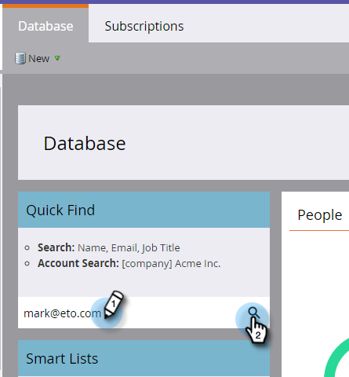

# Perforación, Perforación {#drip-drip-nurture}

## Misión: Entender a las personas que asistieron a su reciente feria {#mission-nurture-the-people-who-attended-your-recent-tradeshow}

Puede crear fácilmente un sistema de alimentación avanzado y sofisticado en Marketo. ¡Así es!

>[!PREREQUISITES]
>
>* [Configurar y agregar una persona](/help/marketo/getting-started/quick-wins/get-set-up-and-add-a-person.md){target=&quot;_blank&quot;}
>* [Importar una lista de personas](/help/marketo/getting-started/quick-wins/import-a-list-of-people.md){target=&quot;_blank&quot;}

## Paso 1: Crear un programa de participación {#step-create-an-engagement-program}

1. Vaya a la **Actividades de marketing** .

   

1. Seleccione el **Aprendizaje** , haga clic en el botón **Nuevo** y seleccione **Nuevo programa**.

   

1. Escriba un **Nombre** y seleccione **Participación** para el **Tipo de programa**.

   

1. Asegúrese de que la variable **Canal** el campo es **Nurtura** y haga clic en **Crear**.

   

   Ahora ha creado un programa de participación.

## Paso 2: Crear un correo electrónico {#step-create-an-email}

1. Seleccione su programa de participación, haga clic en **Nuevo** y seleccione **Nuevo recurso local**.

   

1. Haga clic en **Correo electrónico**.

   

1. Escriba un **Nombre**, seleccione **Plantilla** desea utilizar y haga clic en **Crear**.

   

   >[!NOTE]
   >
   >¿No ve el editor de correo electrónico? Es probable que el navegador haya bloqueado la ventana. Habilitar ventanas emergentes de `app.marketo.com` en el explorador y haga clic en **Editar borrador** en la barra de menús superior.

1. Introduzca un asunto.

   

1. Seleccione el área del correo electrónico que desea editar, haga clic en el icono de engranaje y seleccione **Editar**.

   

1. Edite el correo electrónico y haga clic en **Guardar**.

   

1. En **Acciones de correo electrónico**, haga clic en **Aprobar y cerrar**.

   

   >[!NOTE]
   >
   >Recuerde aprobar los correos electrónicos o no podrá activarlos más adelante.

1. Ahora cree otro correo electrónico repitiendo las acciones de los pasos 2-7.

   

## Paso 3: Añadir contenido a la emisión {#step-add-content-to-your-stream}

Ahora es el momento de crear un flujo de contenido para su programa de participación mediante los correos electrónicos que ha creado.

1. Seleccione su programa de participación y haga clic en el botón **Transmisiones** pestaña .

   

1. Haga clic en el **Añadir contenido** del flujo.

   

   >[!TIP]
   >
   >También puede usar la variable **+** icono.

1. Deje seleccionado el tipo &quot;Correo electrónico&quot;. Busque y seleccione los dos correos electrónicos que ha creado.

   

## Paso 4: Activar el contenido del flujo {#step-activate-stream-content}

1. Para activar todo el contenido a la vez, haga clic en el icono de la rueda de engranaje y, a continuación, haga clic en **Activar todo el contenido**.

   

   >[!NOTE]
   >
   >No puede activar el contenido sin aprobarlo primero.

   ¡bueno trabajo! Un paso más y el programa de participación está listo.

## Paso 5: Definición de la secuencia {#step-set-the-stream-cadence}

1. Haga clic en **Establecer secuencia de flujo**.

   

1. Edite la configuración para que coincida con la programación que desee y haga clic en **Guardar**.

   

   Su programa de participación está configurado. Ahora vamos a agregar una persona de prueba a su programa.

   >[!NOTE]
   >
   >La persona de prueba es la persona que comprueba el programa de participación para probar que es correcto antes de enviarlo a los clientes.

## Paso 6: Agregar una persona de prueba al programa de participación {#step-add-a-test-person-to-your-engagement-program}

1. Vaya a la **Base de datos** .

   

1. Busque la persona de prueba.

   

   >[!NOTE]
   >
   >Asegúrese de que la persona de prueba tiene una dirección de correo electrónico válida para que pueda confirmar la recepción de correos electrónicos al realizar la prueba.

1. Haga clic con el botón derecho en la persona y, a continuación, haga clic en **Programas** y **Agregar al programa de participación**.

   

1. Seleccione su **Programa** y **Flujo** y haga clic en **Ejecutar ahora**.

   

1. ¡Misión finalizada!

1. Debe recibir un correo electrónico a la hora y la cadencia que haya especificado.

   >[!NOTE]
   >
   >Más información sobre [Programas de participación](/help/marketo/product-docs/email-marketing/drip-nurturing/creating-an-engagement-program/understanding-engagement-programs.md){target=&quot;_blank&quot;}.

## ¡Misión finalizada! {#mission-complete}

  

[◄ Misión 5: Importar una lista de personas](/help/marketo/getting-started/quick-wins/import-a-list-of-people.md)

[Misión 7: Personalización de un correo electrónico ►](/help/marketo/getting-started/quick-wins/personalize-an-email.md)
