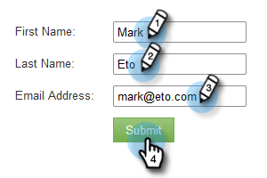

# Respuesta automática de correo electrónico {#email-auto-response}

## Misión: Enviar un correo electrónico de agradecimiento cuando una persona rellene un formulario {#mission-send-out-a-thank-you-email-when-a-person-fills-out-a-form}

>[!PREREQUISITES]
>
>* [Configurar y agregar una persona](/help/marketo/getting-started/quick-wins/get-set-up-and-add-a-person.md){target="_blank"}
>* [Página de aterrizaje con un formulario](/help/marketo/getting-started/quick-wins/landing-page-with-a-form.md){target="_blank"}

## Paso 1: Crear un correo electrónico {#step-create-an-email}

1. Vaya al área de **[!UICONTROL Actividades de mercadotecnia]**.

   

1. Seleccione su programa en el menú de la izquierda, haga clic en la lista desplegable **[!UICONTROL Nuevo]** y seleccione **[!UICONTROL Nuevo recurso local]**.

   

1. Seleccione **[!UICONTROL Correo electrónico]**.

   

1. Asigne un nombre al correo electrónico &quot;Correo electrónico de respuesta automática&quot;, elija una plantilla y haga clic en **[!UICONTROL Crear]**.

   

   Se abrirá un editor de correo electrónico en una nueva ventana o pestaña. Si los elementos emergentes están bloqueados, haga clic en **[!UICONTROL Editar borrador]** en la página de resumen de recursos para acceder al correo electrónico.

1. Introduzca una línea de asunto y haga doble clic en el área editable del correo electrónico.

   

   _Se abrirá un editor de texto enriquecido en la parte superior del editor de correo electrónico._

1. Resaltar el contenido de correo electrónico existente.

   

1. Escriba el contenido del correo electrónico y haga clic en **[!UICONTROL Guardar]**.

   

1. Haga clic en el menú desplegable **[!UICONTROL Acciones de correo electrónico]** y seleccione **[!UICONTROL Aprobar y cerrar]**.

   

## Paso 2: Crear una campaña inteligente {#step-create-a-smart-campaign}

1. Seleccione su programa, haga clic en el menú desplegable **[!UICONTROL Nuevo]** y seleccione **[!UICONTROL Nueva campaña inteligente]**.

   

1. **Asigne un nombre** a la campaña inteligente &quot;Campaña de respuesta automática&quot; y haga clic en **[!UICONTROL Crear]**.

   

1. Vaya a la ficha **[!UICONTROL Lista inteligente]**.

   

   Estamos configurando esta campaña para que se ejecute cada vez que una persona rellene el formulario que creó en [**Página de aterrizaje con un formulario**](/help/marketo/getting-started/quick-wins/landing-page-with-a-form.md){target="_blank"}.

1. Busque y arrastre el déclencheur **[!UICONTROL Rellena formulario]** al lienzo.

   

1. Seleccione **[!UICONTROL Mi formulario]** en la lista desplegable. Luego haga clic en la ficha **[!UICONTROL Flujo]**.

   

1. Arrastre la acción de flujo **[!UICONTROL Enviar correo electrónico]** al lienzo izquierdo.

   

1. Seleccione su **correo electrónico de respuesta automática**. Luego haga clic en la ficha **[!UICONTROL Programar]**.

   

1. Haga clic en **[!UICONTROL Editar]**.

   

1. Seleccione **[!UICONTROL cada vez]** y haga clic en **[!UICONTROL Guardar]**.

   

1. Haga clic en **[!UICONTROL Activar]**.

   

1. Haz clic en **[!UICONTROL Activar]** en la pantalla de confirmación.

   

>[!NOTE]
>
>Una vez activa, esta campaña se ejecutará cada vez que una persona rellene el formulario especificado. La campaña se seguirá ejecutando hasta que se desactive.

## Paso 3: Rellenar el formulario {#step-fill-out-the-form}

1. Seleccione **Mi página** (se creó en la [página de aterrizaje con una ganancia rápida de Form](/help/marketo/getting-started/quick-wins/landing-page-with-a-form.md){target="_blank"}) y haga clic en **[!UICONTROL Vista previa]**.

   

   _Su página de aterrizaje de &quot;Prueba gratuita&quot; se abrirá en una nueva pestaña._

1. Rellene el formulario con su nombre, apellidos y dirección de correo electrónico y, a continuación, haga clic en **[!UICONTROL Enviar]**.

   

>[!NOTE]
>
>Asegúrese de utilizar su dirección de correo electrónico real para poder obtener el correo electrónico.

## Misión finalizada {#mission-complete}

En solo unos minutos, debería ver el correo electrónico de respuesta automática en su bandeja de entrada. ¡Buen trabajo!

  

[◄ Misión 3: Puntuación simple](/help/marketo/getting-started/quick-wins/simple-scoring.md)

[Misión 5: Importar una lista de personas ►](/help/marketo/getting-started/quick-wins/import-a-list-of-people.md)
