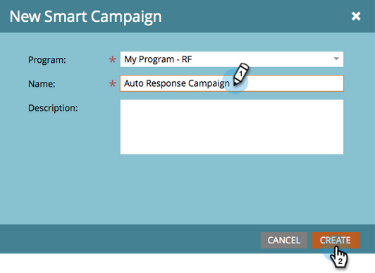

# Respuesta automática de correo electrónico {#email-auto-response}

## Misión: Enviar un correo electrónico de agradecimiento cuando una persona rellene un formulario {#mission-send-out-a-thank-you-email-when-a-person-fills-out-a-form}

>[!PREREQUISITES]
>
>* [Configurar y agregar una persona](/help/marketo/getting-started/quick-wins/get-set-up-and-add-a-person.md){target=&quot;_blank&quot;}
>* [Página de aterrizaje con un formulario](/help/marketo/getting-started/quick-wins/landing-page-with-a-form.md){target=&quot;_blank&quot;}

## Paso 1: Crear un correo electrónico {#step-create-an-email}

1. Vaya al área Actividades de marketing .

   

1. Seleccione el programa en el menú de la izquierda, haga clic en el botón **Nuevo** y seleccione **Nuevo recurso local**.

   

1. Select **Correo electrónico**.

   

1. Asigne un nombre al correo electrónico &quot;Correo electrónico de respuesta automática&quot;, elija una plantilla y haga clic en **Crear**.

   

   Se abrirá un editor de correo electrónico en una nueva ventana o pestaña. Si las ventanas emergentes están bloqueadas, haga clic en **Editar borrador** en la página de resumen de recursos para acceder al correo electrónico.

1. Introduzca una línea de asunto y, a continuación, haga doble clic en el área editable del correo electrónico.

   

   _Se abrirá un editor de texto enriquecido sobre el editor de correo electrónico._

1. Resalte el contenido de correo electrónico existente.

   

1. Escriba el contenido del correo electrónico y haga clic en **Guardar**.

   

1. Haga clic en el **Acciones de correo electrónico** y seleccione **Aprobar y cerrar**.

   

## Paso 2: Creación de una campaña inteligente {#step-create-a-smart-campaign}

1. Seleccione el programa y haga clic en el botón **Nuevo** y seleccione **Nueva campaña inteligente**.

   

1. **Nombre** su campaña inteligente &quot;Campaña de respuesta automática&quot; y haga clic en **Crear**.

   

1. Vaya a la **Lista inteligente** pestaña .

   

   Estamos configurando esta campaña para que se ejecute siempre que una persona rellene el formulario que ha creado en [**Página de aterrizaje con un formulario**](/help/marketo/getting-started/quick-wins/landing-page-with-a-form.md){target=&quot;_blank&quot;}.

1. Busque y arrastre el **Rellena el formulario** déclencheur al lienzo.

   

1. Select **Mi formulario** en la lista desplegable . A continuación, haga clic en el **Flujo** pestaña .

   

1. Arrastre el **Enviar correo electrónico** acción de flujo al lienzo izquierdo.

   

1. Seleccione su **Correo electrónico de respuesta automática**. A continuación, haga clic en el **Programación** pestaña .

   

1. Haga clic en **Editar**.

   

1. Select **Cada vez** y haga clic en **Guardar**.

   

1. Haga clic en **Activar**.

   

1. Haga clic en **Activar** en la pantalla de confirmación.

   

>[!NOTE]
>
>Una vez activa, esta campaña se ejecutará cada vez que una persona rellene el formulario especificado. La campaña seguirá ejecutándose hasta que se desactive.

## Paso 3: Rellenar el formulario {#step-fill-out-the-form}

1. Select **Mi página** (se creó en la variable [Página de aterrizaje con un formulario](/help/marketo/getting-started/quick-wins/landing-page-with-a-form.md){target=&quot;_blank&quot;} win rápido) y haga clic en **Vista previa**.

   

   _La página de aterrizaje &quot;Prueba gratuita&quot; se abrirá en una pestaña nueva._

1. Rellene el formulario con su nombre, apellidos y dirección de correo electrónico y, a continuación, haga clic en **Submit**.

   

>[!NOTE]
>
>Asegúrese de utilizar su dirección de correo electrónico real para obtener el correo electrónico.

## Misión finalizada {#mission-complete}

En solo unos minutos debería ver el correo electrónico de respuesta automática en su bandeja de entrada. ¡bueno trabajo!

  

[◄ Misión 3: Puntuación simple](/help/marketo/getting-started/quick-wins/simple-scoring.md)

[Misión 5: Importar una lista de personas ►](/help/marketo/getting-started/quick-wins/import-a-list-of-people.md)
