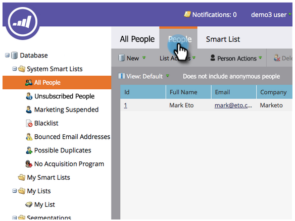

# Configurar y agregar una persona {#get-set-up-and-add-a-person}

Hay algunas cosas que hacer antes de comenzar las misiones.

## Paso 1: Inicio de sesión en Marketo {#step-log-in-to-marketo}

1. [Inicie sesión en ](https://app.marketo.com) Marketing Cloud con las credenciales recibidas por correo electrónico.

   

## Paso 2: Crear una carpeta de aprendizaje {#step-create-a-learning-folder}

Creemos una carpeta para guardar todo lo que hagan en las misiones.

1. Vaya al área **Marketing Activities** .

   

1. Haga clic en la lista desplegable **New** y seleccione **New Campaign Folder**.

   

1. Asigne un nombre a la carpeta &quot;Aprendizaje&quot; y haga clic en **Crear**.

   

1. Verá que la nueva carpeta Aprendizaje aparece en el menú de la izquierda.

   

## Paso 3: Añádase a usted mismo como persona {#step-add-yourself-as-a-person}

Añádese como persona en Marketo para poder enviarse correos electrónicos de prueba más tarde.

1. Vaya al área **Database**.

   

1. Haga clic en la lista desplegable **New** y seleccione **New Person**.

   

1. Escriba su nombre y apellidos, dirección de correo electrónico y nombre de la empresa y, a continuación, haga clic en **Crear** para agregarse como persona.

   

1. Para ver a sus usuarios, abra las Listas inteligentes del sistema en el menú de la izquierda y, a continuación, haga clic en Todas las personas.

   

1. Haga clic en la pestaña **People**. Debería verse en la base de datos.

   

## Configuración completa {#set-up-complete}

¡Estás listo para empezar tu primera misión!

  

[Misión 1: Enviar un mensaje de correo electrónico después de ►](/help/marketo/getting-started/quick-wins/send-an-email.md)
