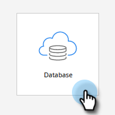

# Configuración y adición de una persona {#get-set-up-and-add-a-person}

Hay algunas cosas que hacer antes de comenzar las misiones.

## Paso 1: Inicie sesión en Marketo Engage {#step-log-in-to-marketo}

1. [Inicie sesión en Marketo Engage](https://app.marketo.com){target="_blank"} con las credenciales que recibió por correo electrónico.

   

## Paso 2: Cree una carpeta de aprendizaje {#step-create-a-learning-folder}

Vamos a crear una carpeta para guardar todo lo que haga en las misiones.

1. Vaya al área **[!UICONTROL Actividades de marketing]**.

   

1. Haga clic en el menú desplegable **[!UICONTROL Nuevo]** y seleccione **[!UICONTROL Nueva carpeta de campaña]**.

   

1. Asigne a la carpeta el nombre “Aprendizaje” y haga clic en **[!UICONTROL Crear]**.

   

1. Verá la nueva carpeta de aprendizaje en el menú de la izquierda.

   

## Paso 3: Añádase como persona {#step-add-yourself-as-a-person}

Añádase como persona en Marketo para poder enviarse correos electrónicos de prueba más adelante.

1. Vaya al área **[!UICONTROL Base de datos]**.

   

1. Haga clic en el menú desplegable **[!UICONTROL Nuevo]** y seleccione **[!UICONTROL Nueva persona]**.

   

1. Escriba su nombre y apellidos, dirección de correo electrónico y nombre de empresa, luego haga clic en **[!UICONTROL Crear]** para añadirse como persona.

   

   >[!CAUTION]
   >
   >* Asegúrese de que las direcciones de correo electrónico solo contienen caracteres ASCII.
   >
   >* Marketo **no** admite direcciones de correo electrónico que contengan emojis.

1. Para ver a sus personas, abra sus [!UICONTROL Listas inteligentes del sistema] en el menú de la izquierda y luego haga clic en **[!UICONTROL Todas las personas]**.

   

1. Haga clic en la pestaña **[!UICONTROL Personas]**. Debería verse en la base de datos.

   

## Configuración completa {#set-up-complete}

Está listo para comenzar su primera misión.

  

[Misión 1: Enviar correos electrónicos de forma masiva ►](/help/marketo/getting-started/quick-wins/send-an-email.md)
