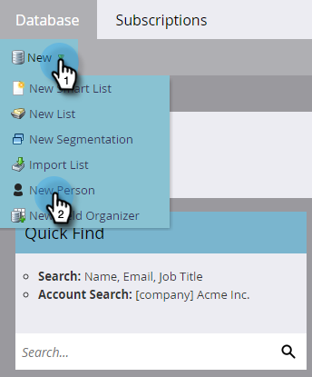
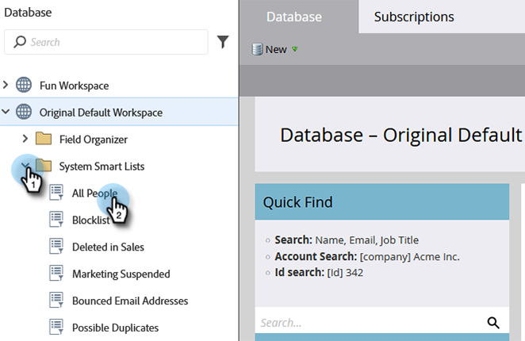

# Configuración y adición de una persona {#get-set-up-and-add-a-person}

Hay algunas cosas que hacer antes de comenzar las misiones.

## Paso 1: Inicio de sesión en Marketo {#step-log-in-to-marketo}

1. [Iniciar sesión en Marketo](https://app.marketo.com){target="_blank"} usando las credenciales que recibió por correo electrónico.

   

## Paso 2: Crear una carpeta de aprendizaje {#step-create-a-learning-folder}

Vamos a crear una carpeta para guardar todo lo que hagas en las misiones.

1. Vaya a la **[!UICONTROL Actividades de marketing]** área.

   

1. Haga clic en **[!UICONTROL Nuevo]** y seleccione. **[!UICONTROL Nueva carpeta de campaña]**.

   

1. Asigne a la carpeta el nombre &quot;Aprendizaje&quot; y haga clic en **[!UICONTROL Crear]**.

   

1. Verá la nueva carpeta de aprendizaje en el menú de la izquierda.

   

## Paso 3: Añádase como persona {#step-add-yourself-as-a-person}

Añádase como persona en Marketo para poder enviarse correos electrónicos de prueba más adelante.

1. Vaya a la **[!UICONTROL Base de datos]** área.

   

1. Haga clic en **[!UICONTROL Nuevo]** y seleccione. **[!UICONTROL Nueva persona]**.

   

1. Escriba su nombre y apellidos, dirección de correo electrónico y nombre de la empresa y haga clic en **[!UICONTROL Crear]** para agregarse como persona.

   

   >[!CAUTION]
   >
   >Marketo lo hace **no** admite direcciones de correo electrónico que contengan emojis.

1. Para ver a los usuarios, abra su [!UICONTROL Listas inteligentes del sistema] en el menú de la izquierda, haga clic en **[!UICONTROL Todas las personas]**.

   

1. Haga clic en **[!UICONTROL People]** pestaña. Debería verse en la base de datos.

   

## Configuración completada {#set-up-complete}

¡Estás listo para comenzar tu primera misión!

  

[Misión 1: Enviar una ► de ráfaga de correo electrónico](/help/marketo/getting-started/quick-wins/send-an-email.md)
