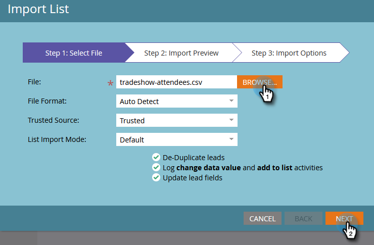

# Importar una lista de personas {#import-a-list-of-people}

## Misión: Importar una hoja de cálculo de los asistentes a los espectáculos comerciales en la base de datos {#mission-import-a-spreadsheet-list-of-trade-show-attendees-into-your-database}

>[!PREREQUISITES]
>
>[Configurar y agregar una persona](/help/marketo/getting-started/quick-wins/get-set-up-and-add-a-person.md){target=&quot;_blank&quot;}

En este tutorial, aprenderá a importar personas de un archivo de hoja de cálculo en Marketo.

## Paso 1: Descargar y editar una hoja de cálculo {#step-download-and-edit-a-spreadsheet}

1. Para empezar, descargue nuestro archivo de hoja de cálculo de prácticas ([**discursos-asistentes.csv**](/help/marketo/getting-started/assets/tradeshow-attendees.csv){target=&quot;_blank&quot;}) en el equipo.

   

   >[!NOTE]
   >
   >Al importar una fecha, use este formato: **21/9/20** (Mes/Día/Año).

   >[!NOTE]
   >
   >Cualquier campo de fecha y hora que se importe se tratará como Hora central. Si tiene campos de fecha y hora en un huso horario diferente, puede utilizar una fórmula de Excel para transformarla a la hora central (América/Chicago).

1. Añada su propio nombre, apellido, dirección de correo electrónico real (para que pueda recibir los correos electrónicos de formación que enviará en la próxima misión) y el puesto que ocupa. Guarde el archivo en el equipo.

   

   >[!CAUTION]
   >
   >Marketo sí **not** admiten direcciones de correo electrónico que contienen emojis.

## Paso 2: Crear un programa {#step-create-a-program}

1. Vaya a la **Actividades de marketing** .

   

1. Seleccione su **Aprendizaje** carpeta, luego debajo de **Nuevo** click **Nuevo programa**.

   

1. **Nombre** el programa &quot;My Tradeshow Program&quot; y seleccione &quot;Event&quot; para el **Tipo de programa**.

   

1. Select **Programa comercial** para el **Canal** y haga clic en **Crear**.

   

>[!NOTE]
>
>Los programas de eventos se producen en fechas específicas. Más información sobre [**Eventos**](/help/marketo/product-docs/demand-generation/events/understanding-events/understanding-event-programs.md){target=&quot;_blank&quot;}.

## Paso 3: Importar la hoja de cálculo en Marketo {#step-import-your-spreadsheet-into-marketo}

1. En **Mi programa de exhibición comercial**, haga clic en **Nuevo** y seleccione **Nuevo recurso local**.

   

1. Select **Lista**.

   

1. **Nombre** la lista &quot;Asistentes a la feria comercial&quot; y haga clic en **Crear**.

   

1. En **Asistentes a la feria comercial** lista, haga clic en **Acciones de lista** y seleccione **Lista de importación**.

   

   >[!CAUTION]
   >
   >Si utiliza su propio archivo CSV, asegúrese de que está codificado en UTF-8, UTF-16, Shift-JIS o EUC-JP.

   >[!NOTE]
   >
   >El límite de tamaño para los archivos CSV es de 100 MB.

1. **Examinar** a **discursos-asistentes.csv** en el equipo y haga clic en **Siguiente**.

   

   >[!NOTE]
   >
   >En el modo de importación de lista, elija **Omitir nuevas personas y actualizaciones** significa que no afectará a los registros de personas existentes ni registrará ninguna actividad. Utilice este modo si desea una lista estática rápida y prefiltrada de personas existentes para utilizarla en sus actividades de marketing. Al seleccionar este modo:
   >
   > * Omitir la creación de nuevas personas
   > * Omitir actualizaciones de campos de persona
   > * Omitir el registro de actividades

1. Asigne los campos de la columna de lista a sus respectivos campos de Marketo y haga clic en **Siguiente**.

   

   >[!TIP]
   >
   >Los encabezados de columna siempre deben coincidir exactamente con el campo (con distinción de mayúsculas y minúsculas) para lograr los mejores resultados de asignación automática. Si está utilizando campos personalizados y no los ve en la lista desplegable, vuelva atrás y [créelos](/help/marketo/product-docs/administration/field-management/create-a-custom-field-in-marketo.md){target=&quot;_blank&quot;} para que puedan convertirse en opciones.

   >[!NOTE]
   >
   >Si hay campos que no desea importar, seleccione **Ignorar** en el menú desplegable Campo de Marketo .

1. Select **Mi programa de exhibición comercial** para el **Programa de adquisición** y haga clic en **Importar**.

   

1. Espere a que las personas se importen y cierre la ventana emergente de progreso de importación.

   

1. Volver **Mi programa de exhibición comercial**, haga clic en **Miembros** pestaña . Verán a todas las personas que acaban de importar.

   

>[!NOTE]
>
>Puede analizar el éxito del programa realizando un seguimiento de la pertenencia a este. Más información sobre [**Programas**](/help/marketo/product-docs/core-marketo-concepts/programs/creating-programs/understanding-programs.md){target=&quot;_blank&quot;}.

## Misión finalizada {#mission-complete}

¡Sus asistentes a la feria comercial ahora son miembros de su programa de Marketo!

  

[◄ Misión 4: Respuesta automática de correo electrónico](/help/marketo/getting-started/quick-wins/email-auto-response.md)

[Misión 6: Perforación, Perforación, Enfermedad ►](/help/marketo/getting-started/quick-wins/drip-drip-nurture.md)
