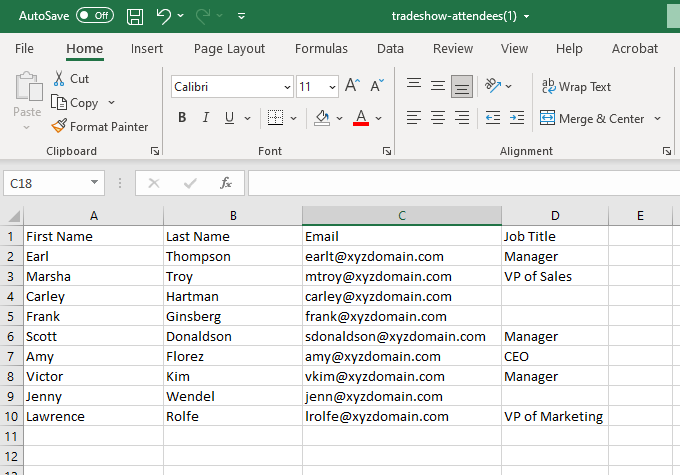
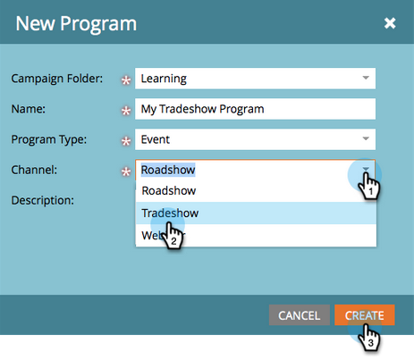

# Importar una lista de personas {#import-a-list-of-people}

## Misión: importar una hoja de cálculo de la lista de asistentes a la feria en la base de datos {#mission-import-a-spreadsheet-list-of-trade-show-attendees-into-your-database}

>[!PREREQUISITES]
>
>[Configurar y agregar una persona](/help/marketo/getting-started/quick-wins/get-set-up-and-add-a-person.md){target="_blank"}

En este tutorial, aprenderá a importar personas de un archivo de hoja de cálculo a Marketo.

## Paso 1: Descargar y editar una hoja de cálculo {#step-download-and-edit-a-spreadsheet}

1. Para empezar, descargue nuestro archivo de hoja de cálculo de prácticas ([**tradeshow-attendees.csv**](/help/marketo/getting-started/assets/tradeshow-attendees.csv){target="_blank"}) en su equipo.

   

   >[!NOTE]
   >
   >Al importar una fecha, use este formato: **21/9/20** (mes/día/año).

   >[!NOTE]
   >
   >Los campos de fecha y hora que se importen se tratarán como Hora central. Si tiene campos de fecha y hora en una zona horaria diferente, puede utilizar una fórmula de Excel para transformarla a la hora central (América/Chicago).

1. Agregue su propio nombre, apellidos, dirección de correo electrónico real (para que pueda recibir los correos electrónicos nutritivos que enviará en la próxima misión) y cargo. Guarde el archivo en el equipo.

   

   >[!CAUTION]
   >
   >* Asegúrese de que las direcciones de correo electrónico solo contienen caracteres ASCII.
   >
   >* Marketo **no** admite direcciones de correo electrónico que contengan emojis.
   >
   >* La importación de `NULL` valores mediante CSV podría generar un &quot;cambio de valor de datos&quot; para los campos numéricos en el [registro de actividad](/help/marketo/product-docs/core-marketo-concepts/smart-lists-and-static-lists/managing-people-in-smart-lists/locate-the-activity-log-for-a-person.md){target="_blank"} de una persona, _incluso si los campos ya están en blanco_. Si tiene [Campañas inteligentes](/help/marketo/product-docs/core-marketo-concepts/smart-campaigns/understanding-smart-campaigns.md){target="_blank"} que usan el déclencheur &quot;Valor de datos cambiado&quot; o &quot;Cambios en el valor de datos&quot;, podría hacer que las personas califiquen para esas campañas aunque los datos no estén cambiando realmente. Puede usar [restricciones](/help/marketo/product-docs/core-marketo-concepts/smart-lists-and-static-lists/using-smart-lists/add-a-constraint-to-a-smart-list-filter.md){target="_blank"} para asegurarse de que nadie cumpla los requisitos para esas campañas tras la importación.

## Paso 2: Crear un programa {#step-create-a-program}

1. Vaya al área de **[!UICONTROL Actividades de mercadotecnia]**.

   

1. Seleccione su carpeta **Aprendizaje** y, a continuación, en **[!UICONTROL Nuevo]** haga clic en **[!UICONTROL Nuevo programa]**.

   

1. **Nombre** el programa &quot;Mi programa de feria comercial&quot; y selecciona &quot;Evento&quot; para el **[!UICONTROL Tipo de programa]**.

   

1. Seleccione **[!UICONTROL Feria comercial]** para el **[!UICONTROL Canal]** y haga clic en **[!UICONTROL Crear]**.

   

>[!NOTE]
>
>Los programas de eventos se producen en fechas específicas. Más información sobre [**Eventos**](/help/marketo/product-docs/demand-generation/events/understanding-events/understanding-event-programs.md){target="_blank"}.

## Paso 3: Importar la hoja de cálculo en Marketo {#step-import-your-spreadsheet-into-marketo}

1. En **Mi programa para ferias**, haga clic en **[!UICONTROL Nuevo]** y seleccione **[!UICONTROL Nuevo recurso local]**.

   

1. Seleccione **[!UICONTROL Lista]**.

   

1. **Nombre** la lista &quot;Asistentes a la feria comercial&quot; y haga clic en **[!UICONTROL Crear]**.

   

1. En tu lista de **[!UICONTROL asistentes a la feria comercial]**, haz clic en **[!UICONTROL Acciones de lista]** y selecciona **[!UICONTROL Importar lista]**.

   

   >[!CAUTION]
   >
   >Si utiliza su propio archivo CSV, asegúrese de que esté codificado en UTF-8, UTF-16, Shift-JIS o EUC-JP.

   >[!NOTE]
   >
   >El límite de tamaño para los archivos CSV es de 100 MB.

1. **[!UICONTROL Examine]** el archivo de hoja de cálculo **tradeshow-attendees.csv** de su equipo y haga clic en **[!UICONTROL Siguiente]**.

   

   >[!NOTE]
   >
   >En el modo de importación de lista, elegir **[!UICONTROL Omitir nuevas personas y actualizaciones]** significa que no afectará los registros de personas existentes ni registrará ninguna actividad. Utilice este modo si desea una lista estática rápida y prefiltrada de personas existentes para utilizarla en sus actividades de marketing. Si selecciona este modo:
   >
   > * Omitir creación de nueva persona
   > * Omitir actualizaciones de los campos de personas
   > * Omitir el registro de actividades

1. Asigne sus campos de [!UICONTROL Columna de lista] a sus respectivos campos de Marketo y haga clic en **[!UICONTROL Siguiente]**.

   

   >[!TIP]
   >
   >Los encabezados de columna siempre deben coincidir exactamente con el campo (con distinción de mayúsculas y minúsculas) para lograr los mejores resultados de asignación automática. Si usa campos personalizados y no los ve en la lista desplegable, vuelva atrás y [créelos](/help/marketo/product-docs/administration/field-management/create-a-custom-field-in-marketo.md){target="_blank"} para que se conviertan en opciones.

   >[!NOTE]
   >
   >Si hay campos que no desea importar, seleccione **Ignorar** en el menú desplegable Campo de Marketo.

1. Seleccione **Mi programa de feria comercial** para el **[!UICONTROL Programa de adquisición]** y luego haga clic en **[!UICONTROL Importar]**.

   

1. Espere a que sus recursos se importen y cierre la ventana emergente de progreso de la importación.

   

1. Cuando vuelva a **Mi programa de feria comercial**, haga clic en la ficha **[!UICONTROL Miembros]**. Ves a todas las personas que acabas de importar.

   

>[!NOTE]
>
>Puede analizar el éxito de su programa mediante el seguimiento de la pertenencia al programa. Más información sobre [**Programas**](/help/marketo/product-docs/core-marketo-concepts/programs/creating-programs/understanding-programs.md){target="_blank"}.

## Misión finalizada {#mission-complete}

Los asistentes a la feria ya son miembros de su programa de Marketo.

  

[◄ Misión 4: Respuesta automática de correo electrónico](/help/marketo/getting-started/quick-wins/email-auto-response.md)

[Misión 6: Goteo, Goteo, Nutrir ►](/help/marketo/getting-started/quick-wins/drip-drip-nurture.md)
