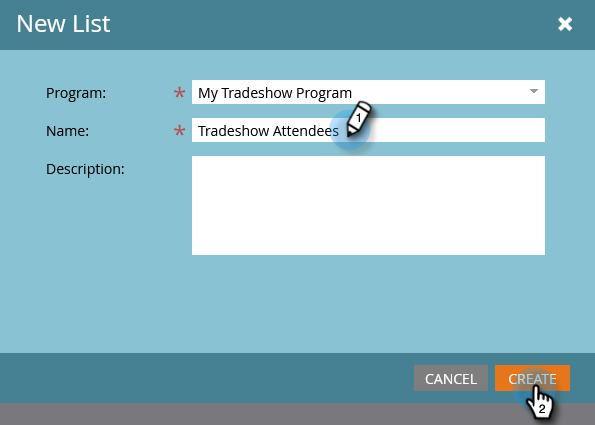

# Importar una lista de personas {#import-a-list-of-people}

## Misión: importar una hoja de cálculo de la lista de asistentes a la feria en la base de datos {#mission-import-a-spreadsheet-list-of-trade-show-attendees-into-your-database}

>[!PREREQUISITES]
>
>[Configuración y adición de una persona](/help/marketo/getting-started/quick-wins/get-set-up-and-add-a-person.md){target="_blank"}

En este tutorial, aprenderá a importar personas de un archivo de hoja de cálculo a Marketo.

## Paso 1: Descargar y editar una hoja de cálculo {#step-download-and-edit-a-spreadsheet}

1. Para empezar, descargue nuestro archivo de hoja de cálculo de prácticas ([**tradeshow-attendees.csv**](/help/marketo/getting-started/assets/tradeshow-attendees.csv){target="_blank"}) a su equipo.

   

   >[!NOTE]
   >
   >Al importar una fecha, utilice este formato: **21/09/20** (Mes/Día/Año).

   >[!NOTE]
   >
   >Los campos de fecha y hora que se importen se tratarán como Hora central. Si tiene campos de fecha y hora en una zona horaria diferente, puede utilizar una fórmula de Excel para transformarla a la hora central (América/Chicago).

1. Agregue su propio nombre, apellidos, dirección de correo electrónico real (para que pueda recibir los correos electrónicos nutritivos que enviará en la próxima misión) y cargo. Guarde el archivo en el equipo.

   

   >[!CAUTION]
   >
   >Marketo lo hace **no** admite direcciones de correo electrónico que contengan emojis.

## Paso 2: Crear un programa {#step-create-a-program}

1. Vaya a la **[!UICONTROL Actividades de marketing]** área.

   

1. Seleccione su **Aprendizaje** carpeta, luego en **[!UICONTROL Nuevo]** click **[!UICONTROL Nuevo programa]**.

   

1. **Nombre** Seleccione el programa &quot;Mi programa de feria comercial&quot; y seleccione &quot;Evento&quot; para la **[!UICONTROL Tipo de programa]**.

   

1. Seleccionar **[!UICONTROL Feria]** para el **[!UICONTROL Canal]** y haga clic en **[!UICONTROL Crear]**.

   

>[!NOTE]
>
>Los programas de eventos se producen en fechas específicas. Más información sobre [**Eventos**](/help/marketo/product-docs/demand-generation/events/understanding-events/understanding-event-programs.md){target="_blank"}.

## Paso 3: Importar la hoja de cálculo en Marketo {#step-import-your-spreadsheet-into-marketo}

1. Entrada **Mi programa de ferias**, haga clic en **[!UICONTROL Nuevo]** y seleccione **[!UICONTROL Nuevo recurso local]**.

   

1. Seleccionar **[!UICONTROL Lista]**.

   

1. **Nombre** Seleccione la lista &quot;Asistentes a la feria&quot; y haga clic en **[!UICONTROL Crear]**.

   

1. En su **[!UICONTROL Asistentes a feria]** , haga clic en **[!UICONTROL Enumerar acciones]** y seleccione **[!UICONTROL Importar lista]**.

   

   >[!CAUTION]
   >
   >Si utiliza su propio archivo CSV, asegúrese de que esté codificado en UTF-8, UTF-16, Shift-JIS o EUC-JP.

   >[!NOTE]
   >
   >El límite de tamaño para los archivos CSV es de 100 MB.

1. **[!UICONTROL Examinar]** a la **tradeshow-attendees.csv** archivo de hoja de cálculo del equipo y haga clic en **[!UICONTROL Siguiente]**.

   

   >[!NOTE]
   >
   >En el modo de importación de lista, seleccione **[!UICONTROL Omitir personas nuevas y actualizaciones]** significa que no afectará a los registros de personas existentes ni registrará actividades. Utilice este modo si desea una lista estática rápida y prefiltrada de personas existentes para utilizarla en sus actividades de marketing. Si selecciona este modo:
   >
   > * Omitir creación de nueva persona
   > * Omitir actualizaciones de campo de persona
   > * Omitir el registro de actividades

1. Asigne su [!UICONTROL Columna de lista] a sus respectivos campos de Marketo y haga clic en **[!UICONTROL Siguiente]**.

   

   >[!TIP]
   >
   >Los encabezados de columna siempre deben coincidir exactamente con el campo (con distinción de mayúsculas y minúsculas) para lograr los mejores resultados de asignación automática. Si utiliza campos personalizados y no los ve en la lista desplegable, vuelva atrás y [crearlos](/help/marketo/product-docs/administration/field-management/create-a-custom-field-in-marketo.md){target="_blank"} para que puedan convertirse en opciones.

   >[!NOTE]
   >
   >Si hay campos que no desea importar, seleccione **Ignorar** en el menú desplegable Marketo Field.

1. Seleccionar **Mi programa de ferias** para el **[!UICONTROL Programa de adquisición]**, luego haga clic en **[!UICONTROL Importar]**.

   

1. Espere a que sus recursos se importen y cierre la ventana emergente de progreso de la importación.

   

1. Volver a entrar **Mi programa de ferias**, haga clic en **[!UICONTROL Miembros]** pestaña. Verá a todas las personas que acaba de importar.

   

>[!NOTE]
>
>Puede analizar el éxito de su programa mediante el seguimiento de la pertenencia al programa. Más información sobre [**Programas**](/help/marketo/product-docs/core-marketo-concepts/programs/creating-programs/understanding-programs.md){target="_blank"}.

## Misión finalizada {#mission-complete}

Los asistentes a la feria ya son miembros de su programa de Marketo.

  

[◄ Misión 4: Respuesta automática de correo electrónico](/help/marketo/getting-started/quick-wins/email-auto-response.md)

[Misión 6: Goteo, Goteo, Nutrir ►](/help/marketo/getting-started/quick-wins/drip-drip-nurture.md)
