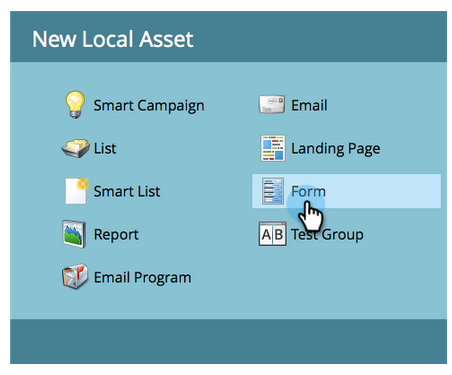
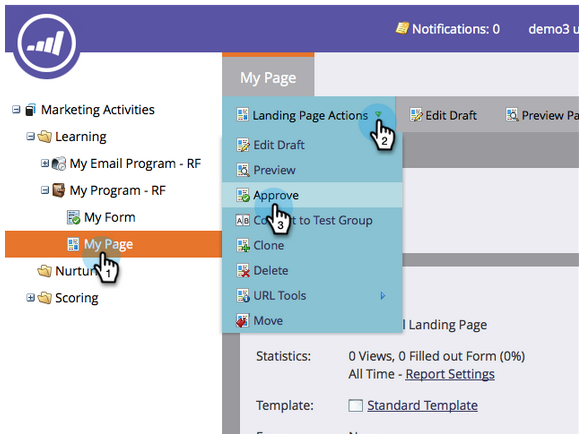

# Página de aterrizaje con un formulario {#landing-page-with-a-form}

## Misión: Cree una página de aterrizaje con un formulario para adquirir nuevas personas. {#mission-create-a-landing-page-with-a-form-to-acquire-new-people}

>[!PREREQUISITES]
>
>[Configurar y agregar una persona](/help/marketo/getting-started/quick-wins/get-set-up-and-add-a-person.md)

## PASO 1: Crear un programa {#step-create-a-program}

1. Vaya al área **Marketing Activities** .

   

1. Seleccione la carpeta **Learning** creada en la [anterior rápida win](/help/marketo/getting-started/quick-wins/send-an-email.md).

   

1. En **Nuevo**, haga clic en **Nuevo programa**.

   

1. Introduzca un programa **Name**, seleccione un **Channel** y haga clic en **Crear**.

   >[!NOTE]
   >
   >Incluya sus iniciales al final del Nombre del programa para que sea único.

   

   >[!NOTE]
   >
   >Un programa es una iniciativa de marketing específica. El **canal** está diseñado para ser el mecanismo de envío, como seminario web, patrocinio o publicidad en línea. Puede ver diferentes opciones de canal en la lista desplegable, según lo que esté disponible en su propia instancia. También puede [crear su propio canal](/help/marketo/product-docs/administration/tags/create-a-program-channel.md).

   

¡Bien hecho! Ahora que hemos creado un programa, sigamos adelante y creemos algo de contenido.

## PASO 2: Crear un formulario {#step-create-a-form}

1. Con el programa seleccionado, haga clic en **Nuevo** y luego en **Nuevo recurso local**.

   

1. Seleccione **Formulario**.

   

1. Introduzca un formulario **Name** y haga clic en **Create**.

   

   >[!NOTE]
   >
   >Asegúrese de que la casilla **Open in editor** esté marcada. Si no es así, deberá hacer clic en la pestaña **Editar formulario**.

   >[!TIP]
   >
   >¿No ve el editor de formularios? Es probable que el navegador haya bloqueado la ventana. Habilite las ventanas emergentes de [app.marketo.com](https://app.marketo.com/) en el explorador y haga clic en Editar borrador en la barra de menú superior.

1. Seleccione el campo **Email Address** y marque **Is Required**.

   

1. Haga clic en **Siguiente**.

   

1. Haga clic en las flechas para desplazarse por los temas. Seleccione una.

   

1. Haga clic en **Siguiente**.

   

1. En la sección Página de agradecimiento , seleccione **URL externa** para **Seguimiento con**.

   

1. Introduzca la dirección URL.

   

   >[!NOTE]
   >
   >En la página de seguimiento se redirige al visitante después de rellenar el formulario. La URL externa es una opción, pero hay más. Consulte [Establecer una página de agradecimiento del formulario](/help/marketo/product-docs/demand-generation/forms/creating-a-form/set-a-form-thank-you-page.md).

1. Haga clic en **Finish**.

   

1. Haga clic en **Aprobar y cerrar**.

   

   ¡Super! Ahora tiene un programa con un formulario. Sigamos adelante y creemos una página.

   

## PASO 3: Crear una página de aterrizaje y agregar el formulario {#step-create-a-landing-page-and-add-your-form}

1. Con el programa seleccionado, haga clic en **Nuevo** y, a continuación, en **Nuevo recurso local**.

   

1. Seleccione **Landing Page**.

   

1. Introduzca una página **Name**, seleccione una plantilla y haga clic en **Create**.

   >[!NOTE]
   >
   >Puede que tengas una plantilla diferente a la de nuestra captura de pantalla, está bien, simplemente elige una y sigue adelante.

   

1. Una vez que se abra el editor de páginas de aterrizaje, arrastre el elemento Formulario al lienzo.

   

1. Busque y seleccione el formulario y haga clic en **Insert**.

   

1. Arrastre el formulario hasta la ubicación deseada.

   

1. Todos los cambios se guardan automáticamente. Cierre la pestaña o ventana del editor de formularios.

   

   ¡bueno trabajo! Ahora tiene una página de aterrizaje con un formulario en ella. Aprobemos su página para que se active.

## PASO 4: Aprobar la página de aterrizaje {#step-approve-your-landing-page}

1. Seleccione la página de aterrizaje, en **Landing Page Actions** haga clic en **Approve**.

   >[!NOTE]
   >
   >La aprobación de la página de aterrizaje la hará activa y estará disponible para el acceso a través de Internet.

   

   ¡Perfecto! ¿Ves la marca de verificación verde?

   

## PASO 5: Probar el formulario {#step-test-your-form}

1. Seleccione la página de aterrizaje y haga clic en **Ver página aprobada**.

   

1. Rellene el formulario con información que sepa que es única y haga clic en **Enviar**.

   

1. Vaya al área **Database**.

   

1. Busque la dirección de correo electrónico única que utilizó al rellenar el formulario.

   

   ¡Ahí está! Ha creado una nueva página de aterrizaje con un formulario en ella y la ha utilizado para generar una nueva persona.

   

## ¡Misión finalizada! {#mission-complete}

  

[◄ Enviar un mensaje de correo electrónico](/help/marketo/getting-started/quick-wins/send-an-email.md)

[Puntuación simple ►](/help/marketo/getting-started/quick-wins/simple-scoring.md)
