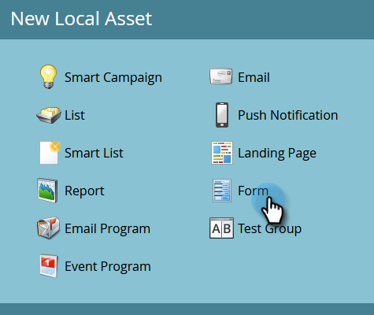
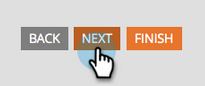

# Página de aterrizaje con un formulario {#landing-page-with-a-form}

## Misión: Cree una página de aterrizaje con un formulario para adquirir nuevas personas. {#mission-create-a-landing-page-with-a-form-to-acquire-new-people}

>[!PREREQUISITES]
>
>[Configurar y agregar una persona](/help/marketo/getting-started/quick-wins/get-set-up-and-add-a-person.md)

## PASO 1: Crear un programa {#step-create-a-program}

1. Vaya a la **Actividades de marketing** .

   

1. Seleccione el **Aprendizaje** carpeta creada en el [victoria rápida anterior](/help/marketo/getting-started/quick-wins/send-an-email.md){target=&quot;_blank&quot;}. En **Nuevo**, haga clic en **Nuevo programa**.

   

1. Introducir un programa **Nombre**, seleccione un **Canal** y haga clic en **Crear**.

   

   >[!TIP]
   >
   >Incluya sus iniciales al final del nombre del programa para que sea único.

   >[!NOTE]
   >
   >Un programa es una iniciativa de marketing específica. La variable **canal** está diseñado para ser el mecanismo de entrega, como seminario web, patrocinio o publicidad en línea. Puede ver diferentes opciones de canal en la lista desplegable, según lo que esté disponible en su propia instancia. También puede [crear su propio canal](/help/marketo/product-docs/administration/tags/create-a-program-channel.md){target=&quot;_blank&quot;}.

¡Bien hecho! Ahora que hemos creado un programa, sigamos adelante y creemos algo de contenido.

## PASO 2: Crear un formulario {#step-create-a-form}

1. Con el programa seleccionado, haga clic en el botón **Nuevo** y seleccione **Nuevo recurso local**.

   

1. Select **Formulario**.

   

1. Escribir un formulario **Nombre** y haga clic en **Crear**.

   

   >[!NOTE]
   >
   >Asegúrese de que la variable **Abrir en editor** está activada. Si no es así, tendrá que hacer clic en el **Editar formulario** pestaña .

   >[!TIP]
   >
   >¿No ve el editor de formularios? Es probable que el navegador haya bloqueado la ventana. Habilitar ventanas emergentes de `app.marketo.com` en el explorador y haga clic en Editar borrador en la barra de menú superior.

1. Seleccione el **Dirección de correo electrónico** campo y marcar **Es obligatorio**.

   

1. Haga clic en **Siguiente**.

   

1. Haga clic en las flechas para desplazarse por los temas. Seleccione una.

   

1. Haga clic en **Siguiente**.

   

1. En la sección Página de agradecimiento , seleccione **Dirección URL externa** para **Realizar el seguimiento con**.

   

1. Introduzca la dirección URL.

   

   >[!NOTE]
   >
   >En la página de seguimiento se redirige al visitante después de rellenar el formulario. La URL externa es una opción, pero hay más. Consulte [Establecer una página de agradecimiento de formulario](/help/marketo/product-docs/demand-generation/forms/creating-a-form/set-a-form-thank-you-page.md){target=&quot;_blank&quot;}.

1. Haga clic en **Finalizar**.

   

1. Haga clic en **Aprobar y cerrar**.

   

   ¡Excelente! Ahora tiene un programa con un formulario. Sigamos adelante y creemos una página.

## PASO 3: Crear una página de aterrizaje y agregar el formulario {#step-create-a-landing-page-and-add-your-form}

1. Con el programa seleccionado, haga clic en el botón **Nuevo** y seleccione **Nuevo recurso local**.

   

1. Select **Página de aterrizaje**.

   

1. Escriba una página **Nombre**, seleccione una plantilla y haga clic en **Crear**.

   >[!NOTE]
   >
   >Puede que tengas una plantilla diferente a la de nuestra captura de pantalla, está bien, simplemente elige una y sigue adelante.

   

1. Una vez que se abra el editor de páginas de aterrizaje, arrastre el elemento Formulario al lienzo.

   

1. Busque y seleccione el formulario y haga clic en **Insertar**.

   

1. Arrastre el formulario hasta la ubicación deseada.

   

1. Todos los cambios se guardan automáticamente. Cierre la pestaña o ventana del editor de formularios.

   

   ¡bueno trabajo! Ahora tiene una página de aterrizaje con un formulario en ella. Aprobemos su página para que se active.

## PASO 4: Aprobar la página de aterrizaje {#step-approve-your-landing-page}

1. Seleccione la página de aterrizaje y haga clic en **Aprobar borrador**.

   

   >[!NOTE]
   >
   >La aprobación de la página de aterrizaje la hará activa y estará disponible para el acceso a través de Internet.

   ¡Perfecto! ¿Ves la marca de verificación verde?

   

## PASO 5: Probar el formulario {#step-test-your-form}

1. Seleccione la página de aterrizaje y haga clic en **Ver página aprobada**.

   

1. Rellene el formulario con información que sepa que es única y haga clic en **Submit**.

   

1. Vaya a la **Base de datos** .

   

1. Busque la dirección de correo electrónico única que utilizó al rellenar el formulario.

   

   ¡Ahí está! Ha creado una nueva página de aterrizaje con un formulario en ella y la ha utilizado para generar una nueva persona.

   

## ¡Misión finalizada! {#mission-complete}

  

[◄ Misión 1: Enviar una explosión de correo electrónico](/help/marketo/getting-started/quick-wins/send-an-email.md)

[Misión 3: Puntuación simple ►](/help/marketo/getting-started/quick-wins/simple-scoring.md)
