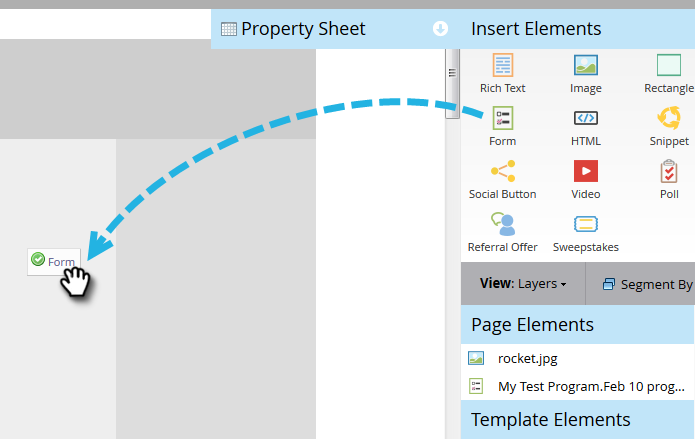

# Página de aterrizaje con un formulario {#landing-page-with-a-form}

## Misión: Crear una página de aterrizaje con un formulario para adquirir nuevas personas. {#mission-create-a-landing-page-with-a-form-to-acquire-new-people}

>[!PREREQUISITES]
>
>[Configurar y agregar una persona](/help/marketo/getting-started/quick-wins/get-set-up-and-add-a-person.md)

## PASO 1: Crear un programa {#step-create-a-program}

1. Vaya al área de **[!UICONTROL Actividades de mercadotecnia]**.

   

1. Seleccione la carpeta **Aprendizaje** creada en la [ganancia rápida anterior](/help/marketo/getting-started/quick-wins/send-an-email.md){target="_blank"}. En **[!UICONTROL Nuevo]**, haga clic en **[!UICONTROL Nuevo programa]**.

   

1. Escriba un programa **[!UICONTROL Name]**, seleccione un **[!UICONTROL canal]** y haga clic en **[!UICONTROL Crear]**.

   

   >[!TIP]
   >
   >Incluya sus iniciales al final del nombre del programa para que sea único.

   >[!NOTE]
   >
   >Un programa es una iniciativa de marketing específica. El **canal** está diseñado para ser el mecanismo de entrega, como seminario web, patrocinio o anuncio en línea. Puede ver diferentes opciones de canal en la lista desplegable, según lo que esté disponible en su propia instancia. También puedes [crear tu propio canal](/help/marketo/product-docs/administration/tags/create-a-program-channel.md){target="_blank"}.

¡Bien hecho! Ahora que hemos creado un programa, sigamos adelante y creemos contenido.

## PASO 2: Crear un formulario {#step-create-a-form}

1. Con el programa seleccionado, haga clic en el menú desplegable **[!UICONTROL Nuevo]** y seleccione **[!UICONTROL Nuevo recurso local]**.

   

1. Seleccionar **[!UICONTROL Formulario]**.

   

1. Escriba un formulario **[!UICONTROL Nombre]** y haga clic en **[!UICONTROL Crear]**.

   

   >[!NOTE]
   >
   >Asegúrese de marcar la casilla **[!UICONTROL Abrir en editor]**. Si no es así, tendrá que hacer clic en la ficha **[!UICONTROL Editar formulario]**.

   >[!TIP]
   >
   >¿No ve el editor de formularios? Su navegador probablemente bloqueó la ventana. Habilite las ventanas emergentes de `app.marketo.com` en su explorador y haga clic en Editar borrador en la barra de menús superior.

1. Seleccione el campo **[!UICONTROL Dirección de correo electrónico]** y marque **[!UICONTROL Es obligatorio]**.

   

1. Haga clic en **[!UICONTROL Siguiente]**.

   

1. Haga clic en las flechas para desplazarse por las temáticas. Seleccione uno.

   

1. Haga clic en **[!UICONTROL Siguiente]**.

   

1. En la sección de la página de agradecimiento, seleccione **[!UICONTROL URL externa]** para **[!UICONTROL realizar seguimiento con]**.

   

1. Introduzca la dirección URL.

   

   >[!NOTE]
   >
   >En la página de seguimiento se redirige al visitante después de rellenar el formulario. La dirección URL externa es una opción, pero hay más. Ver [Configurar una página de agradecimiento de formulario](/help/marketo/product-docs/demand-generation/forms/creating-a-form/set-a-form-thank-you-page.md){target="_blank"}.

1. Haga clic en **[!UICONTROL Finalizar]**.

   

1. Haga clic en **[!UICONTROL Aprobar y cerrar]**.

   

   ¡Excelente! Ahora tiene un programa con un formulario en él. Vamos a pasar página y a crearla.

## PASO 3: Crear una página de aterrizaje y agregar el formulario {#step-create-a-landing-page-and-add-your-form}

1. Con el programa seleccionado, haga clic en el menú desplegable **[!UICONTROL Nuevo]** y seleccione **[!UICONTROL Nuevo recurso local]**.

   

1. Seleccione **[!UICONTROL Página de aterrizaje]**.

   

1. Escriba una página **[!UICONTROL Name]**, seleccione una plantilla y haga clic en **[!UICONTROL Crear]**.

   >[!NOTE]
   >
   >Puede que tengas una plantilla diferente a la de nuestra captura de pantalla, está bien, elige una y sigue adelante.

   

1. Una vez que se abra el editor de la página de aterrizaje, arrastre el elemento [!UICONTROL Form] al lienzo.

   

1. Busque y seleccione el formulario, y haga clic en **[!UICONTROL Insertar]**.

   

1. Arrastre el formulario hasta la ubicación deseada.

   

1. Todos los cambios se guardan automáticamente. Cierre la pestaña o ventana del editor de formularios.

   

   ¡Buen trabajo! Ahora tiene una página de aterrizaje con un formulario. Vamos a aprobar la página para que esté activa.

## PASO 4: Aprobar La Página De Aterrizaje {#step-approve-your-landing-page}

1. Seleccione su página de aterrizaje y haga clic en **[!UICONTROL Aprobar borrador]**.

   

   >[!NOTE]
   >
   >La aprobación de la página de aterrizaje la activará y estará disponible para su acceso a través de Internet.

   ¡Perfecto! ¿Ves la marca verde?

   

## PASO 5: Probar el formulario {#step-test-your-form}

1. Seleccione su página de aterrizaje y haga clic en **[!UICONTROL Ver página aprobada]**.

   

1. Rellene el formulario con información que usted sepa que es única y haga clic en **[!UICONTROL Enviar]**.

   

1. Vaya al área de **[!UICONTROL Base de datos]**.

   

1. Busque la dirección de correo electrónico única que utilizó al rellenar el formulario.

   

   ¡Ahí está! Ha creado una nueva página de aterrizaje con un formulario y lo ha utilizado para generar una nueva persona.

   

## ¡Misión completa! {#mission-complete}

  

[◄ Misión 1: Enviar una ráfaga de correo electrónico](/help/marketo/getting-started/quick-wins/send-an-email.md)

[Misión 3: ► de puntuación simple](/help/marketo/getting-started/quick-wins/simple-scoring.md)
