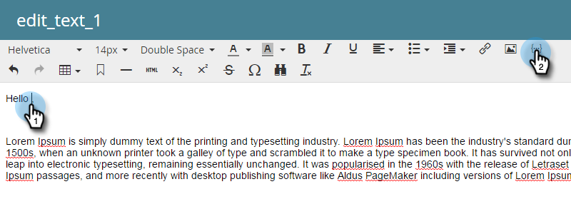

# Personalización de un correo electrónico {#personalize-an-email}

## Misión: Conversión de correos electrónicos en personales añadiendo tokens de datos {#mission-make-your-emails-personal-by-adding-data-tokens}

>[!PREREQUISITES]
>
>* [Configurar y agregar una persona](/help/marketo/getting-started/quick-wins/get-set-up-and-add-a-person.md){target=&quot;_blank&quot;}
>* [Enviar una explosión de correo electrónico](/help/marketo/getting-started/quick-wins/send-an-email.md){target=&quot;_blank&quot;}
>* [Perforación, Perforación](/help/marketo/getting-started/quick-wins/drip-drip-nurture.md){target=&quot;_blank&quot;}

## Paso 1: Seleccionar un correo electrónico para personalizar {#step-select-an-email-to-personalize}

1. Seleccione uno de los correos electrónicos de formación creados en la [victoria rápida anterior](/help/marketo/getting-started/quick-wins/drip-drip-nurture.md){target=&quot;_blank&quot;} y haga clic en **Crear borrador**.

   

   >[!NOTE]
   >
   >Esto crea una copia del correo electrónico como borrador. Recuerde aprobar el borrador para que los cambios se activen.

Si no ha habilitado un bloqueador de ventanas emergentes, el editor de correo electrónico se abrirá en una nueva pestaña o ventana. De lo contrario, haga clic en **Crear borrador** dos veces.

## Paso 2: Convertir al vendedor en el remitente {#step-make-the-salesperson-the-sender}

1. Seleccione el **De** campo, resaltado y **delete** el nombre actual.

   

1. Haga clic en el **Token** a la derecha del **De** campo .

   

1. Busque y seleccione el **`{{lead.Lead Owner First Name}}`** token.

   

1. Escriba el nombre de su empresa y un guión para la **Valor predeterminado** para garantizar que se muestre algo en caso de que el nombre del representante de venta no esté disponible. Haga clic en **Insertar**.

   

1. Pulse la barra espaciadora de la **De** , asegúrese de que el cursor parpadea un espacio después del token que acaba de insertar. A continuación, haga clic en el **Token** de nuevo.

   

1. Busque y seleccione el **`{{lead.Lead Owner Last Name}}`** token.

   

1. Escriba &quot;Ventas&quot; para la variable **Valor predeterminado** y haga clic en **Insertar**.

   

## Paso 3: Añadir el nombre del posible cliente al correo electrónico {#step-add-the-leads-name-to-the-email}

1. Seleccione la sección editable superior, haga clic en el icono de engranaje y seleccione **Editar**.

   

1. Añada un espacio después de &quot;Hello&quot; y coloque el cursor delante de la coma y, a continuación, haga clic en el botón **Insertar token** icono.

   

1. Busque y seleccione el **`{{lead.First Name}}`** token.

   

1. Escriba &quot;Amigo&quot; (o cualquier etiqueta que desee) en el **Valor predeterminado** y haga clic en **Insertar**.

   

   >[!TIP]
   >
   >Incluya siempre un valor predeterminado para los tokens; esto garantiza que el valor predeterminado se muestre en el correo electrónico si falta alguna parte de la información personal.

1. Haga clic en **Guardar**.

   

1. En **Acciones de correo electrónico** y seleccione **Aprobar y cerrar**.

   

>[!TIP]
>
>¿Necesita un repaso rápido sobre cómo enviarse el correo electrónico? Consulte [Enviar una explosión de correo electrónico](/help/marketo/getting-started/quick-wins/send-an-email.md){target=&quot;_blank&quot;}.

### Misión finalizada {#mission-complete}

¡Felicidades, has personalizado tu correo electrónico!

  

[◄ Misión 6: Perforación, Perforación](/help/marketo/getting-started/quick-wins/drip-drip-nurture.md)

[Misión 8: Alerta al representante de ventas ►](/help/marketo/getting-started/quick-wins/alert-the-sales-rep.md)
