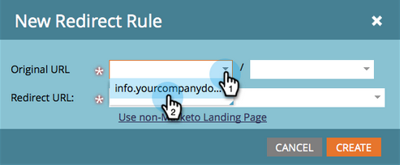

# Redireccionar una página de aterrizaje {#redirect-a-landing-page}

## Misión: Redirigir una página de aterrizaje a otra página web {#mission-redirect-a-landing-page-to-a-different-web-page}

>[!NOTE]
>
>**Se requieren permisos de administrador**

>[!PREREQUISITES]
>
>* [Página de aterrizaje con un formulario](/help/marketo/getting-started/quick-wins/landing-page-with-a-form.md){target=&quot;_blank&quot;}
>* [Personalización de la dirección URL de la página de aterrizaje con un CNAME](/help/marketo/product-docs/demand-generation/landing-pages/landing-page-actions/customize-your-landing-page-urls-with-a-cname.md){target=&quot;_blank&quot;}

## Paso 1: Iniciar una nueva regla de redirección {#step-start-a-new-redirect-rule}

1. Vaya a la **Administrador** .

   

1. Vaya a **Páginas de aterrizaje**.

   

1. Haga clic en el **Reglas** a continuación, haga clic en **Nuevo** y **Nueva regla de redirección**.

   

## Paso 2: Definir la regla de redirección {#step-define-the-redirect-rule}

1. Haga clic en la primera **URL original** y seleccione su CNAME de Marketo.

   

   >[!NOTE]
   >
   >Recuerde que solo puede redireccionar páginas de aterrizaje que comiencen con su Marketo [CNAME](/help/marketo/product-docs/demand-generation/landing-pages/landing-page-actions/customize-your-landing-page-urls-with-a-cname.md){target=&quot;_blank&quot;}.

1. Haga clic en el segundo **URL original** y seleccione la página de aterrizaje que desee redirigir.

   

1. Para **Dirección URL de redireccionamiento** seleccione la página a la que desee redirigir y haga clic en **Crear**.

   

## Misión finalizada {#mission-complete}

¡Felicidades! Ha redirigido correctamente una página de aterrizaje.

  

[◄ Misión 9: Actualizar datos de posibles clientes](/help/marketo/getting-started/quick-wins/update-person-data.md)
