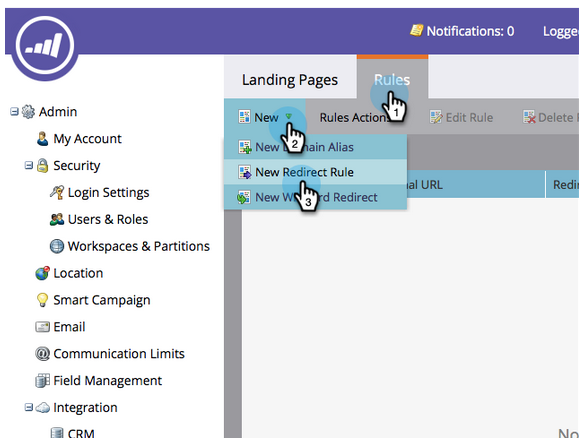

# Redireccionar una página de aterrizaje {#redirect-a-landing-page}

## Misión: Redirigir una página de aterrizaje a otra página web {#mission-redirect-a-landing-page-to-a-different-web-page}

>[!NOTE]
>
>**Se requieren permisos de administrador**

>[!PREREQUISITES]
>
>* [Página de aterrizaje con un formulario](/help/marketo/getting-started/quick-wins/landing-page-with-a-form.md)
>* [Personalización de la dirección URL de la página de aterrizaje con un CNAME](/help/marketo/product-docs/demand-generation/landing-pages/landing-page-actions/customize-your-landing-page-urls-with-a-cname.md)

## Paso 1: Iniciar una nueva regla de redirección {#step-start-a-new-redirect-rule}

1. Vaya al área **Admin**.

   

1. Vaya a **Páginas de aterrizaje**.

   

1. Haga clic en la pestaña **Rules** y luego en **New** y **New Redirect Rule**.

   

## Paso 2: Definir la regla de redirección {#step-define-the-redirect-rule}

1. Haga clic en la primera lista desplegable **Original URL** y seleccione el CNAME de Marketo.

   

   >[!NOTE]
   >
   >Recuerde, solo puede redirigir las páginas de aterrizaje que comiencen con el [CNAME](/help/marketo/product-docs/demand-generation/landing-pages/landing-page-actions/customize-your-landing-page-urls-with-a-cname.md) de Marketo.

1. Haga clic en la segunda lista desplegable **Original URL** y seleccione la página de aterrizaje que desee redirigir.

   

1. Para **Redirigir URL**, seleccione la página a la que desee redirigir y haga clic en **Crear**.

   

## Misión completada {#mission-complete}

¡Felicidades! Ha redirigido correctamente una página de aterrizaje.

  

[◄ Misión 9: Actualizar datos de posibles clientes](/help/marketo/getting-started/quick-wins/update-person-data.md)
