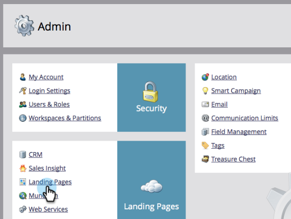
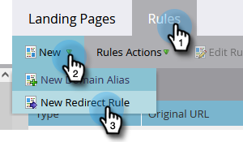
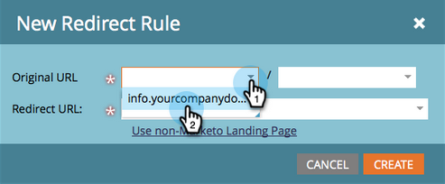

# Redirigir una página de destino {#redirect-a-landing-page}

## Misión: Redirigir una página de aterrizaje a una página web diferente {#mission-redirect-a-landing-page-to-a-different-web-page}

>[!NOTE]
>
>**Se requieren permisos de administrador**

>[!PREREQUISITES]
>
>* [Página de destino con un formulario](/help/marketo/getting-started/quick-wins/landing-page-with-a-form.md){target="_blank"}
>* [Personalice la dirección URL de su página de aterrizaje con un CNAME](/help/marketo/product-docs/demand-generation/landing-pages/landing-page-actions/customize-your-landing-page-urls-with-a-cname.md){target="_blank"}

## Paso 1: Inicio de una nueva regla de redirección {#step-start-a-new-redirect-rule}

1. Vaya al área de **[!UICONTROL Admin]**.

   

1. Vaya a **[!UICONTROL Páginas de destino]**.

   

1. Haga clic en la ficha **[!UICONTROL Reglas]**, luego haga clic en **[!UICONTROL Nueva]** y **[!UICONTROL Nueva regla de redireccionamiento]**.

   

## Paso 2: Definición de la regla de redireccionamiento {#step-define-the-redirect-rule}

1. Haga clic en la primera lista desplegable **[!UICONTROL URL original]** y seleccione su CNAME de Marketo.

   

   >[!NOTE]
   >
   >Recuerde, solo puede redirigir páginas de aterrizaje que comiencen con su Marketo [CNAME](/help/marketo/product-docs/demand-generation/landing-pages/landing-page-actions/customize-your-landing-page-urls-with-a-cname.md){target="_blank"}.

1. Haga clic en el segundo menú desplegable **[!UICONTROL URL original]** y seleccione la página de aterrizaje que desee redirigir.

   

1. Para **[!UICONTROL URL de redireccionamiento]**, seleccione la página a la que quiera redireccionar y haga clic en **[!UICONTROL Crear]**.

   

## Misión completada {#mission-complete}

¡Felicidades! Ha redirigido correctamente una página de aterrizaje.

  

[◄ misión 9: actualizar datos de posibles clientes](/help/marketo/getting-started/quick-wins/update-person-data.md)
