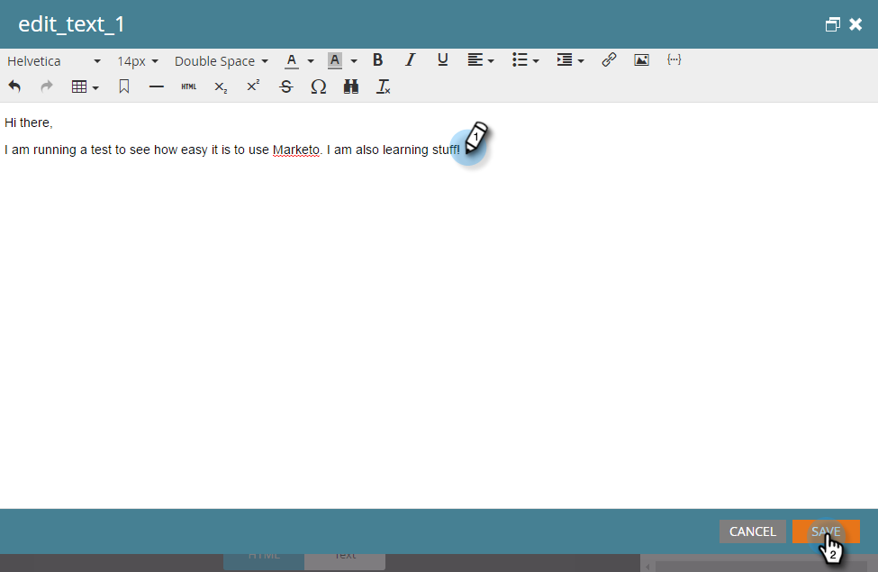

# Enviar un correo electrónico {#send-an-email}

Es lo primero que todos quieren hacer. ¡Enviemos un correo electrónico desde Marketo!

>[!PREREQUISITES]
>
>[Configurar y agregar una persona](/help/marketo/getting-started/quick-wins/get-set-up-and-add-a-person.md){target=&quot;_blank&quot;}

## Crear un programa de correo electrónico {#create-an-email-program}

1. Vaya a la **Actividades de marketing** .

   

1. Seleccione su **Aprendizaje** carpeta. Haga clic en el **Nuevo** y seleccione **Nuevo programa**.

   

1. Escriba un **Nombre** y seleccione **Correo electrónico** para **Tipo de programa.**

   >[!TIP]
   >
   >Añada sus iniciales al final del nombre del programa para que sea único.

   

1. En **Canal**, seleccione **Envío de correo electrónico** y haga clic en **Crear**.

   

## Definir la audiencia {#define-your-audience}

1. Haga clic en **Editar lista inteligente** en el mosaico Audiencia .

   

1. Busque y arrastre el filtro Dirección de correo electrónico al lienzo.

   

   >[!TIP]
   >
   >Utilice la variable **Buscar** para buscar filtros más fácilmente.

1. Busque y seleccione su dirección de correo electrónico.

   

   >[!NOTE]
   >
   >Si el correo electrónico no se rellena automáticamente, es posible que haya olvidado hacerlo [Obtener configuración y agregar un posible cliente.](/help/marketo/getting-started/quick-wins/get-set-up-and-add-a-person.md){target=&quot;_blank&quot;}

   >[!NOTE]
   >
   >En este ejemplo, le enviaremos el correo electrónico solo a usted mismo, pero puede personalizar la audiencia como considere oportuno.

1. Vuelva a la pestaña del programa principal y haga clic en el icono de actualización de **Persona**.

   

   Debería ver que el recuento de personas sube a 1. ¡Tú eres!

## Crear un correo electrónico {#create-an-email}

1. En el mosaico Correo electrónico , haga clic en **Nuevo correo electrónico**.

   

1. Escriba un **Nombre**, seleccione un **Plantilla** y haga clic en **Crear**.

   

1. Se abrirá la ventana del editor de correo electrónico. Introduzca un asunto de 50 caracteres o menos (recomendado).

   

   >[!NOTE]
   >
   >Si tiene un bloqueador de ventanas emergentes, haga clic en **Editar borrador** para introducir el editor de correo electrónico.

1. Seleccione el área que desea editar, haga clic en el icono de engranaje de la derecha y, a continuación, seleccione **Editar** (también puede hacer doble clic en la sección editable para editarla).

   

1. Introduzca el contenido que desea y haga clic en **Guardar**.

   

1. Haga clic en el **Acciones de correo electrónico** y seleccione **Aprobar y cerrar**.

   

   >[!TIP]
   >
   >¿Quiere enviar una muestra rápida para ver el aspecto del correo electrónico antes del lanzamiento? Select **Enviar muestra** en el menú de arriba, o haga clic en **Acciones de correo electrónico** then [**Enviar muestra**](/help/marketo/product-docs/email-marketing/general/creating-an-email/send-a-sample-email.md){target=&quot;_blank&quot;}.

1. Seleccione el programa de correo electrónico en el árbol de la izquierda.

   

1. En el mosaico Programar , establezca el día de lanzamiento del correo electrónico en **Hoy.**

   

   >[!NOTE]
   >
   >Más información sobre [Zona horaria del destinatario](/help/marketo/product-docs/email-marketing/email-programs/email-program-actions/scheduling-with-recipient-time-zone/schedule-email-programs-with-recipient-time-zone.md){target=&quot;_blank&quot;} y [Inicio del cabezal](/help/marketo/product-docs/email-marketing/email-programs/email-program-actions/head-start-for-email-programs.md){target=&quot;_blank&quot;}.

1. Seleccione una hora que sea de al menos 15 minutos en el futuro.

   

   >[!TIP]
   >
   >¿La zona horaria predeterminada no es tuya? Obtenga información sobre cómo [actualícelo aquí](/help/marketo/product-docs/administration/settings/select-your-language-locale-and-time-zone.md){target=&quot;_blank&quot;}.

1. Haga clic en **Aprobar programa** en el mosaico Aprobación y ya has terminado.

   

Debe recibir el correo electrónico poco después del día/hora programados.

## ¡Misión finalizada! {#mission-complete}

  

[◄ Configurar y agregar una persona](/help/marketo/getting-started/quick-wins/get-set-up-and-add-a-person.md)

[Misión 2: Página de aterrizaje con un formulario ►](/help/marketo/getting-started/quick-wins/landing-page-with-a-form.md)
