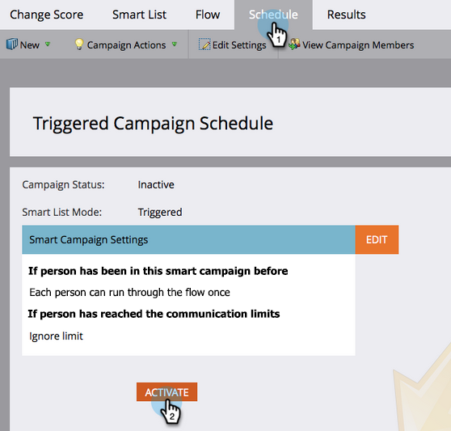

# Puntuación simple {#simple-scoring}

>[!PREREQUISITES]
>
>* [Configurar y agregar una persona](/help/marketo/getting-started/quick-wins/get-set-up-and-add-a-person.md){target=&quot;_blank&quot;}
>* [Página de aterrizaje con un formulario](/help/marketo/getting-started/quick-wins/landing-page-with-a-form.md){target=&quot;_blank&quot;}

## Paso 1: Creación de una campaña de puntuación {#step-create-a-scoring-campaign}

1. Vaya a la **Actividades de marketing** .

   

1. Haga clic con el botón derecho en su **Aprendizaje** carpeta y haga clic en **Nueva carpeta de campañas**.

   

1. Asigne a la carpeta de campañas el nombre &quot;Puntuación&quot; y haga clic en **Crear**.

   

   >[!NOTE]
   >
   >Si ya tiene una carpeta de Puntuación, asígnele un nombre diferente a este, como Puntuación 1. Los nombres de carpeta deben ser únicos.

1. Haga clic con el botón derecho en su **Puntuación** carpeta y seleccione **Nueva campaña inteligente**.

   

1. Asigne a la campaña el nombre &quot;Cambiar puntuación&quot; y haga clic en **Crear**.

   

1. Haga clic en el **Lista inteligente** pestaña .

   

   Queremos que esta campaña se ejecute siempre que una persona rellene su **Formulario de solicitud de prueba**.

1. Busque y arrastre el **Rellena el formulario** déclencheur en el lienzo izquierdo.

   

1. Select **Mi formulario**.

   

   >[!NOTE]
   >
   >Si ha completado el [Página de aterrizaje con un formulario](/help/marketo/getting-started/quick-wins/landing-page-with-a-form.md){target=&quot;_blank&quot;} victoria rápida, debería tener el formulario . Si ha utilizado un nombre diferente para el formulario, selecciónelo.

1. Haga clic en el **Flujo** pestaña .

   

1. Arrastre el **Cambiar puntuación** en el lienzo izquierdo.

   

1. Puede escribir cualquier valor que desee añadir a la puntuación de la persona. Introduzcamos &quot;+5&quot; en la **Cambiar** campo .

   

   >[!TIP]
   >
   >Las buenas campañas de puntuación son clave para ofrecer a las ventas personas de alta calidad. Lectura [**La Guía definitiva para la puntuación de posibles clientes**](https://www.marketo.com/definitive-guides/lead-scoring/){target=&quot;_blank&quot;}.

1. Haga clic en el **Programación** y **Activar** botón.

   

1. Haga clic en **Activar** en la pantalla de confirmación.

   

>[!NOTE]
>
>Una vez activa, esta campaña se ejecutará cada vez que una persona rellene el formulario. La campaña seguirá ejecutándose hasta que se desactive.

## Paso 2: Rellenar el formulario {#step-fill-out-the-form}

1. Seleccione la página de aterrizaje que ha creado en la [Página de aterrizaje con un formulario](/help/marketo/getting-started/quick-wins/landing-page-with-a-form.md){target=&quot;_blank&quot;} victoria rápida.

   

1. Haga clic en **Vista previa**. La página de aterrizaje se abrirá en una pestaña nueva.

   

1. Rellene el formulario con su nombre, apellidos y dirección de correo electrónico y, a continuación, haga clic en **Submit**.

   

   >[!NOTE]
   >
   >Utilice el mismo nombre y dirección de correo electrónico que utilizó cuando se introdujo por primera vez como persona para aplicar el aumento de puntuación &quot;+5&quot;.

## Paso 3: Ver la información de la persona {#step-view-the-person-info}

1. Vaya al área Base de datos.

   

1. Busque la dirección de correo electrónico que utilizó al rellenar el formulario.

   

1. Haga doble clic en su persona.

   

Los detalles de la persona se abrirán en una nueva pestaña o ventana. ¿Ver cómo su puntuación aumentó en 5 puntos para rellenar el formulario?

## ¡Misión finalizada! {#mission-complete}

  

[◄ Misión 2: Página de aterrizaje con un formulario](/help/marketo/getting-started/quick-wins/landing-page-with-a-form.md)

[Misión 4: Respuesta automática por correo electrónico ►](/help/marketo/getting-started/quick-wins/email-auto-response.md)
