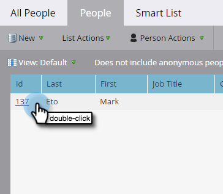

# Actualizar los datos de la persona {#update-person-data}

## Misión: Actualizar la información de contacto de una persona u otros datos {#mission-update-a-persons-contact-info-or-other-data}

>[!PREREQUISITES]
>
>* [Configurar y añadir una persona](/help/marketo/getting-started/quick-wins/get-set-up-and-add-a-person.md){target="_blank"}
>* [Importar una lista de personas](/help/marketo/getting-started/quick-wins/import-a-list-of-people.md){target="_blank"}

Imaginemos que en su reciente feria comercial, una persona le dio información de contacto adicional. A continuación, se indica cómo actualizar los datos de persona.

## Buscar a la persona que necesita actualizar {#find-the-person-you-need-to-update}

1. Vaya a su [!UICONTROL base de datos].

   

1. Busque el nombre o la dirección de correo electrónico de la persona.

   >[!TIP]
   >
   >El uso de la dirección de correo electrónico para buscar resultará en una búsqueda más rápida.

   

1. Haga doble clic para abrir los detalles de la persona.

   

   >[!TIP]
   >
   >Hay muchas maneras de actualizar los datos de personas en Marketo. Ver [Importar una lista de personas](/help/marketo/getting-started/quick-wins/import-a-list-of-people.md){target="_blank"} y [Cambiar valor de datos](/help/marketo/product-docs/core-marketo-concepts/smart-campaigns/flow-actions/change-data-value.md){target="_blank"}.

## Actualización de los datos de persona {#update-the-person-data}

1. Escriba la nueva información que recibió y cierre la pestaña.

>[!CAUTION]
>
>* Asegúrese de que las direcciones de correo electrónico solo contienen caracteres ASCII.
>
>* Marketo **no** admite direcciones de correo electrónico que contengan emojis.

>[!NOTE]
>
>Una vez que cambie los datos, las listas inteligentes y las campañas inteligentes reconocerán la nueva información inmediatamente.

## Misión completada {#mission-complete}

¡Buen trabajo! Ha actualizado los datos de su persona.

  

[◄ Misión 8: Alertar al representante de ventas](/help/marketo/getting-started/quick-wins/alert-the-sales-rep.md)

[Misión 10: redireccionar una página de aterrizaje ►](/help/marketo/getting-started/quick-wins/redirect-a-landing-page.md)
