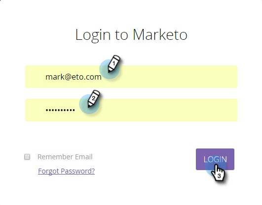
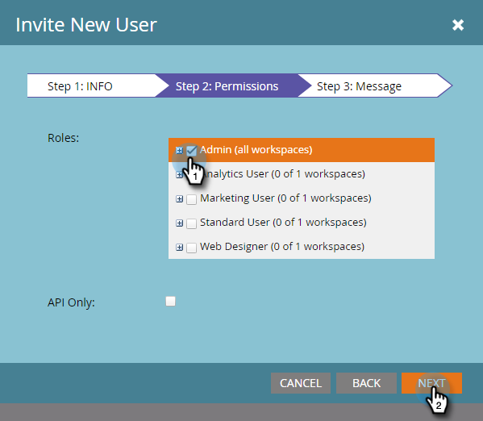

# Pasos de configuración {#setup-steps}

**¡Bienvenido a Marketing!**

Antes de sumergirse en el uso de Marketo, debe seguir algunos pasos.

Estos pasos incluyen:

* configuración básica de cuenta
* personalizar las direcciones URL de su página de aterrizaje y los vínculos de correo electrónico para mejorar la confianza y la capacidad de entrega
* sincronizar su CRM
* agregar código de seguimiento al sitio Web de la empresa

>[!NOTE]
>
>Solo debe realizar estos pasos si la compañía es **nueva en Marketing**. Si no es así, es posible que la configuración ya se haya realizado.

Algunos pasos requieren la ayuda de su equipo de TI.

>[!TIP]
>
>Si [imprime esta lista de comprobación](/help/marketo/getting-started/setup-steps/setup-checklist.md), puede desactivar los elementos al completarlos.

1. Inicie sesión y cree más usuarios de marketing

1. Inicie sesión en Marketing [aquí](https://app.marketo.com/) con las credenciales que recibió por correo electrónico.

   

¡Felicitaciones! Ahora está en Marketo y puede explorar inicios. Puede que desee invitar a sus colegas del equipo de mercadotecnia para que se unan a usted. Puede hacerlo agregando nuevos usuarios.

Vaya al área **Administración**.

>[!TIP]
>
>Mientras esté aquí, puede hacer clic en **Mi cuenta** para cambiar la configuración de su cuenta y ubicación, así como establecer un nuevo nombre de suscripción.

>[!NOTE]
>
>**Se requieren permisos de administración**

Haga clic en **Usuarios y funciones**.

Haga clic en **Invitar a nuevo usuario**.

Rellene la dirección de correo electrónico, el nombre y los apellidos de su colega.

También puede introducir un motivo para la invitación y una fecha de caducidad de acceso mediante el selector de calendario. Haga clic en **Aceptar**.

Haga clic en **Siguiente**.

>[!TIP]
>
>Una fecha de caducidad es buena para los consultores o interesados externos a corto plazo, que sólo necesitan el acceso de Marketing por un breve tiempo.

>[!NOTE]
>
>Cuando llega la fecha de caducidad, el usuario recibe una notificación de caducidad y la cuenta está bloqueada.

Seleccione una función y haga clic en **Siguiente**. Los usuarios estándar tienen acceso a todas las áreas excepto a Administración.

>[!NOTE]
>
>Además de las cinco funciones integradas, también puede crear funciones personalizadas. Obtenga más información sobre [Administración de roles y permisos de usuario](/help/marketo/product-docs/administration/users-and-roles/managing-user-roles-and-permissions.md).

No dude en modificar el texto de la invitación. Haga clic en **Enviar**.

El nuevo usuario aparece ahora en la ficha Usuarios y debe recibir un correo electrónico con un vínculo para crear una contraseña y un inicio de sesión. ¡Próximo paso!

1. Configurar los contactos de asistencia técnica autorizados

   Es posible que haya recibido un mensaje de correo electrónico de la asistencia técnica de marketing en el que se indica que es el administrador de asistencia al cliente de Marketing to para su compañía. Si es así, puede configurar **contactos de soporte autorizados** para su equipo. Sólo los contactos de asistencia autorizados pueden ponerse en contacto directamente con el servicio de asistencia al cliente de Marketing a través del [Portal de asistencia técnica de marketing](https://support.marketo.com).

   >[!NOTE]
   >
   >El número de contactos de asistencia técnica que puede crear está determinado por el paquete que ha adquirido. Este límite se especifica en el correo electrónico de la asistencia técnica de marketing.

   Los documentos de contacto de asistencia técnica autorizados se han trasladado a la comunidad de marketing. Consulte [este artículo](https://nation.marketo.com/t5/Knowledgebase/Managing-Authorized-Support-Contacts/ta-p/254341).

   >[!NOTE]
   >
   >En la lista solo aparecen las personas que iniciaron sesión en la Comunidad de productos de marketing. Si no puede encontrar a la persona, asegúrese de que inicia sesión en la Comunidad primero.

1. Personalización de las direcciones URL de su Página de aterrizaje con un CNAME

   >[!NOTE]
   >
   >¿Es cliente de Launch Pack? Puede omitir este paso. Su asesor le proporcionará un documento de instrucciones de configuración de TI durante su llamada de lanzamiento.

   >[!NOTE]
   >
   >**Se requieren permisos de administración**

   Elija un CNAME para sus páginas de aterrizaje. Algunos ejemplos:

   * **ve**.[CompanyDomain].com
   * **www2**.[CompanyDomain].com
   * **lp**.[CompanyDomain].com

   >[!TIP]
   >
   >¡Déjalo corto! Las direcciones URL más cortas son más fáciles de recordar. Sugerimos &quot;ir&quot; como dominio.

   La primera parte (en negrita) es la `[LandingPageCNAME]`. Lo necesitará en el paso 5.

   Para recuperar la cadena de cuenta que va a reemplazar por su CNAME de página de aterrizaje, vaya al área de administración.

   

   Haga clic en **Páginas de aterrizaje**.

   

   Copie la cadena de cuenta de la configuración de página de aterrizaje.

   

   Este es el `[AccountString]`. Guárdalo. Tendrá que dárselo a TI en el paso 5.

Configure las opciones de dominio para que las páginas de aterrizaje utilicen el dominio de la compañía en lugar de Marketo (donde están alojadas).

1. Garantizar la capacidad de entrega de correo electrónico

   >[!NOTE]
   >
   >¿Es cliente de Launch Pack? Puede omitir este paso. Su asesor le proporcionará un documento de instrucciones de configuración de TI durante su llamada de lanzamiento.

   Existen varias medidas que puede tomar para garantizar que los correos electrónicos lleguen al mayor número posible de personas.

   1. **Marque sus vínculos** de seguimiento. Puede elegir un CNAME para usar su propio dominio (en lugar de Marketo) en los vínculos que incluye en los correos electrónicos de Marketing. Esto refuerza la marca del dominio y aumenta la confianza y la capacidad de entrega con sus destinatarios.
   1. **Añada Marketing a su lista de permitidos de correo electrónico corporativa.** Se recomienda enviar correos electrónicos de prueba a las cuentas de prueba antes de enviarlos a personas reales. Con el Marcador de inclusión en la lista de permitidos, puede evitar que esos correos electrónicos de prueba se bloqueen o marquen como correo no deseado.
   1. **Configure SPF y DKIM.** Estas tecnologías garantizan a sus destinatarios que los correos electrónicos de marketing no son spam. Para evitar que los filtros de correo no deseado de los destinatarios rechacen sus correos electrónicos de marketing, siga estos pasos para [Configurar un SPF y DKIM para su capacidad de entrega por correo electrónico](/help/marketo/product-docs/email-marketing/deliverability/set-up-spf-and-dkim-for-your-email-deliverability.md).
   1. **Configure un registro MX para su dominio.** Un registro MX permite recibir correo al dominio desde el que se envía un correo electrónico para procesar las respuestas y los respondedores automáticos. Si va a enviar desde su dominio corporativo, es probable que ya tenga esto configurado. Si no es así, normalmente puede configurarse para asignar al registro MX del dominio corporativo.
   1. **Configuración recomendada para la dirección Desde.** Debe usar un dominio de correo electrónico válido, existente y en funcionamiento en la dirección de correo electrónico de todas las campañas de correo electrónico. Puede resultar beneficioso configurar un subdominio del dominio corporativo en lugar de enviarlo desde el dominio corporativo. Esto garantizará que los problemas del flujo de correo corporativo no afecten al flujo de correo de Marketing to y viceversa. Además, enviar correo desde something@nonexistentdomain.com provocará que el correo electrónico se filtre o bloquee. Cualquier dominio utilizado en la dirección del remitente debe tener una cuenta válida y de funcionamiento de postmaster@ y de abuso@.
Si está utilizando aplicaciones de Google para alojar el correo electrónico corporativo, no podrá crear correos electrónicos de tipo &quot;abuse@&quot; o &quot;postmaster@&quot; bajo su dominio. Para evitar esto, debe crear grupos llamados &quot;abuso&quot; y &quot;administrador de publicidad&quot;. Los usuarios que sean miembros de estos grupos recibirán correos electrónicos enviados a esas direcciones (por ejemplo, postmaster@domain.com). Encontrará instrucciones detalladas para crear grupos [aquí](https://support.google.com/a/answer/33343#adminconsole).

   Elija un CNAME para los vínculos de seguimiento del correo electrónico (elija uno que sea _diferente_ del CNAME de página de aterrizaje elegido en el paso 3). Algunos ejemplos:

   * go2.[CompanyDomain].com
   * em.[CompanyDomain].com
   * wow.[CompanyDomain].com

   La primera parte es el CNAME de seguimiento del correo electrónico, `[EmailTrackingCNAME]`. Tendrá que entregarlo a TI en el paso 5.

   >[!CAUTION]
   >
   >Los CNAME de correo electrónico y Página de aterrizaje deben ser diferentes. Además, evite los CNAME como ‘track’ o ‘link’. A menudo se marca como correo no deseado

   Para encontrar el vínculo de seguimiento de marketing, vaya al área **Administración**.

   

   Haga clic en **Correo electrónico**.

   

   Copie el vínculo de seguimiento de su configuración de correo electrónico.

   El vínculo de seguimiento tiene el formato: `mkto-[a-z][4 digits].com`.

   

   Éste es su `[MktoTrackingLink]`. Guárdalo. Tendrá que dárselo a TI en el paso 5.

   Recopilar dominios &quot;De&quot;. Realice una lista de todos los dominios &quot;De&quot; (como `[Sender]@[FromDomain].com`) que planea utilizar para enviar correos electrónicos desde Marketing. Para la mayoría, hay sólo uno.

   Por ejemplo: &#39;marketo.com,&#39; &#39;info.marketo.com,&#39;. Son `[FromDomain1]`,`[FromDomain2]`, etc. Guárdalos. Tendrá que entregárselos a TI en el paso 5.

   Ahora tiene toda la información que necesita para enviar su solicitud al departamento de TI.

1. Solicitar a TI que configure protocolos

   >[!NOTE]
   >
   >¿Es cliente de Launch Pack? Puede omitir este paso. Su asesor le proporcionará un documento de instrucciones de configuración de TI durante su llamada de lanzamiento.

   Una vez que haya recopilado toda la información necesaria, estará listo para enviar una solicitud a TI. Puede utilizar el texto siguiente como plantilla, reemplazando el texto en negrita con su propia información.

   [Incluya un vínculo a este artículo](/help/marketo/getting-started/setup-steps/configure-protocols-for-marketo.md).

   Pegue este texto en el correo electrónico y reemplace los marcadores de posición en negrita:

   >[!NOTE]
   >
   >Consulte los pasos 3 y 4 para determinar el texto que se va a reemplazar con los marcadores de posición. Recuerde que `[LandingPageCNAME]` y `[EmailTrackingCNAME]` deben ser diferentes.

`---------------------------------------------`

Estimado e impresionante administrador de TI:

Nuestro equipo de mercadotecnia está usando la plataforma de mercadotecnia para comunicarse con nuestra gente. Para garantizar la buena entrega por correo electrónico, debemos realizar los siguientes cambios:

`1)` Para nuestras páginas de aterrizaje, agregue una entrada DNS (CNAME) para  **[LandingPageCNAME]**.**[CompanyDomain]**.com, apuntando a  **[AccountString]**.mktoweb.com.

`2)` Para nuestros vínculos de seguimiento en el correo electrónico, agregue una entrada DNS (CNAME) para  **[EmailTrackingCNAME]**.**[CompanyDomain]**.com, que señala a  **[MktoTrackingLink]**.

`3)` Marcador de lista de permitidos.

    * Si utilizamos direcciones IP en nuestra Lista de permitidos de correo electrónico, agregue las direcciones IP enumeradas a continuación:
    199.15.212.0/22
    
    192.28.144.0/20
    
    192.28.160.0/19
    
    185.28.196.0/22
    
    130.248.172.0/24
    
    130.248.173.0/24
    
    103.237.104.0/22
    
    94.236.119.0/26

NOTA: Póngase en contacto con la asistencia técnica de marketing si desea una lista abreviada de las IP para la lista de permitidos específica de su entorno.

    * Si nuestro sistema antispam utiliza dominios de From, agregue estos:

**`[FromDomain1]`**
**`[FromDomain2]`**

`4)` Necesitamos configurar SPF y DKIM para que Marketing esté autorizado a enviar correos firmados en nuestro nombre.

`a.` Para configurar SPF, agregue la siguiente línea a nuestras entradas DNS:

IN TXT **[Desde el dominio]**:  v=spf1 mx ip4:**[IP de la empresa]**
 incluyen: mktomail.com ~all

Si ya tenemos un registro SPF existente en nuestra entrada DNS, simplemente agregue lo siguiente:

include:mktomail.com

`[`Reemplazar  **de** dominio por su correo electrónico de dominio (por ejemplo: compañía.com) y  **** CorpIPcon la dirección IP de su servidor de correo electrónico corporativo (por ejemplo: 255 255 255 255).  Si va a enviar correos electrónicos desde varios dominios a través de Marketing, debe hacer que el personal de TI agregue esta línea para cada dominio (en una línea).`]`

`b.` Para DKIM, cree Registros de recursos DNS para cada dominio que desee configurar. A continuación se muestran los registros de host y los valores TXT de cada dominio para el que firmaremos:

**`[DKIMDomain1]`**:: El registro de host es  **`[HostRecord1]`** y el valor TXT es  **[TXTValue1]**.

**`[DKIMDomain2]`**:: El registro de host es  **`[HostRecord2]`** y el valor de TXT es  **`[TXTValue2]`**.

`[`Copie  **** HostRecordand  **** TXTValuepara cada  **** DKIMDomainque haya configurado después de seguir las  [instrucciones aquí](/help/marketo/product-docs/email-marketing/deliverability/set-up-a-custom-dkim-signature.md). No olvide verificar cada dominio en **Administración > Correo electrónico > DKIM** después de que su personal de TI haya completado este paso.`]`

`5)` Debemos asegurarnos de que hay un registro MX válido para nuestros dominios  **[FromDomain1]**,  **[FromDomain2]**, etc. ¿Puedes confirmar? Si no es así, configúrelo para asignarlo a nuestro registro MX de dominio corporativo. Esto asegurará que podamos procesar las respuestas/respuestas automáticas a nuestros envíos de correo de Marketing to.

Hágame saber cuando haya completado estos pasos, para que pueda completar el proceso de configuración con Marketing.

¡Gracias! ¡Eres el mejor!

Amor,

**`[Your Name]`**

`---------------------------------------------`

Envíe el correo electrónico a TI. Entendemos que la TI puede tardar algún tiempo en completar estas tareas. Puede continuar con el paso 7, pero recuerde que debe regresar el paso 6 para completar la configuración de Marketing to.

1. Complete la configuración de Marketingto una vez que finalice la TI

   Una vez que TI haya completado sus tareas, siga estos pasos para agregar su página de aterrizaje y enviar por correo electrónico los CNAME, y para activar la firma de DKIM.

   Vaya al área **Administración** para Añadir el CNAME de Página de aterrizaje

   

   Seleccione Páginas de aterrizaje y haga clic en **Editar** en el área Configuración.

   

   Escriba el nuevo nombre de dominio en el campo Nombre de dominio para Páginas de aterrizaje. Debe tener la forma siguiente:

   `[LandingPageCNAME].[CompanyDomain].com`

   

   En el campo de página de reserva, introduzca la dirección URL a la que desea que se dirijan los usuarios si una página de aterrizaje no está disponible. Puede utilizar la página de inicio de compañía si no tiene una página de reserva. En el campo Página de inicio, introduzca el sitio web de la compañía.

   

   En el área Administración, seleccione Correo electrónico para Añadir el CNAME de correo electrónico

   

   Desplácese hacia abajo y haga clic en **Editar**.

   

   En el campo Dominio, introduzca el dominio de seguimiento del correo electrónico. Debe tener la forma siguiente:

   `[EmailTrackingCNAME].[CompanyDomain].com`. Haga clic en **Guardar**.

   

1. Envío de una dirección URL para plantillas de Página de aterrizaje y correo electrónico

   Nuestros diseñadores creativos pueden proporcionarle plantillas personalizadas de correo electrónico y página de aterrizaje que facilitan y agilizan el lanzamiento de sus programas de marketing. Debe proporcionarles información para que puedan relacionar las plantillas con el sitio web y el logotipo de la compañía.

   >[!NOTE]
   >
   >Estas plantillas personalizadas solo están disponibles para los clientes de Launch Pack.

   Vaya al formulario [Diseño y generación de plantillas de marketing](https://pages2.marketo.com/CESubmit-URL-ForTemplates.html). Complete la información de compañía.

   

   Para la URL de su Página de aterrizaje, introduzca una URL de muestra del sitio web de la compañía que muestre los colores, el logotipo y el estilo de la compañía. La mayoría de los clientes utilizan una página de Contacto que incluye un formulario.

   

   Para CNAME, introduzca el CNAME de página de aterrizaje que seleccionó en el paso 3 (`[LandingPageCNAME]`). Envíe su solicitud.

   

   >[!NOTE]
   >
   >Las plantillas no se pueden completar hasta que el departamento de TI cree un registro DNS para el CNAME de página de aterrizaje.

   ¡Eso es todo! Debería ver las nuevas plantillas en Marketing Design Studio en 3-5 días laborables.

1. Integrar su CRM

   Este es probablemente el paso más emocionante de tu configuración - es hora de llenar Marketo con todos esos leads y contactos que has almacenado en tu CRM!

   Elija una de las siguientes opciones, según el CRM que utilice su compañía.

   * [Integrar Marketing con Salesforce.com](/help/marketo/product-docs/crm-sync/salesforce-sync/understanding-the-salesforce-sync.md)
   * [Integración de Marketing con Microsoft Dynamics](/help/marketo/product-docs/crm-sync/microsoft-dynamics-sync/understanding-the-microsoft-dynamics-sync.md)

   >[!NOTE]
   >
   >Necesita la asistencia del administrador de CRM de su compañía para completar estos pasos.

## 9. Añadir código de seguimiento a su sitio Web {#add-tracking-code-to-your-website}

>[!NOTE]
>
>¿Es cliente de Launch Pack? Puede omitir este paso. Su consultor le proporcionará las instrucciones de código Munchkin en su documento de instrucciones de configuración de TI.

Marketo tiene JavaScript de seguimiento personalizado (llamado Munchkin) que puede utilizar para rastrear actividades personales en cualquier página web. Munchkin debe integrar su sitio web en Marketo. Siga estos pasos para [Añadir código de seguimiento de Munchkin en su sitio Web](/help/marketo/product-docs/administration/additional-integrations/add-munchkin-tracking-code-to-your-website.md).

>[!NOTE]
>
>Experiencia con HTML necesaria para agregar el código de seguimiento.

Todos los pasos de configuración han terminado. Lo único que queda es sumergirse y usar el Marketing!
