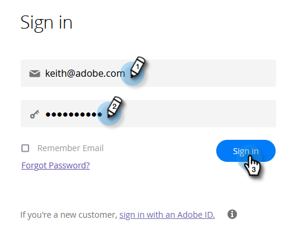
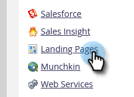
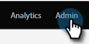
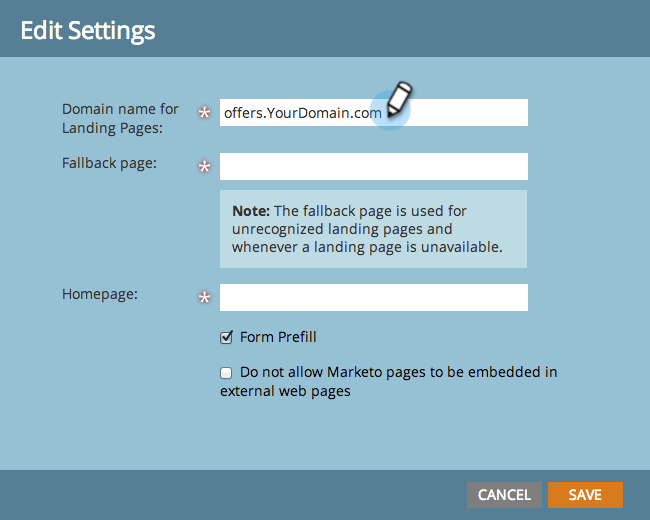

# Pasos de configuración {#setup-steps}

**Le damos la bienvenida a Marketo Engage!**

Antes de sumergirse en el uso de Marketo, debe realizar algunos pasos.

Estos pasos incluyen:

* Configuración básica de la cuenta
* Personalizar la marca de las direcciones URL de su página de aterrizaje y los vínculos de correo electrónico para mejorar la confianza y la capacidad de envío
* Sincronización de CRM
* Adición de código de seguimiento al sitio web de la empresa

>[!NOTE]
>
>Solo debe realizar estos pasos si su empresa está **nuevo en Marketo**. Si no es así, es posible que ya se haya realizado la configuración.

Algunos pasos requieren la ayuda de su equipo de TI.

>[!TIP]
>
>Si [imprimir esta lista de comprobación](/help/marketo/getting-started/setup/setup-checklist.md){target=&quot;_blank&quot;}, puede desactivar los elementos cuando los complete.

## Inicio de sesión y creación de usuarios adicionales de Marketo {#log-in-and-create-additional-marketo-users}

1. Iniciar sesión en Marketo [here](https://app.marketo.com/){target=&quot;_blank&quot;} utilizando las credenciales que recibió por correo electrónico.

   

¡Felicidades! Ahora estás en Marketo y puedes empezar a explorar. Puede que desee invitar a sus colegas del equipo de marketing a que se unan a usted. Para ello, agregue nuevos usuarios.

Vaya a la **Administrador** .

>[!TIP]
>
>Mientras esté aquí, puede hacer clic en **Mi cuenta** para cambiar la configuración de la cuenta y la ubicación, así como para establecer un nuevo nombre de suscripción.

>[!NOTE]
>
>**Se requieren permisos de administrador**

Haga clic en **Usuarios y funciones**.

Haga clic en **Invitar a nuevo usuario**.

Rellene la dirección de correo electrónico, el nombre y los apellidos de su colega. _La configuración de la fecha de caducidad del acceso es opcional_. Haga clic en **Siguiente**.

>[!TIP]
>
>Una fecha de caducidad es buena para los consultores o partes interesadas externas a corto plazo que solo necesitan acceso a Marketo durante un breve periodo.

>[!NOTE]
>
>Cuando llega la fecha de caducidad, el usuario recibe una notificación de caducidad y la cuenta está bloqueada.

Seleccione una función y haga clic en **Siguiente**. Los usuarios de Standard tienen acceso a todas las áreas excepto a Admin.

>[!NOTE]
>
>Además de las cinco funciones integradas, también puede crear funciones personalizadas. Más información sobre [Administración de roles y permisos de usuario](/help/marketo/product-docs/administration/users-and-roles/managing-user-roles-and-permissions.md){target=&quot;_blank&quot;}.

Siéntase libre de modificar el texto de la invitación. Haga clic en **Enviar**.

El nuevo usuario aparece ahora en la pestaña Usuarios y debe recibir un correo electrónico con un vínculo para crear una contraseña y un inicio de sesión. ¡El siguiente paso!

## Configurar los contactos de asistencia autorizados {#set-up-your-authorized-support-contacts}

Es posible que haya recibido un correo electrónico de la asistencia de Marketo en el que se indica que es el administrador de asistencia al cliente de Marketo para su empresa. Si es así, puede configurar **contactos de asistencia autorizados** para su equipo. Solo los contactos de asistencia autorizados pueden ponerse en contacto con el servicio de asistencia al cliente de Marketo directamente a través de la [Portal de asistencia de Marketo](https://support.marketo.com){target=&quot;_blank&quot;}.

>[!NOTE]
>
>El número de contactos de asistencia técnica que puede crear viene determinado por el paquete que ha comprado. Este límite se especifica en el mensaje de correo electrónico de la asistencia de Marketo.

Los documentos de contacto de asistencia autorizada se han trasladado a la comunidad de Marketo. Consulte [este artículo](https://nation.marketo.com/t5/Knowledgebase/Managing-Authorized-Support-Contacts/ta-p/254341){target=&quot;_blank&quot;}.

>[!NOTE]
>
>Solo aparecen en la lista las personas que han iniciado sesión en la comunidad de Marketo. Si no encuentra a la persona, asegúrese de que primero inicie sesión en la comunidad.

## Personalizar las direcciones URL de su página de aterrizaje con un CNAME {#customize-your-landing-page-urls-with-a-cname}

>[!NOTE]
>
>¿Es cliente de Launch Pack? Puede omitir este paso. Su consultor le proporcionará un documento de instrucciones de configuración de TI durante su llamada inicial.

>[!NOTE]
>
>**Se requieren permisos de administrador**

Elija un CNAME para sus páginas de aterrizaje. Algunos ejemplos:

    * **ir**.[CompanyDomain].com
    * **www2**.[CompanyDomain].com
    * **lp**.[CompanyDomain].com

>[!TIP]
>
>¡Mantenlo corto! Las direcciones URL más cortas son más fáciles de recordar. Sugerimos &quot;ir&quot; como dominio.

La primera parte (en negrita) es la `[LandingPageCNAME]`. Lo necesitará en el paso 5.

Para recuperar la cadena de cuenta que va a reemplazar por su CNAME de página de aterrizaje, vaya al área de administración.

Haga clic en **Páginas de aterrizaje**.

Copie la cadena de cuenta de la configuración de la página de aterrizaje.

Esta es la `[AccountString]`. Guárdelo. Tendrá que proporcionárselo a TI en el paso 5.

Configure las opciones de dominio para que las páginas de aterrizaje utilicen el dominio de la empresa en lugar de Marketo (donde están alojadas).

## Garantizar la capacidad de entrega de correos electrónicos {#ensure-email-deliverability}

>[!NOTE]
>
>¿Es cliente de Launch Pack? Puede omitir este paso. Su consultor le proporcionará un documento de instrucciones de configuración de TI durante su llamada inicial.

Existen varias medidas que puede tomar para garantizar que los mensajes de correo electrónico lleguen al mayor número posible de personas.

* **Marcar los vínculos de seguimiento**. Puede elegir un CNAME para usar su propio dominio (en lugar de Marketo) en los vínculos que incluye en los correos electrónicos de Marketo. Esto refuerza la promoción de la marca del dominio y aumenta la confianza y la capacidad de envío con los destinatarios.
* **Añada Marketo a la lista de permitidos de correo electrónico corporativa.** Se recomienda enviar correos electrónicos de prueba a las cuentas de prueba antes de enviar correos electrónicos a las personas reales. Por inclusión en la lista de permitidos Marketo, puede evitar que esos correos electrónicos de prueba se bloqueen o se marquen como correo no deseado.
* **Configure SPF y DKIM.** Estas tecnologías garantizan a los destinatarios que los correos electrónicos de Marketo no son spam. Para evitar que los filtros de correo no deseado de los destinatarios rechacen los correos electrónicos de Marketo, siga estos pasos para [Configuración de SPF y DKIM para su capacidad de entrega por correo electrónico](/help/marketo/product-docs/email-marketing/deliverability/set-up-spf-and-dkim-for-your-email-deliverability.md).
* **Configure un registro MX para su dominio.** Un registro MX le permite recibir correo al dominio desde el que envía el correo electrónico para procesar las respuestas y los respondedores automáticos. Si está enviando desde su dominio corporativo, probablemente ya lo haya configurado. Si no es así, normalmente puede configurarse para asignarlo al registro MX de su dominio corporativo.
* **Configuración recomendada para la dirección De.** Debe utilizar un dominio de correo electrónico válido, existente y en funcionamiento en la Dirección de origen en todas las campañas de correo electrónico. Puede ser beneficioso configurar un subdominio del dominio corporativo en lugar de enviarlo desde el dominio corporativo. Esto garantizará que los problemas del flujo de correo empresarial no afecten al flujo de correo de Marketo y viceversa. Además, el envío de correo desde `something@nonexistentdomain.com` hará que el correo electrónico se filtre o bloquee. Cualquier dominio utilizado en la dirección De del remitente debe tener una cuenta de administrador de correo@ válida y que funcione y de abuso@.

Si utiliza aplicaciones de Google para alojar el correo electrónico de la empresa, no podrá crear correos electrónicos de abuso@ o postmaster@ en su dominio. Para evitarlo, debe crear grupos llamados &quot;abuso&quot; y &quot;administrador de correo&quot;. Los usuarios que sean miembros de estos grupos recibirán correos electrónicos enviados a esas direcciones (por ejemplo, postmaster@domain.com). Encontrará instrucciones detalladas para crear grupos [here](https://support.google.com/a/answer/33343#adminconsole){target=&quot;_blank&quot;}.

Elija un CNAME para los vínculos de seguimiento de correo electrónico (elija uno que sea _different_ desde la página de aterrizaje (CNAME que eligió en el paso 3). Algunos ejemplos:

* go2.[CompanyDomain].com
* em.[CompanyDomain].com
* wow.[CompanyDomain].com

La primera parte es el CNAME de seguimiento de correo electrónico, `[EmailTrackingCNAME]`. Deberá proporcionárselo a TI en el paso 5.

>[!CAUTION]
>
>Los CNAME de correo electrónico y de página de aterrizaje deben ser diferentes. Además, evite los CNAME como &quot;track&quot; o &quot;link&quot;. A menudo se marca como correo no deseado

Para encontrar el vínculo de seguimiento de Marketo, vaya a la **Administrador** .

Haga clic en **Correo electrónico**.

Copie el vínculo de seguimiento de la configuración de correo electrónico.

El vínculo de seguimiento tiene el siguiente formato: `mkto-[a-z][4 digits].com`.

Esta es su `[MktoTrackingLink]`. Guárdelo. Tendrá que proporcionárselo a TI en el paso 5.

Recopile dominios &quot;De&quot;. Realice una lista de todos los dominios &quot;De&quot; (como en, `[Sender]@[FromDomain].com`) que planea utilizar para enviar correos electrónicos desde Marketo. Para la mayoría, sólo hay uno.

Por ejemplo, &quot;marketo.com&quot;, &quot;info.marketo.com&quot;. Estos son `[FromDomain1]`,`[FromDomain2]`, etc. Guárdelos. Deberá proporcionárselos a TI en el paso 5.

Ahora tiene toda la información que necesita para enviar su solicitud a TI.

## Solicitar a TI que configure protocolos {#ask-it-to-configure-protocols}

>[!NOTE]
>
>¿Es cliente de Launch Pack? Puede omitir este paso. Su consultor le proporcionará un documento de instrucciones de configuración de TI durante su llamada inicial.

Una vez que haya recopilado toda la información necesaria, estará listo para enviar una solicitud a TI. Puede utilizar el siguiente texto como plantilla, reemplazando el texto en negrita por su propia información.

[Incluir un vínculo a este artículo](/help/marketo/getting-started/setup/configure-protocols-for-marketo.md).

Pegue este texto en el correo electrónico y reemplace los marcadores de posición en negrita:

>[!NOTE]
>
>Consulte los pasos 3 y 4 anteriores para determinar el texto que reemplazará a los marcadores de posición. Recuerde que `[LandingPageCNAME]` y `[EmailTrackingCNAME]` debe ser diferente.

`---------------------------------------------`

Estimado administrador asombroso de TI:

Nuestro equipo de marketing ahora está usando la plataforma Marketo para comunicarse con nuestra gente. Para garantizar la buena capacidad de envío de correo electrónico, se deben realizar los siguientes cambios:

`1)` Para nuestras páginas de aterrizaje, agregue una entrada DNS (CNAME) para **[LandingPageCNAME]**.**[CompanyDomain]**.com, señalando a **[AccountString]**.mktoweb.com.

`2)` Para nuestros vínculos de seguimiento en el correo electrónico, agregue una entrada DNS (CNAME) para **[EmailTrackingCNAME]**.**[CompanyDomain]**.com, señalando a **[MktoTrackingLink]**.

`3)` Lista de permitidos de Marketo.

    * Si utilizamos direcciones IP en nuestra Lista de permitidos de correo electrónico, añada las direcciones IP enumeradas a continuación:
    199.15.212.0/22
    
    192.28.144.0/20
    
    192.28.160.0/19
    
    185.28.196.0/22
    
    130.248.172.0/24
    
    130.248.173.0/24
    
    103.237.104.0/22
    
    94.236.119.0/26

>[!NOTE]
>
>Póngase en contacto con el servicio de asistencia técnica de Marketo si desea obtener una lista abreviada de las IP para la lista de permitidos específica de su entorno.

    * Si nuestro sistema de correo no deseado utiliza Desde dominios, agregue estos:

**`[FromDomain1]`**
**`[FromDomain2]`**

`4)` Necesitamos configurar SPF y DKIM para que Marketo esté autorizado a enviar correos electrónicos firmados en nuestro nombre.

`a.` Para configurar SPF, agregue la siguiente línea a nuestras entradas DNS:

EN TXT **[Desde dominio]**: v=spf1 mx ip4:**[IP corporativas]**
 incluir: mktomail.com ~all

Si ya tenemos un registro SPF existente en nuestra entrada DNS, simplemente agregue lo siguiente:

include:mktomail.com

`[`Reemplazar **Desde dominio** con el dominio Correo electrónico de (por ejemplo: company.com) y **CorpIP** con la dirección IP de su servidor de correo electrónico corporativo (por ejemplo: 255 255 255 255).  Si va a enviar correos electrónicos de varios dominios a través de Marketo, debe hacer que su personal de TI agregue esta línea para cada dominio (en una línea).`]`

`b.` Para DKIM, cree Registros de recursos DNS para cada dominio que desee configurar. A continuación, se muestran los registros de host y los valores TXT de cada dominio para el que se firmará:

**`[DKIMDomain1]`**: El registro de host es **`[HostRecord1]`** y el valor TXT es **[TXTValue1]**.

**`[DKIMDomain2]`**: El registro de host es **`[HostRecord2]`** y el valor TXT es **`[TXTValue2]`**.

`[`Copie el **HostRecord** y **TXTValue** para cada **DKIMDomain** ha configurado después de seguir la [instrucciones aquí](/help/marketo/product-docs/email-marketing/deliverability/set-up-a-custom-dkim-signature.md). No olvide verificar cada dominio en **Administración > Correo electrónico > DKIM** una vez que su personal de TI haya completado este paso.`]`

`5)` Necesitamos asegurarnos de que haya un registro MX válido para nuestros dominios FROM **[FromDomain1]**, **[FromDomain2]**, etc. ¿Puede confirmar? Si no es así, configure para asignar a nuestro registro MX de dominio corporativo. Esto asegurará que podamos procesar las respuestas/respuestas automáticas a nuestros correos de Marketo.

Háblame cuando hayas completado estos pasos, para que pueda completar el proceso de configuración con Marketo.

Gracias! ¡Eres el mejor!

Amor,

**`[Your Name]`**

`---------------------------------------------`

Envíe el correo electrónico a TI. Entendemos que puede llevar algún tiempo que TI complete estas tareas. Puede continuar con el paso 7, pero recuerde que debe volver al paso 6 para completar la configuración de Marketo.

## Complete la configuración de Marketo una vez que TI haya finalizado {#complete-your-marketo-setup-after-it-finishes}

Una vez que TI haya completado sus tareas, siga estos pasos para añadir su página de aterrizaje y enviar por correo electrónico CNAME, así como para activar la firma de DKIM.

Vaya a la **Administrador** área para añadir el CNAME de su página de aterrizaje

Seleccione Páginas de aterrizaje y haga clic en **Editar** en el área Configuración .

Introduzca el nuevo nombre de dominio en el campo Nombre de dominio de las páginas de aterrizaje. Debe tener el siguiente formato:

`[LandingPageCNAME].[CompanyDomain].com`

En el campo Página de reserva , introduzca la dirección URL a la que desea que se dirijan los usuarios si una página de aterrizaje no está disponible. Puede usar la página de inicio de su empresa si no tiene una página de reserva. En el campo Página de inicio , introduzca el sitio web de la empresa.

En el área de administración, seleccione Correo electrónico para añadir su CNAME de correo electrónico

Desplácese hacia abajo hasta Dominios de marca. Seleccione el dominio y haga clic en **Editar**.

En el campo Domain , introduzca su dominio de seguimiento de correo electrónico. Debe tener el siguiente formato:

`[EmailTrackingCNAME].[CompanyDomain].com`. Haga clic en **Guardar**.

## Integrar su CRM {#integrate-your-crm}

Este es probablemente el paso más emocionante de su configuración - es hora de llenar Marketo con todos esos posibles clientes y contactos que ha almacenado en su CRM!

Elija entre las siguientes opciones, según el CRM que use su empresa.

    * [Integrar Marketo con Salesforce.com](/help/marketo/product-docs/crm-sync/salesforce-sync/understanding-the-salesforce-sync.md)
    * [Integrar Marketo con Microsoft Dynamics](/help/marketo/product-docs/crm-sync/microsoft-dynamics-sync/understanding-the-microsoft-dynamics-sync.md)

>[!NOTE]
>
>Necesita la asistencia del administrador de CRM de su empresa para completar estos pasos.

## Agregar código de seguimiento al sitio web {#add-tracking-code-to-your-website}

>[!NOTE]
>
>¿Es cliente de Launch Pack? Puede omitir este paso. Su consultor le proporcionará instrucciones de código de Munchkin en su documento de instrucciones de configuración de TI.

Marketo tiene JavaScript de seguimiento personalizado (denominado Munchkin) que puede utilizar para rastrear actividades personales en cualquier página web. Munchkin es necesario para integrar su sitio web en Marketo. Siga estos pasos para [Agregar código de seguimiento de Munchkin a su sitio web](/help/marketo/product-docs/administration/additional-integrations/add-munchkin-tracking-code-to-your-website.md){target=&quot;_blank&quot;}.

>[!NOTE]
>
>Experiencia con el HTML necesaria para añadir el código de seguimiento.

## Expectativas de rendimiento {#performance-expectations}

¿Qué puede esperar en términos de rendimiento de Marketo? Puede variar, según el tamaño y la complejidad de sus campañas de marketing. Sin embargo, puede esperar niveles de rendimiento a la par con lo que se describe en la columna &quot;Estándar&quot; en varias de las tablas que se encuentran en la variable [Descripción del producto del Marketo Engage](https://helpx.adobe.com/legal/product-descriptions/adobe-marketo-engage---product-description.html){target=&quot;_blank&quot;}. Las columnas &quot;Performance&quot; y &quot;Performance Plus&quot; hacen referencia a paquetes de niveles de rendimiento que proporcionan [niveles de performance más altos](https://nation.marketo.com/t5/product-documents/marketo-engage-performance-tiers/ta-p/328835){target=&quot;_blank&quot;}.

Todos los pasos de configuración han finalizado. ¡Lo único que queda es sumergirse y usar Marketo!
