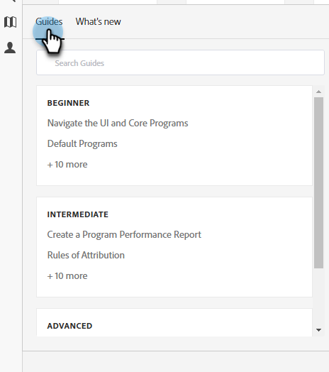

# Centro de ayuda {#help-center}

El Centro de ayuda de Adobe Marketo Engage sirve como ubicación centralizada para obtener asistencia. Además de vincularse a varios recursos (p. ej., [documentación del producto](/help/marketo/home.md){target="_blank"}, [información de la versión](/help/marketo/release-notes/current.md){target="_blank"}, la [comunidad de usuarios de Marketo](https://nation.marketo.com/){target="_blank"}), puede acceder a útiles tutoriales del producto organizados por nivel de experiencia.

## Cómo acceder {#how-to-access}

Existen dos experiencias diferentes, en función de si su suscripción ha migrado al sistema de administración de identidades de Adobe (IMS).

### Migración IMS previa a Adobe {#pre-adobe-ims-integration}

Estos pasos son para usuarios de Marketo Engage que _no_ han migrado aún a [Adobe IMS](/help/marketo/product-docs/administration/marketo-with-adobe-identity/adobe-identity-management-overview.md){target="_blank"}.

[Inicie sesión](https://login.marketo.com/){target="_blank"} en Marketo Engage y haga clic en el icono Ayuda.

#### Guías {#guides}

Las guías sirven como tutoriales rápidos para las funciones populares.

1. Haga clic en la guía que desee para verla.

   

1. Haga clic en **Empezar**.

   

1. Seleccione **Siguiente** para continuar.

   

1. Haga clic en **Listo** para salir del tutorial.

   

   >[!TIP]
   >
   >Salga de la guía en cualquier momento haciendo clic en **Descartar**.

#### Novedades {#whats-new}

La pestaña Novedades contiene los detalles de la última versión de Marketo Engage.

>[!TIP]
>
>Haga clic en el icono de flecha en la parte inferior para ver la página en Experience League.

#### Recursos {#resources}

La pestaña Recursos le permite acceder rápida y directamente a varias formas de obtener ayuda adicional con su instancia de Marketo Engage.

### Migración de IMS posterior a Adobe {#post-adobe-ims-integration}

Estos pasos son para usuarios de Marketo Engage que ya han migrado a [Adobe IMS](/help/marketo/product-docs/administration/marketo-with-adobe-identity/adobe-identity-management-overview.md){target="_blank"}.

[Inicie sesión](https://experience.adobe.com/){target="_blank"} en Marketo Engage y haga clic en el icono Ayuda.

Aparece el Centro de ayuda. Haga clic en cualquiera de los recursos de ayuda citados para llevarlos a su respectiva área. También puede buscar términos específicos.

Las guías (que anteriormente formaban parte del centro de ayuda previo a la migración de Adobe IMS) ahora se encuentran en el área de navegación izquierda.

El centro de guías tiene dos pestañas: Guías y Novedades. Las guías sirven como tutoriales rápidos para las funciones populares de Marketo Engage. Haga clic en la guía que desee o busque en una específica.

La pestaña Novedades contiene los detalles de la última versión de Marketo Engage.

