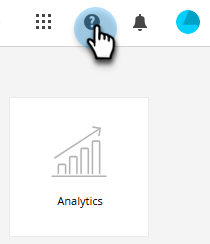

# Centro de ayuda {#help-center}

El Centro de ayuda de Adobe Marketo Engage sirve como ubicación centralizada para obtener asistencia. Además de vincularse a varios recursos (p. ej., [documentación del producto](/help/marketo/home.md){target="_blank"}, [información de la versión](/help/marketo/release-notes/current.md){target="_blank"}, la [Comunidad de países de mercadotecnia](https://nation.marketo.com/){target="_blank"}), puede obtener acceso a tutoriales útiles en el producto organizados por nivel de experiencia.

## Cómo acceder a {#how-to-access}

Existen dos experiencias diferentes, en función de si su suscripción se ha migrado aún a Adobe Identity Management System (IMS).

### Migración IMS previa a Adobe {#pre-adobe-ims-integration}

Estos pasos son para usuarios Marketo Engage que _no_ se han migrado aún a [Adobe IMS](/help/marketo/product-docs/administration/marketo-with-adobe-identity/adobe-identity-management-overview.md).

[Inicia sesión](http://login.marketo.com/) en el Marketo Engage y haz clic en el icono Ayuda.

#### Guías {#guides}

Las guías sirven como tutoriales rápidos para las funciones populares.

1. Haga clic en la guía que desee para verla.

   

1. Haga clic en **Comenzar**.

   

1. Haga clic en **Siguiente** para continuar.

   

1. Haga clic en **Listo** para salir del tutorial.

   

   >[!TIP]
   >
   >Salga de la guía en cualquier momento haciendo clic en **Descartar**.

#### Novedades {#whats-new}

La pestaña Novedades contiene los detalles de la última versión de Marketo Engage.

>[!TIP]
>
>Haga clic en el icono de flecha en la parte inferior para ver la página en Experience League.

#### Recursos {#resources}

La pestaña Recursos le permite acceder rápida y directamente a varias formas de obtener ayuda adicional con la instancia de Marketo Engage.

### Migración de IMS posterior a Adobe {#post-adobe-ims-integration}

Estos pasos son para usuarios Marketo Engage que ya se han migrado a [Adobe IMS](/help/marketo/product-docs/administration/marketo-with-adobe-identity/adobe-identity-management-overview.md).

[Inicia sesión](https://experience.adobe.com/) en el Marketo Engage y haz clic en el icono Ayuda.

Aparecerá el Centro de ayuda. Haga clic en cualquiera de los recursos de ayuda enumerados para llevarlos a su área respectiva. También puede buscar términos específicos.

Las guías (que anteriormente formaban parte del Centro de ayuda previo a la migración de Adobe IMS) ahora se encuentran en el área de navegación izquierda.

El Centro de guías tiene dos fichas, Guías y Novedades. Las guías sirven como tutoriales rápidos para las funciones populares de Marketo Engage. Haga clic en la guía que desee o busque una específica.

La pestaña Novedades contiene los detalles de la última versión de Marketo Engage.

