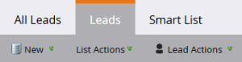
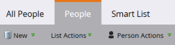

# Actualizaciones de terminología de marketing {#updates-to-marketo-terminology}

Estamos haciendo algunos cambios en nuestra plataforma, que afectarán lo que se llama algunas cosas. Si tiene una nueva instancia de Marketing a partir de marzo de 2016, o si su compañía se ha renovado después de julio de 2016, es posible que esté viendo la nueva terminología ahora.

Aunque puede ver una terminología diferente en la documentación de Marketing, tenga la seguridad de que todos los artículos se actualizarán pronto para reflejar estos cambios. Todas las instrucciones son iguales.

Entonces, ¿qué ha cambiado?

## El posible cliente es ahora persona {#lead-is-now-person}

El cambio más importante es el cambio de nombre de posibles clientes/posibles clientes a persona/personas.

<table> 
 <colgroup> 
  <col> 
  <col> 
 </colgroup> 
 <tbody> 
  <tr> 
   <td><strong>Antiguo</strong></td> 
   <td><strong>Nuevo</strong></td> 
  </tr> 
  <tr> 
   <td> 
    
 
      
    
</td> 
   <td> 
    
 
      
    
</td> 
  </tr> 
 </tbody> 
</table>

En algunos casos, la palabra &quot;posible cliente&quot; se elimina simplemente.

<table> 
 <colgroup> 
  <col> 
  <col> 
 </colgroup> 
 <tbody> 
  <tr> 
   <td><strong>Antiguo</strong></td> 
   <td><strong>Nuevo</strong></td> 
  </tr> 
  <tr> 
   <td> 
    
 
      
    
</td> 
   <td> 
    
 
     

 
    
</td> 
  </tr> 
 </tbody> 
</table>

El posible cliente y la persona **son lo mismo**.

## Tokens {#tokens}

Los tokens con la palabra lead en ellos **no cambian**. Pedimos disculpas por cualquier confusión; sin embargo, cambiar todos los tokens para que coincidan con la nueva terminología rompería un montón de tokens que se utilizan actualmente. De modo que aún verá tokens como &quot;`{{lead.First Name}}`&quot;. No hay tokens específicos de la persona.

>[!NOTE]
>
>Hay *es* un token llamado &quot;Notas personales&quot;, pero ese token siempre estuvo ahí. Normalmente se utiliza para un campo de descripción en su CRM, si es que lo hace.

## Administración de campos {#field-management}

Los campos que contenían el término Posible cliente se han sustituido por Persona o se ha eliminado la palabra Posible cliente. Sin embargo, una excepción notable es el campo &quot;Propietario de posibles clientes&quot;. Ahora se conoce como &quot;Propietario de ventas&quot;.

<table> 
 <colgroup> 
  <col> 
  <col> 
 </colgroup> 
 <tbody> 
  <tr> 
   <td><strong>Antiguo</strong></td> 
   <td><strong>Nuevo</strong></td> 
  </tr> 
  <tr> 
   <td> 
    
 
      
    
</td> 
   <td> 
    
 
      
    
</td> 
  </tr> 
 </tbody> 
</table>

>[!NOTE]
>
>Para obtener una lista completa de los nombres de campo afectados, visite este [Artículo de soporte](https://nation.marketo.com/docs/DOC-4218#jive_content_id_Field_Names_and_Tokens).

## La Personalización en tiempo real (RTP) es ahora Personalización Web {#real-time-personalization-rtp-is-now-web-personalization}

<table> 
 <colgroup> 
  <col> 
  <col> 
 </colgroup> 
 <tbody> 
  <tr> 
   <td><strong>Antiguo</strong></td> 
   <td><strong>Nuevo</strong></td> 
  </tr> 
  <tr> 
   <td> 
    
 
      
    
</td> 
   <td> 
    
 
      
    
</td> 
  </tr> 
 </tbody> 
</table>

Además del cambio de nombre, ahora consta de cuatro aplicaciones independientes:

| ** [Personalización Web](https://docs.marketo.com/display/DOCS/Web+Personalization+-+RTP)** | Tiene su propio mosaico en la pantalla de inicio |
|---|---|
| ** [Marketing web basado en cuentas](https://docs.marketo.com/display/DOCS/Account-Based+Web+Marketing)** | Accesible a través del mosaico de Personalización web |
| ** [Retargeting personalizado](https://docs.marketo.com/display/DOCS/Website+Retargeting)** | Accesible a través del mosaico de Personalización web |
| ** [Contenido predictivo](https://docs.marketo.com/display/DOCS/Predictive+Content)** | Tiene su propio mosaico en la pantalla de inicio |

>[!NOTE]
>
>Los mosaicos visibles en la pantalla de inicio reflejarán los módulos comprados.

Gracias por su paciencia durante esta actualización.
