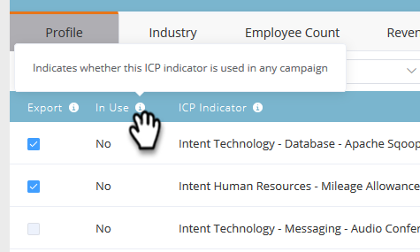

# Clasificación y ajuste de perfiles de cuenta {#account-profiling-ranking-and-tuning}

La generación de perfiles de cuenta identifica el Perfil ideal del cliente (ICP), clasifica las compañías en la base de datos en función del PCI y agrega datos del indicador ICP a las cuentas promocionadas como cuentas con nombre.

## Resultados del modelo {#model-results}

Los resultados muestran todas las cuentas conocidas desglosadas por categoría. A es la categoría más alta, D es la más baja.

Aunque es opcional, se recomienda seleccionar la casilla de verificación Promocionar automáticamente, ya que le ahorrará un montón de tiempo. Sin embargo, si desea pasar por cada cuenta y [agregarla manualmente](http://docs.marketo.com/display/DOCS/Discover+Accounts#DiscoverAccounts-DiscoverCRMAccounts), simplemente deje la casilla sin marcar.

<table> 
 <tbody> 
  <tr> 
   <td><strong>Clasificación</strong></td> 
   <td> 
    

      Clasificación de cuenta basada en el Perfil del cliente ideal. A es el mejor ajuste, D es el menos apropiado. 
    
</td> 
  </tr> 
  <tr> 
   <td><strong>Propensión</strong></td> 
   <td> 
    

      Aumento estimado de la tasa de conversión en comparación con una selección de cuentas no basada en el PCI. 
    
</td> 
  </tr> 
  <tr> 
   <td><strong>Cuentas (%)</strong></td> 
   <td> 
    

      Porcentaje de cuentas en entrada de modelo que tienen esta clasificación. 
    
</td> 
  </tr> 
  <tr> 
   <td><strong>% de base de modelo</strong></td> 
   <td> 
    

      Porcentaje de cuentas en base modelo que tienen esta clasificación. 
    
</td> 
  </tr> 
 </tbody> 
</table>

## Ajuste de modelo {#model-tuning}

En la ficha Modelo, haga clic en el botón Ajustar modelo.

Hay varias fichas entre las que elegir, lo que permite una personalización más profunda.

Categorías del indicador

| **Cumplimiento** | Certificaciones, puestos/contratación relacionados con el cumplimiento. |
|---|---|
| **Operaciones** | Puestos/contratación relacionados con las operaciones. |
| **HR** | Software de RR.HH. o Nómina, puestos/contratación relacionados con RH. |
| **Ingeniería** | Tecnologías, marcos, puestos relacionados con la ingeniería y contratación. |
| **Ventas** | Soluciones y software para ventas, posiciones/contratación relacionadas con ventas. |
| **Calidad** | Indicadores de calidad. |
| **IT** | Soluciones de hardware y software, tecnologías, puestos/contratación relacionados con TI. |
| **Finanzas** | Programas informáticos financieros, puestos relacionados con las finanzas/contratación. |
| **Mercadotecnia** | Tecnologías y software de mercadotecnia, puestos/contratación relacionados con la mercadotecnia. |
| **Negocios** | Listas de Forbes o Inc o sociedades comerciales. |
| **Experiencia y relaciones con el cliente** | Posiciones/contratación de éxito del cliente y relaciones con el cliente. |

Pase el ratón sobre la información del objeto para ver una descripción de cada columna.

Haga clic en la lista desplegable Añadir indicador ICP para insertar indicadores adicionales en el modelo.

Si activa la casilla Exportar, podrá ver el indicador ICP en la página Detalles de la cuenta con nombre, así como utilizar el indicador ICP seleccionado como restricciones en filtros [de cuenta](http://docs.marketo.com/display/DOCS/Account+Filters)con nombre.

>[!NOTE]
>
>Los indicadores del PCI se incluyen como limitaciones en **Miembro de los activadores y Filtros de cuentas** designadas.

La ponderación del indicador es lo que controla el nivel de importancia que cada indicador recibe en su modelo.

Haga clic en Actualizar modelo para que esos cambios surtan efecto.

Cuando haya terminado de ajustar el modelo (después de actualizarlo), vuelva a la ficha Resultados del modelo y haga clic en **Guardar y aplicar clasificaciones**.

