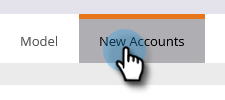

# Descubrimiento de nueva cuenta {#new-account-discovery}

La nueva detección de cuentas puede ayudarle a encontrar nuevas cuentas para destinatario mediante el uso de las recomendaciones impulsadas por AI de su perfil ideal para clientes.

>[!PREREQUISITES]
>
>[Configuración de perfiles de cuenta](/help/marketo/product-docs/account-based-marketing/account-profiling/setting-up-account-profiling.md)

>[!TIP]
>
>Se recomienda pulsar el botón **Actualizar cuentas existentes** antes de realizar una nueva búsqueda en la cuenta para asegurarse de que está mirando los datos más recientes. Esta actualización puede tardar hasta 24 horas.

1. En Mi marketing, haga clic en **ABM**.

   

1. Haga clic en la ficha **Perfiles de cuenta**.

   

1. Haga clic en la ficha **Nuevas cuentas**.

   

   >[!NOTE]
   >
   >Nuevas cuentas muestra una lista de cuentas que no son suyas en ABM, sin embargo. Son cuentas que tienen el potencial de ser nuevas para usted según los filtros que seleccione.

1. Seleccione todos los filtros aplicables (esta parte es altamente personalizable, el siguiente es sólo un ejemplo para demostrar el filtrado).

   

1. Haga clic en **Guardar todo y crear Lista** en la parte inferior derecha de la página.

   

   >[!NOTE]
   >
   >Si solo ve algunas cuentas que desea, tiene la opción de hacer clic en cuentas individuales y hacer clic en **Guardar cuentas seleccionadas** cuando haya terminado.

1. Puede convertir su lista en su propia nueva Lista de cuenta o agregarla a una existente. En este ejemplo, crearemos uno nuevo.

   

   >[!NOTE]
   >
   >Para guardarla en una Lista de cuenta existente, seleccione esa opción, haga clic en la lista desplegable y seleccione la Lista de cuenta que desee y haga clic en **Siguiente**.

1. Haga clic en **Guardar**.

   

   >[!NOTE]
   >
   >Sólo puede guardar hasta 5000 cuentas a la vez. Si la búsqueda arroja 10.000 resultados, tendrá que guardar los primeros 5.000 (primeros), luego restablecer los filtros y guardar los siguientes 5.000. El límite de cuentas **total** es de un millón.

1. Haga clic en **Aceptar**.

   

   >[!TIP]
   >
   >Una vez guardadas las cuentas, puede utilizar una [audiencia coincidente en LinkedIn](/help/marketo/product-docs/account-based-marketing/target/create-a-matched-audience-on-linkedin.md) para destinatario.
