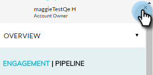

# Información general del complemento de perspectiva de cuenta {#account-insight-plug-in-overview}

Account Insight es un complemento de Chrome que presenta información sobre cuentas y ABM procesables a sus equipos de ventas, lo que les permite comprometer cuentas de forma más eficaz.

>[!NOTE]
>
>**Disponibilidad**
>
>La perspectiva de cuenta se incluye para todos los clientes que tienen ABM y Marketingto Sales Insight. Para los clientes que solo tienen ABM, Account Insight está disponible como complemento adquirido. Cada cliente tiene un límite de 250 asientos de perspectiva de cuenta. Póngase en contacto con su representante de ventas para obtener más detalles. No está disponible para clientes que no tienen ABM.

>[!CAUTION]
>
>El complemento de perspectiva de cuenta no funcionará en suscripciones que tengan [solo SSO](http://docs.marketo.com/display/DOCS/Restrict+User+Login+to+SSO+Only) (inicio de sesión único) habilitado.
>
>El contexto CRM funciona para Salesforce al iniciar el complemento desde una cuenta, un posible cliente o un contacto. El contexto de CRM no funcionará para Dynamics al iniciar el complemento desde una cuenta, un posible cliente o un contacto. Para los usuarios de Dynamics, se recomienda utilizar el complemento de perspectiva de cuenta.

## Cuentas con nombre {#named-accounts}

Ver cuentas con nombre en orden de clasificación entre sí. Esta lista solo está disponible para los propietarios de cuentas. El equipo de cuentas estará disponible próximamente.

Para ver los detalles de una cuenta con nombre, haga clic en su nombre...

...y aparece la información general.

Vea momentos interesantes usando la lista desplegable.

Desplácese hacia abajo para ver las mejores apuestas. Momentos interesantes también están aquí, junto con gente comprometida.

Haga clic en el nombre de una persona...

...y ver su actividad.

También puede cambiar la vista de Participación a Canalización.

Para salir de la cuenta con nombre, haga clic en la X en la esquina superior derecha.

## Fuente de actividad {#activity-feed}

La fuente de actividad muestra la actividad reciente, que se remonta a siete días.

Haga clic en la lista desplegable **Filtro** para filtrar por diferentes tipos de actividades.\

Se puede hacer clic en varios elementos. Haga clic en la cuenta con nombre para ver sus detalles. Haga clic en el nombre del usuario para ver su actividad. Haga clic en Más Actividades para ver más actividades.

¡Bastante genial!

>[!MORELIKETHIS]
>
>* [Configurar perspectiva de cuenta](set-up-account-insight.md)

>

