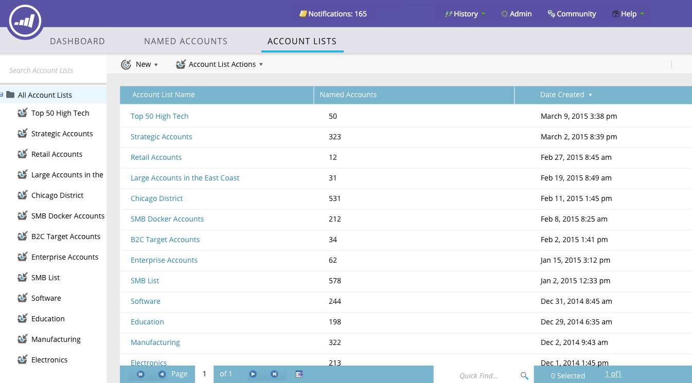

# Listas de cuenta {#account-lists}

Una lista de cuenta es una colección de cuentas con nombre que se pueden dirigir juntas. Las listas de cuenta le permiten realizar destinatarios de cuentas con nombre por sector, ubicación o tamaño de la compañía.

Además de las listas de cuenta, también puede crear listas de cuenta dinámicas que se generan a partir de Vistas de cuenta de CRM públicas. Una Vista de cuenta de CRM es un conjunto de reglas que actúa como filtro al mostrar las cuentas. Por ejemplo: puede utilizarla para encontrar cuentas en las que la industria es *de salud y* los ingresos superan los 100 millones de dólares.

>[!NOTE]
>
>Las listas de cuenta creadas en Marketing basado en cuentas de marketing están disponibles automáticamente al crear listas inteligentes y campañas web en [Personalización web](http://docs.marketo.com/display/DOCS/RTP+Segments).

## Crear una nueva Lista de cuenta {#create-a-new-account-list}

1. Haga clic en la lista desplegable **Nuevo** y seleccione **Crear nueva Lista de cuenta**.

   

1. Asigne un nombre a la lista y haga clic en **Crear**.

   

1. Después de crear la lista de la cuenta, comience [agregándole cuentas con nombre](http://docs.marketo.com/display/DOCS/Add+an+Existing+Named+Account+to+an+Account+List)!

   >[!NOTE]
   >
   >Marketo solo mostrará perspectivas para listas de cuentas con 2.000 o menos cuentas con nombre.

## Crear una nueva Lista de cuenta dinámica {#create-a-new-dynamic-account-list}

1. Haga clic en la lista desplegable **Nuevo** y seleccione **Crear nueva Lista dinámica**.

   

1. En el cuadro de diálogo, seleccione una **Vista de cuenta de CRM** en la lista desplegable o escriba el nombre para buscarla.

   

1. Haga clic en **Crear**.

   

   >[!NOTE]
   >
   >En Salesforce, asegúrese de proporcionar permisos de objeto de Vista de Lista al usuario de sincronización.

## Cambiar el nombre de una Lista de cuenta {#rename-an-account-list}

>[!NOTE]
>
>Estos pasos solo se aplican a listas de cuenta. *Las listas de* cuentas dinámicas utilizan el nombre de sus Vistas de cuentas de CRM asociadas.

1. Seleccione la cuenta a la que desea cambiar el nombre, haga clic en la lista desplegable **Acciones de Lista de cuenta** y seleccione **Cambiar el nombre de la Lista de cuenta**.

   

1. Escriba el nuevo nombre y haga clic en **Cambiar nombre**.

   

   >[!NOTE]
   >
   >La Vista Cuenta CRM se sincroniza con la lista de cuenta dinámica cada 8 horas. Si aún no se han sincronizado, Marketing hará la sincronización durante el siguiente ciclo.

## Eliminar una Lista de cuenta {#delete-an-account-list}

>[!NOTE]
>
>Estos pasos son los mismos tanto para las listas de cuenta como para las listas de cuentas dinámicas.

1. Seleccione la cuenta que desee eliminar, haga clic en la lista desplegable **Acciones de Lista de cuenta** y seleccione **Eliminar Lista de cuenta**.

   

1. Haga clic en **Eliminar**.

   

>[!MORELIKETHIS]
>
>* [Añadir una cuenta con nombre existente en una Lista de cuenta](named-accounts/add-an-existing-named-account-to-an-account-list.md)
>* [Perspectivas de Lista de cuentas](../../../product-docs/account-based-marketing/measure/account-list-insights.md)

>

