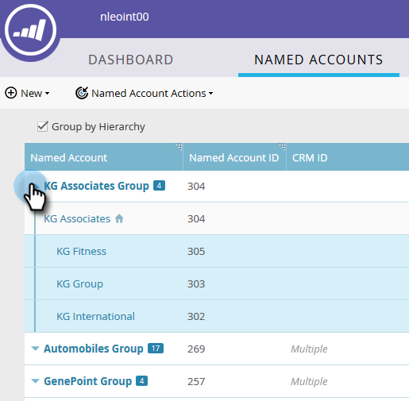

# Crear una jerarquía {#create-a-hierarchy}

Las jerarquías deben crearse en CRM. Sin embargo, si no tiene una CRM, siga estos pasos para crear una jerarquía manualmente.

1. En Cuentas con nombre, haga clic en la casilla **Agrupar por jerarquía**.

   

   >[!NOTE]
   >
   >Solo se pueden usar cuentas que no sean de CRM para crear una jerarquía manualmente. Las cuentas vinculadas a CRM deben tener sus jerarquías creadas en la CRM.

1. Con Ctrl+clic (Windows) o Cmd+clic (Mac), seleccione todas las cuentas que desee agrupar en una jerarquía.

   

1. Haga clic en la lista desplegable **Acciones de cuenta con nombre** y seleccione **Vínculo a cuenta con nombre**.

   

   >[!NOTE]
   >
   >Si desea desvincular cuentas, siga los pasos anteriores pero elija **Desvincular de cuenta con nombre**.

1. Seleccione una cuenta con nombre principal en la lista desplegable y haga clic en **Vínculo**.

   

1. Sus cuentas con nombre ahora forman parte de una jerarquía. Haga clic en la flecha a la izquierda para ver todas sus cuentas secundarias.

   
