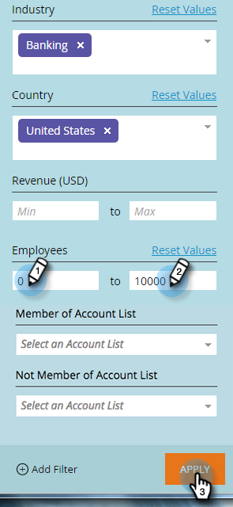

# Filtrado de cuentas con nombre {#filtering-in-named-accounts}

El filtrado es una buena manera de reducir los datos rápidamente.

>[!NOTE]
>
>Los datos que aparecen en los menús desplegables del filtro reflejan todos los campos disponibles en su CRM que se han sincronizado con Marketing.

1. Haga clic en el icono de filtro.

   

   >[!NOTE]
   >
   >Existen varias combinaciones de parámetros de búsqueda. En este ejemplo se encuentra: _Industria = Banca, País = Estados Unidos, Número máximo de empleados = 10000_.

1. Haga clic en la lista desplegable **Industria** y seleccione **Banca**.

   

1. Haga clic en la lista desplegable **País** y seleccione **Estados Unidos**.

   

1. En **Empleados**, escriba &quot;0&quot; en el campo **Min**, &quot;10000&quot; en el campo **Max** y haga clic en **Aplicar**.

   

   ¡Y eso es todo! Los resultados filtrados aparecen en la parte izquierda de la pantalla.

   >[!NOTE]
   >
   >Para agregar más filtros para elegir, haga clic en **Añadir filtro** en la parte inferior izquierda del formulario.
