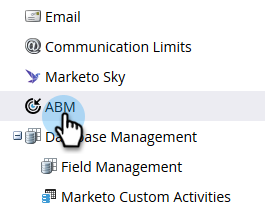

# Uso de personas {#using-personas}

Las personas son una buena manera de segmentar su audiencia y mercado ABM a un subconjunto específico de personas.

## Añadir una persona {#add-a-persona}

1. En Mi marketing, haga clic en **Administración**.

   

1. En el árbol, seleccione **ABM**.

   

1. Haga clic en **Editar**.

   

   >[!NOTE]
   >
   >De forma predeterminada, se incluye la persona Puesto. No se puede modificar ni eliminar.

1. Para agregar otras personas, haga clic en **+Añadir**.

   

1. Asigne un nombre a la persona y seleccione el campo correspondiente en la lista desplegable. Puede agregar hasta dos personas adicionales. Haga clic en **Guardar** cuando termine.

   

   >[!NOTE]
   >
   >Sólo los campos personalizados de Salesforce de tipo &quot;picklist&quot; que se han sincronizado con la instancia de Marketo están disponibles en la lista desplegable de campos de persona al crear una persona.

## Vista de sus personas {#view-your-personas}

Vista de las personas visitando una cuenta con nombre específica.

1. Seleccione la cuenta con nombre que desee.

   

1. Haga clic en la ficha **Personas** .

   

1. Todas tus personalidades aparecen en la lista. Haga clic en un número para ver la lista de personas.

   

   >[!NOTE]
   >
   >La X del Título Persona actúa como comodín. Por ejemplo, &quot;CXO&quot; incluirá a los directores ejecutivos, los directores financieros, etc.

## Filtros personales {#persona-filters}

1. Utilice filtros personales en una lista inteligente para comercializar a un grupo específico de personas.

