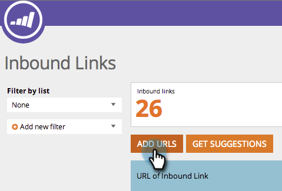

# SEO: añadir manualmente una URL de vínculo entrante {#seo-add-an-inbound-link-url-manually}

Puede añadir vínculos entrantes manualmente. Así es cómo se hace.

>[!IMPORTANT]
>
>El 31 de marzo de 2026, Marketo Engage dejará de utilizar la función Optimización del motor de búsqueda. Exporte los datos pertinentes el 30 de marzo o antes. [Más información](https://nation.marketo.com/t5/product-blogs/marketo-engage-seo-feature-deprecation/ba-p/359060){target="_blank"}.
>
>* [Problemas de exportación](https://experienceleague.adobe.com/es/docs/marketo/using/product-docs/additional-apps/seo/pages/seo-export-issues-to-csv){target="_blank"}
>* [Exportar resultados de palabras clave](https://experienceleague.adobe.com/es/docs/marketo/using/product-docs/additional-apps/seo/keywords/seo-exporting-keyword-results){target="_blank"}
>* [Exportar tendencias de palabras clave](https://experienceleague.adobe.com/es/docs/marketo/using/product-docs/additional-apps/seo/reports/seo-use-the-keyword-trends-report#exporting-data){target="_blank"}
>* [Exportar tendencias de palabras clave de la competencia](https://experienceleague.adobe.com/es/docs/marketo/using/product-docs/additional-apps/seo/reports/seo-use-the-competitor-kw-trends-report#exporting-data){target="_blank"}

1. Vaya a la sección **[!UICONTROL Vínculos entrantes]**.

   

1. Haga clic en **[!UICONTROL Agregar direcciones URL]**.

   

1. Escriba la dirección URL. Haga clic en **[!UICONTROL Agregar]**.

   

   >[!TIP]
   >
   >¿Sabía que puede [agregar su vínculo de entrada a una lista nueva o existente](/help/marketo/product-docs/additional-apps/seo/understanding-seo/seo-managing-lists.md){target="_blank"}? ¡Eche un vistazo!

   

¡Rockea! Ahora debería ver la nueva URL agregada a la lista. La recopilación de todos los datos puede tardar un poco.
