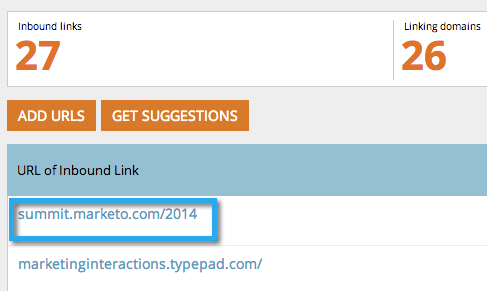

# SEO - Añadir una URL de vínculo entrante de forma manual {#seo-add-an-inbound-link-url-manually}

Puede agregar vínculos de entrada manualmente. Así es como:

1. Vaya a la sección **Vínculos de entrada**.

   

1. Haga clic en **Añadir direcciones URL**.

   

1. Escriba la dirección URL. Haga clic en **Añadir**.

   

   >[!TIP]
   >
   >¿Sabía que puede [agregar el vínculo de entrada a una lista nueva o existente](/help/marketo/product-docs/additional-apps/seo/understanding-seo/seo-managing-lists.md)? ¡Echa un vistazo!

   

¡Vamos! Ahora debería ver la nueva dirección URL agregada a la lista. Puede tomar algún tiempo recopilar todos los datos.

