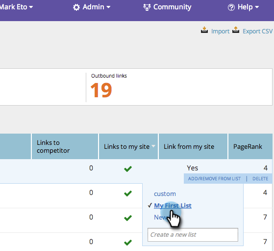

# SEO: Agregar o eliminar una URL de vínculo de entrada de una lista {#seo-add-remove-an-inbound-link-url-from-a-list}

Puede organizar sus URL de enlace entrantes al contenido de su corazón.

## Añadir una URL de vínculo de entrada a una lista {#add-an-inbound-link-url-to-a-list}

1. Vaya a la sección Vínculos entrantes .

   

1. Pase el ratón sobre la dirección URL del vínculo entrante que quiera categorizar. Haga clic en **Agregar o quitar de la lista**.

   

1. Haga clic en la lista a la que desea que vaya la dirección URL del vínculo de entrada.

   

>[!TIP]
>
>También puede crear una nueva lista para que su palabra clave vaya. Escriba el nombre que desee en Crear una lista nueva.

## Eliminar una URL de vínculo entrante de una lista {#remove-an-inbound-link-url-from-a-list}

A veces, se recomienda quitar una URL de vínculo entrante de una lista.

1. Haga clic en **Vínculos entrantes**.

   

1. Haga clic en la lista desplegable **Filter by list**. Haga clic en la lista que desee limpiar.

   

1. Pase el ratón sobre la dirección URL del vínculo entrante que desee eliminar. Haga clic en **Agregar o quitar de la lista**.

   

1. Se comprobará la lista que desee organizar. Haga clic en el nombre de la lista para eliminar la URL del vínculo de entrada de esta lista.

   

¡Lo hiciste! Actualice la página para actualizar la visualización.
