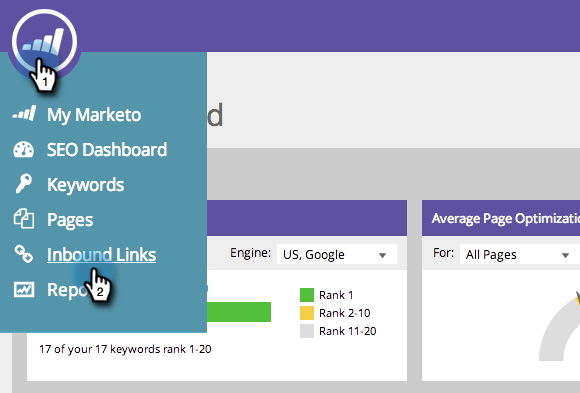

# SEO: añadir o quitar una URL de vínculo de entrada de una lista {#seo-add-remove-an-inbound-link-url-from-a-list}

Puede organizar las direcciones URL de los vínculos de entrada para el contenido de su corazón.

## Adición de una URL de vínculo de entrada a una lista {#add-an-inbound-link-url-to-a-list}

1. Vaya a la sección **[!UICONTROL Vínculos entrantes]**.

   

1. Pase el ratón sobre la dirección URL del vínculo de entrada que quiera clasificar. Haga Clic En **[!UICONTROL Agregar/Quitar De La Lista]**.

   

1. Haga clic en la lista a la que desee dirigir la dirección URL del vínculo de entrada.

   

>[!TIP]
>
>También puede crear una nueva lista para que la palabra clave vaya. Escriba el nombre que desee en [!UICONTROL Crear una lista nueva].

## Eliminar una URL de vínculo entrante de una lista {#remove-an-inbound-link-url-from-a-list}

A veces, es recomendable quitar las direcciones URL de los vínculos de entrada de una lista.

1. Haga clic en **[!UICONTROL Vínculos entrantes]**.

   

1. Haga clic en la lista desplegable **[!UICONTROL Filtrar por lista]**. Haga clic en la lista que desee limpiar.

   

1. Pase el ratón sobre la dirección URL del vínculo de entrada que quiera eliminar. Haga Clic En **[!UICONTROL Agregar/Quitar De La Lista]**.

   

1. La lista que desee organizar se comprobará. Haga clic en el nombre de la lista para eliminar la dirección URL del vínculo de entrada de esta lista.

   

¡Tú lo hiciste! Actualice la página para actualizar la visualización.
