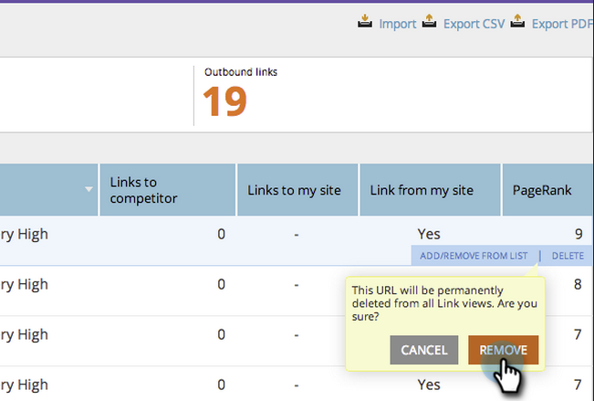

# SEO: quitar/eliminar una URL de vínculo de entrada {#seo-remove-delete-an-inbound-link-url}

A veces, es recomendable eliminar los vínculos de entrada. Así es cómo se hace.

>[!IMPORTANT]
>
>El 31 de marzo de 2026, Marketo Engage dejará de utilizar la función Optimización del motor de búsqueda. Exporte los datos pertinentes el 30 de marzo o antes. [Más información](https://nation.marketo.com/t5/product-blogs/marketo-engage-seo-feature-deprecation/ba-p/359060){target="_blank"}.
>
>* [Problemas de exportación](https://experienceleague.adobe.com/en/docs/marketo/using/product-docs/additional-apps/seo/pages/seo-export-issues-to-csv){target="_blank"}
>* [Exportar resultados de palabras clave](https://experienceleague.adobe.com/en/docs/marketo/using/product-docs/additional-apps/seo/keywords/seo-exporting-keyword-results){target="_blank"}
>* [Exportar tendencias de palabras clave](https://experienceleague.adobe.com/en/docs/marketo/using/product-docs/additional-apps/seo/reports/seo-use-the-keyword-trends-report#exporting-data){target="_blank"}
>* [Exportar tendencias de palabras clave de la competencia](https://experienceleague.adobe.com/en/docs/marketo/using/product-docs/additional-apps/seo/reports/seo-use-the-competitor-kw-trends-report#exporting-data){target="_blank"}

1. Vaya a la sección **[!UICONTROL Vínculos entrantes]**.

   

1. Pase el ratón sobre la dirección URL del vínculo de entrada que quiera eliminar.

   

1. Haga clic en **[!UICONTROL Quitar]**.

   

Ahora ha eliminado este vínculo de entrada.
