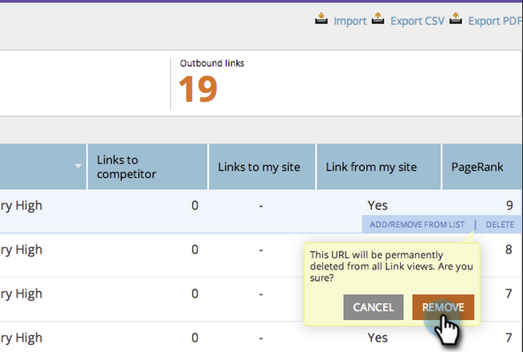

# SEO - Eliminar/Eliminar una URL de vínculo de entrada {#seo-remove-delete-an-inbound-link-url}

A veces querrá eliminar los vínculos entrantes. Así es como:

1. Vaya a la sección **Vínculos de entrada**.

   

1. Pase el ratón sobre la dirección URL del vínculo de entrada que desee eliminar.

   
Haga clic en QUITAR.
   

   ¡Levántate! Ha eliminado este vínculo de entrada.

