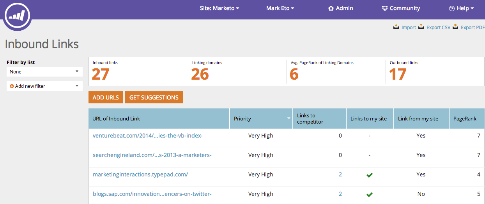

# SEO: Explicación de los vínculos de entrada {#seo-understanding-inbound-links}

Los vínculos de entrada indican a los motores de búsqueda que vale la pena hacer referencia a su sitio. ¡Eso es bueno!

## Definición de columnas {#definition-of-columns}

| Título de columna | Descripción |
|---|---|
| URL del vínculo entrante | La página web en cuestión. |
| Prioridad | Cuán valiosa es esta oportunidad para la clasificación de su página. |
| Vínculos a la competencia | Indica si un competidor está vinculado a en esa dirección URL. |
| Vínculos a mi sitio | Indica si el sitio está vinculado en esa dirección URL. |
| Vínculos desde mi sitio | Indica si el sitio está vinculado a esa dirección URL. |
| Clasificación de página | Identifica que las URL clasifican la página en la búsqueda (1 - 10) |

¡Dulce! Ahora que comprende los vínculos entrantes, podemos sugerir más oportunidades de vínculo entrante para su sitio.

>[!MORELIKETHIS]
>
>[Obtener sugerencias de vínculos de entrada](/help/marketo/product-docs/additional-apps/seo/inbound-links/seo-get-inbound-link-suggestions.md)
