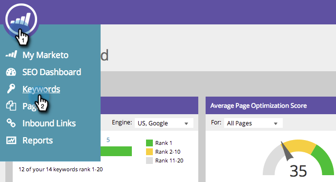

# SEO: Agregar palabras clave {#seo-add-keywords}

Las palabras clave son frases que la gente escribe en los motores de búsqueda. Añada las palabras clave más relevantes para su negocio.

>[!NOTE]
>
>Si tiene muchas palabras clave, puede [Importarlos con un archivo CSV](/help/marketo/product-docs/additional-apps/seo/keywords/seo-importing-keywords-with-a-csv.md).

1. Vaya a la **[!UICONTROL Palabras clave]** sección.

   

1. Introduzca las palabras clave que quiera segmentar y haga clic en **[!UICONTROL Guardar]**.

   

   >[!TIP]
   >
   >Separe las palabras clave con saltos de línea o comas.

   

   >[!MORELIKETHIS]
   >
   >[Explicación de las palabras clave (vista de resumen)](/help/marketo/product-docs/additional-apps/seo/keywords/seo-understanding-keywords.md)

¡Buen trabajo! Ahora debería ver las nuevas adiciones a la lista de palabras clave.
