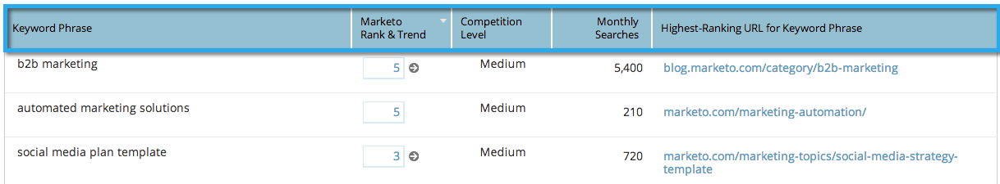

# SEO: añadir o quitar columnas de la vista de palabras clave {#seo-add-remove-columns-from-your-keywords-view}

Puede ajustar la vista de palabras clave para mostrar los datos que más le interesen.
>[!IMPORTANT]
>
>El 31 de marzo de 2026, Marketo Engage dejará de utilizar la función Optimización del motor de búsqueda. Exporte los datos pertinentes el 30 de marzo o antes. [Más información](https://nation.marketo.com/t5/product-blogs/marketo-engage-seo-feature-deprecation/ba-p/359060){target="_blank"}.
>
>* [Problemas de exportación](https://experienceleague.adobe.com/es/docs/marketo/using/product-docs/additional-apps/seo/pages/seo-export-issues-to-csv){target="_blank"}
>* [Exportar resultados de palabras clave](https://experienceleague.adobe.com/es/docs/marketo/using/product-docs/additional-apps/seo/keywords/seo-exporting-keyword-results){target="_blank"}
>* [Exportar tendencias de palabras clave](https://experienceleague.adobe.com/es/docs/marketo/using/product-docs/additional-apps/seo/reports/seo-use-the-keyword-trends-report#exporting-data){target="_blank"}
>* [Exportar tendencias de palabras clave de la competencia](https://experienceleague.adobe.com/es/docs/marketo/using/product-docs/additional-apps/seo/reports/seo-use-the-competitor-kw-trends-report#exporting-data){target="_blank"}

1. Vaya a la sección **[!UICONTROL Palabras clave]**.

   

   Estas son las columnas predeterminadas:

   

1. Haga clic en el icono de engranaje.

   

1. Seleccione o anule la selección de las columnas que desee ver. Haga clic en **[!UICONTROL Guardar]**.

   

   ¡Fantástico! Ahora ha personalizado la vista de palabra clave.

   

   >[!MORELIKETHIS]
   >
   >[Comprender las palabras clave - Vista de resumen](/help/marketo/product-docs/additional-apps/seo/keywords/seo-understanding-keywords.md)
