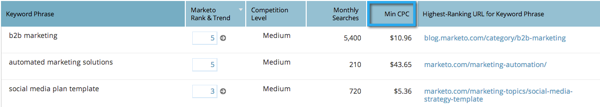

# SEO: Agregar o eliminar columnas de la vista de palabras clave {#seo-add-remove-columns-from-your-keywords-view}

Puede ajustar la vista de palabra clave para mostrar los datos que más le interesen.

1. Vaya a la sección **Palabras clave**.

   

   Estas son las columnas predeterminadas:

   

1. Haga clic en el icono del engranaje.

   

1. Seleccione o anule la selección de las columnas que desee ver. Haga clic en **Guardar**.

   

   ¡Increíble! Ahora ha personalizado la vista de palabras clave.

   

   >[!MORELIKETHIS]
   >
   >[Explicación de las palabras clave: vista de resumen](/help/marketo/product-docs/additional-apps/seo/keywords/seo-understanding-keywords.md)
