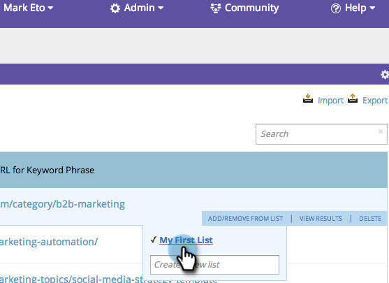

# SEO - Añadir/eliminar palabras clave de una Lista {#seo-add-remove-keywords-from-a-list}

Puede mantener todas las palabras clave en buen estado y organizadas mediante listas. Esto facilitará la búsqueda de datos en palabras clave específicas como tarta.

## Añadir a una Lista {#add-to-a-list}

1. Vaya a la sección **Palabras clave** .

   

1. Pase el ratón sobre la palabra clave que desee agregar a una lista. Haga clic en **AÑADIR/QUITAR DE LISTA**.

   

1. Haga clic en la lista y se agregarán las palabras clave.

   

   >[!TIP]
   >
   >También puede crear una nueva lista para las palabras clave. Escriba el nombre en Crear una nueva lista.

   

¡Guau! Seleccione la lista para ver las nuevas palabras clave.

## Eliminar palabra clave de la Lista {#remove-keyword-from-list}

También puede eliminar palabras clave de una lista.

1. Vaya a la sección **Palabras clave** .

   

1. Pase el ratón sobre la palabra clave que desee eliminar de una lista. Haga clic en **AÑADIR/QUITAR DE LISTA**.

   

1. Haga clic en la lista de la que desee eliminar las palabras clave.

   >[!NOTE]
   >
   >Todas las listas a las que pertenece la palabra clave actualmente tendrán una marca de verificación. Una vez retirada de la lista, la comprobación desaparece. ¡Magia!

   

   Perfecto, la palabra clave ya no está en esta lista. Actualice la página para actualizar la visualización.

   >[!NOTE]
   >
   >**Artículos relacionados**
   >    
   >* [Explicación de las palabras clave (Vista de resumen)](seo-understanding-keywords.md)

