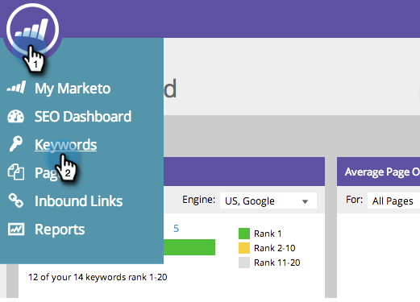

# SEO: Exportación de resultados de palabras clave {#seo-exporting-keyword-results}

Puede exportar los resultados de las palabras clave para compartirlos con su equipo o para crear un informe.

1. Vaya a la sección **Palabras clave**.

   

1. Haga clic en **Export**.

   

   Sí, realmente es tan fácil.
