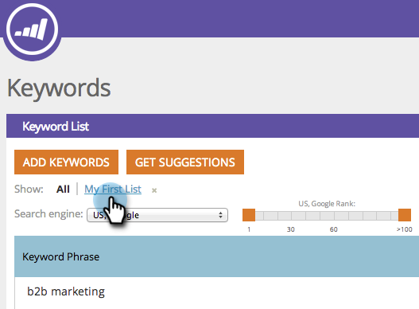

# SEO - Filtrar resultados de palabras clave {#seo-filter-keyword-results}

Puede tener muchas [palabras clave](seo-understanding-keywords.md). A continuación se indican diferentes formas de filtrarlos:

## Filtrar por lista {#filter-by-list}

1. Vaya a la sección **Palabras clave**.

   

1. Haga clic en el nombre de la lista en la que está centrado.

   

   >[!NOTE]
   >
   >Si no ve ninguna lista, [l](../../../../product-docs/additional-apps/seo/understanding-seo/seo-managing-lists.md) [aprenda a hacer una lista de palabra clave](../../../../product-docs/additional-apps/seo/understanding-seo/seo-managing-lists.md).

¡Dulce! Ahora sólo estará mirando las palabras clave de esa lista.

## Filtrar por clasificación SERP {#filter-by-serp-rank}

1. Vaya a la sección Palabras clave.

   

   Los cuadrados anaranjados definen los límites superior (izquierda) e inferior (derecha). El filtro funciona con la [clasificación SERP](../../../../product-docs/additional-apps/seo/understanding-seo/understanding-search-engine-optimization.md) de la palabra clave.

1. Deslice los cuadrados de naranja hacia la izquierda/derecha para filtrar los resultados.

   

## Filtrar por búsqueda {#filter-by-search}

También puede encontrar las palabras clave que busca utilizando el campo de búsqueda en la esquina superior derecha.

1. Vaya a la sección **Palabras clave**.

   

1. Escriba la palabra clave en el campo de búsqueda.

   

   ¡Felicitaciones! ¡Ahora es una palabra clave que filtra el guerrero samurai!

